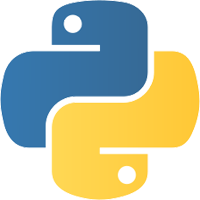
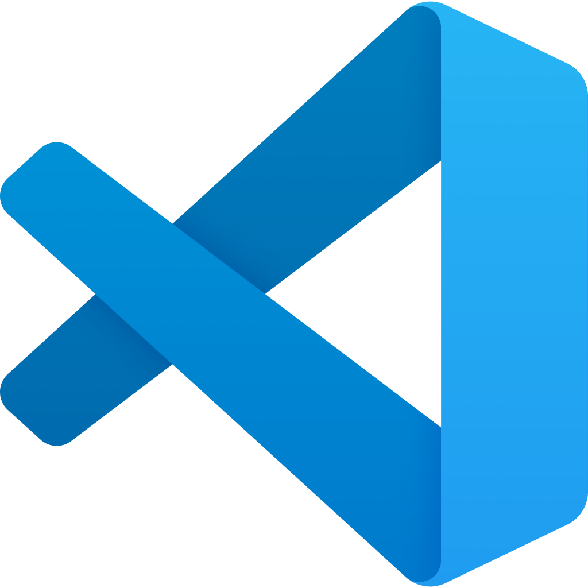

# Лекция 1. Введение. Типизации. Переменные. Строки и числа. Булева алгебра. Ветвление

### Оглавление курса

<details open>
  <summary>Блок 1 — Python Basic (1–6)</summary>

  - ▶ **Лекция 1. Введение. Типизации. Переменные. Строки и числа. Булева алгебра. Ветвление**
  - [Лекция 2. Обработка исключений. Списки, строки детальнее, срезы, циклы.](lesson02.md)
  - [Лекция 3: None. Range, list comprehension, sum, max, min, len, sorted, all, any. Работа с файлами](lesson03.md)
  - [Лекция 4. Хэш таблицы. Set, frozenset. Dict. Tuple. Немного об импортах. Namedtuple, OrderedDict](lesson04.md)
  - [Лекция 5. Функции, типизация, lambda. Map, zip, filter.](lesson05.md)
  - [Лекция 6. Алгоритмы и структуры данных](lesson06.md)
</details>

<details>
  <summary>Блок 2 — Git (7–8)</summary>

  - [Лекция 7. Git. История системы контроля версий. Локальный репозиторий. Базовые команды управления репозиторием.](lesson07.md)
  - [Лекция 8. Git. Удаленный репозиторий. Remote, push, pull. GitHub, Bitbucket, GitLab, etc. Pull request.](lesson08.md)
</details>

<details>
  <summary>Блок 3 — Python Advanced (9–14)</summary>

  - [Лекция 9. Введение в ООП. Основные парадигмы ООП. Классы и объекты. Множественное наследование.](lesson09.md)
  - [Лекция 10. Magic methods. Итераторы и генераторы.](lesson10.md)
  - [Лекция 11. Imports. Standard library. PEP8](lesson11.md)
  - [Лекция 12. Декораторы. Декораторы с параметрами. Декораторы классов (staticmethod, classmethod, property)](lesson12.md)
  - [Лекция 13. Тестирование](lesson13.md)
  - [Лекция 14. Проектирование. Паттерны. SOLID.](lesson14.md)
</details>

<details>
  <summary>Блок 4 — SQL (15–17)</summary>

  - [Лекция 15. СУБД. PostgreSQL. SQL. DDL. Пользователи. DCL. DML. Связи.](lesson15.md)
  - [Лекция 16. СУБД. DQL. SELECT. Индексы. Group by. Joins.](lesson16.md)
  - [Лекция 17. СУБД. Нормализация. Аномалии. Транзакции. ACID. TCL. Backup](lesson17.md)
</details>

- [Лекция 18. Virtual env. Pip. Устанавливаемые модули. Pyenv.](lesson18.md)

<details>
  <summary>Блок 5 — Django (19–26)</summary>

  - [Лекция 19. Знакомство с Django](lesson19.md)
  - [Лекция 20. Templates. Static](lesson20.md)
  - [Лекция 21. Модели. Связи. Meta. Abstract, proxy.](lesson21.md)
  - [Лекция 22. Django ORM.](lesson22.md)
  - [Лекция 23. Forms, ModelForms. User, Authentication.](lesson23.md)
  - [Лекция 24. ClassBaseView](lesson24.md)
  - [Лекция 25. NoSQL. Куки, сессии, кеш](lesson25.md)
  - [Лекция 26. Логирование. Middleware. Signals. Messages. Manage commands](lesson26.md)
</details>

<details>
  <summary>Блок 6 — Django Rest Framework (27–30)</summary>

  - [Лекция 27. Что такое API. REST и RESTful. Django REST Framework.](lesson27.md)
  - [Лекция 28. @api_view, APIView, ViewSets, Pagination, Routers](lesson28.md)
  - [Лекция 29. REST аутентификация. Авторизация. Permissions. Фильтрация.](lesson29.md)
  - [Лекция 30. Тестирование. Django, REST API.](lesson30.md)
</details>

<details>
  <summary>Блок 7 — Python async (31–33)</summary>

  - [Лекция 31. Celery. Multithreading. GIL. Multiprocessing](lesson31.md)
  - [Лекция 32. Asyncio. Aiohttp. Асинхронное программирование на практике.](lesson32.md)
  - [Лекция 33. Сокеты. Django channels.](lesson33.md)
</details>

<details>
  <summary>Блок 8 — Deployment (34–35)</summary>

  - [Лекция 34. Linux. Всё, что нужно знать для деплоймента.](lesson34.md)
  - [Лекция 35. Deployment](lesson35.md)
</details>

- [Лекция 36. Методологии разработки. CI/CD. Монолит и микросервисы. Docker](lesson36.md)


## Что такое программирование?

Программирование — это процесс создания инструкций, которые позволяют компьютеру выполнять определенные задачи. Эти
инструкции называются программами. Программы могут решать широкий спектр задач, от простых вычислений до управления
сложными системами и автоматизации процессов. Программирование требует логического мышления и умения решать проблемы.

По сути, программирование состоит из двух частей. Это алгоритмы и структуры данных.

Алгоритмы — это чёткие последовательности действий, которые описывают, как решить конкретную задачу. Они являются
основой программирования, так как позволяют разработчикам точно указать, что должно быть сделано для достижения цели.
Примеры алгоритмов включают сортировку данных, поиск значений и выполнение математических вычислений.

Структуры данных — это способы организации и хранения данных для эффективного доступа и модификации. Они включают
массивы, списки, стеки, очереди, деревья и хеш-таблицы. Понимание алгоритмов и структур данных является ключевым для
написания эффективных и оптимизированных программ.

Если говорить простым языком, алгоритмы — это как делать, а структуры данных — это с чем делать.


## Python



Python — это высокоуровневый язык программирования, который отличается простотой и читаемостью синтаксиса. Его легко
изучить, что делает его популярным среди начинающих программистов, а также профессионалов. Python поддерживает несколько
парадигм программирования, включая процедурное, объектно-ориентированное и функциональное программирование.

История Python начинается в конце 1980-х годов. Язык был создан Гвидо ван Россумом в Центре математики и информатики (
CWI) в Нидерландах. Ван Россум начал работу над Python в декабре 1989 года, а первая версия была выпущена в феврале 1991
года. Название "Python" происходит не от змеи, а от британского комедийного шоу "Monty Python’s Flying Circus", которое
ван Россум очень любил.

Основные этапы развития Python:

- Python 1.0 (январь 1994): Включал основные возможности, такие как обработка исключений, функции и модули.
- Python 2.0 (октябрь 2000): Представил новые возможности, включая сборку мусора и поддержку Unicode.
- Python 3.0 (декабрь 2008): Внёс изменения, которые не были обратно совместимы с предыдущими версиями, с целью сделать
  язык более понятным и лёгким в использовании.

Python активно развивается и поддерживается сообществом разработчиков по всему миру. Последние версии языка включают
множество улучшений и новых возможностей, что делает его мощным инструментом для решения самых разнообразных задач.

В современном мире активно используется Python 3+. Python 2 официально не поддерживается с 1 января 2020 года, но на очень старых проектах его ещё можно встретить.

## Где можно применять язык Python?

Python — это высокоуровневый язык программирования, известный своей простотой и читаемостью. Он широко используется в
различных областях, таких как:

1. **Веб-разработка:** Создание серверной логики для веб-приложений (Django, Flask).
2. **Научные исследования и анализ данных:** Инструменты для работы с большими данными, машинное обучение (NumPy,
   Pandas, TensorFlow, scikit-learn).
3. **Автоматизация и скриптинг:** Автоматизация рутинных задач (Selenium, BeautifulSoup).
4. **Разработка игр:** Создание простых игр и графических приложений (Pygame).
5. **Встроенные системы:** Программирование микроконтроллеров (MicroPython).
6. **Образование:** Простой синтаксис делает Python отличным выбором для обучения программированию.

Первые три являются основными сферами применения языка, как раз с первой мы и будем знакомиться глубже.

## Установка Python на Windows


Для операционной системы Windows необходимо скачать и установить Python с официального сайта. Перейдите
по [ссылке](https://www.python.org/downloads/) и загрузите последнюю версию Python. Убедитесь, что во время установки вы
отметили опцию "Add Python to PATH".

## Как запустить консоль


Для запуска Python в различных операционных системах мы будем использовать консоль (командную строку/терминал):

1. **Windows:**
    - Откройте "Пуск" (либо кнопки Win + R) и введите "cmd" или "Командная строка".
    - Нажмите Enter для открытия командной строки.

2. **Linux:**
    - Откройте терминал. Обычно это можно сделать с помощью сочетания клавиш `Ctrl + Alt + T` или через меню приложений.

3. **macOS:**
    - Откройте "Finder" и перейдите в "Программы" -> "Утилиты".
    - Откройте "Терминал".

## Что вообще использовать для написания кода? Какие программы?

В первую очередь такие программы называются IDE или редакторы кода. Хотя чисто технически можно использовать хоть Word,
хоть Блокнот, разница только в вашем личном удобстве.

Редактор кода — это специализированная программа, предназначенная для написания и редактирования кода. Он предоставляет
функции, которые упрощают процесс программирования, такие как подсветка синтаксиса, автодополнение, отладка и многое
другое.

### 1. Visual Studio Code (VS Code)



**Visual Studio Code** — это бесплатный, открытый и кроссплатформенный редактор кода, разработанный Microsoft. Он
поддерживает множество языков программирования, включая Python, и предлагает богатый набор функций:

- **Подсветка синтаксиса и автодополнение:** VS Code поддерживает подсветку синтаксиса и автодополнение для Python.
- **Отладка:** Встроенная отладка позволяет легко находить и исправлять ошибки.
- **Расширения:** Существует множество расширений, которые можно установить для улучшения функциональности редактора.
- **Интеграция с Git:** Удобные инструменты для работы с системой контроля версий Git.

### 2. PyCharm


**PyCharm** — это интегрированная среда разработки (IDE) для Python, разработанная JetBrains. PyCharm доступен в двух
версиях: Community (бесплатная) и Professional (платная с дополнительными функциями).

- **Умное автодополнение кода:** PyCharm предлагает мощное автодополнение кода и анализ кода в реальном времени.
- **Отладка и тестирование:** Встроенные инструменты для отладки и тестирования кода.
- **Поддержка веб-разработки:** Версия Professional поддерживает разработку веб-приложений с использованием Django,
  Flask и других фреймворков.
- **Интеграция с VCS:** Поддержка различных систем контроля версий, включая Git, Mercurial и другие.

### 3. Sublime Text


**Sublime Text** — это лёгкий и быстрый текстовый редактор, который поддерживает различные языки программирования,
включая Python.

- **Подсветка синтаксиса и автодополнение:** Sublime Text поддерживает подсветку синтаксиса и автодополнение для Python.
- **Пакетный менеджер:** С помощью пакетного менеджера Package Control можно легко установить дополнительные пакеты и
  плагины.
- **Мини-карта:** Удобная навигация по коду с помощью мини-карты, отображающей весь файл.

### 4. Jupyter Notebook


**Jupyter Notebook** — это веб-приложение, которое позволяет создавать и делиться документами, содержащими живой код,
уравнения, визуализации и текстовые пояснения. Оно широко используется в науке о данных, исследовательской и
образовательной деятельности.

- **Интерактивные блокноты:** Возможность выполнения кода по ячейкам, что упрощает тестирование и отладку.
- **Визуализация данных:** Поддержка встроенных библиотек для визуализации данных, таких как Matplotlib и Seaborn.
- **Поддержка нескольких языков:** Помимо Python, Jupyter Notebook поддерживает другие языки программирования через
  ядра (kernels).

## Что же выбрать?

На самом деле это далеко не все редакторы кода, которые существуют.

Для задач нашего курса хорошо подходят VS Code или PyCharm.

Я лично использую PyCharm.

Но нужно обратить внимание: версия, которая позволит нам нормально изучать вторую половину курса с использованием PyCharm,
**платная**; однако у JetBrains есть бесплатные образовательные лицензии. VS Code бесплатный — выбор за вами.

## Типы данных

Любое изучение программирования начинается с типов данных.

### Виды типизации

Типизация определяет, как язык программирования работает с типами данных и как они используются в программах.

#### Слабая (не строгая) / Сильная (строгая) типизации

- Слабая (не строгая) типизация: Язык слабо типизирован, если он позволяет выполнять операции между различными типами
  данных без явного приведения типов. Пример: JavaScript.

- Сильная (строгая) типизация: Язык сильно типизирован, если он требует явного приведения типов для выполнения операций
  между различными типами данных. Пример: Python.

При слабой типизации сложить число и строку можно, при сильной — нельзя.

#### Статическая / Динамическая типизация

Статическая типизация: В статически типизированных языках типы переменных определяются во время компиляции и не могут
изменяться. Пример: Java, C++.

Динамическая типизация: В динамически типизированных языках типы переменных могут изменяться во время выполнения
программы. Пример: Python, JavaScript.

При статической типизации нужно четко указывать тип данных переменной, при динамической будет использована утиная
типизация, и переменная может изменить свой тип во время исполнения.

Python является языком с сильной, динамической типизацией.

### Утиная типизация


В питоне используется так называемая утиная типизация. Если что-то выглядит как утка, плавает как утка и крякает как
утка, то это, скорее всего, утка :)

Пока что мы не будем вникать в детали и рассмотрим только два очень простых типа. Строки и числа.

## Переменные


Переменная — это именованная область памяти, которая используется для хранения данных, которые могут изменяться во время
выполнения программы. В Python переменные создаются присваиванием значения идентификатору:

```python
x = 5
name = "Alice"
```

В этих примерах `x` и `name` — это имена переменных, а `5` и `"Alice"` — это их значения.

Имена переменных могут содержать маленькие и большие буквы латинского алфавита, цифры и символ `_`.

Имя переменной не может начинаться с цифры и не может быть из списка ключевых слов, мы будем все их разбирать в рамках
этого курса.

Технически вы можете использовать большие буквы для имени переменной, но не стоит этого делать, это не соответствует
общепринятым правилам. Дальше по курсу я расскажу, когда можно и нужно использовать большие буквы.


Коротко про стиль: будем придерживаться PEP 8 (подробнее позже в курсе). Имена переменных — в snake_case: например, `user_name`, `total_amount`.

## Использование функции `print`

Функция `print` — это встроенная функция Python, которая используется для вывода текста и данных на экран. Она может
принимать один или несколько аргументов и выводить их в стандартный поток вывода (обычно это консоль или терминал).

Создание переменной — это хорошо, но нам для обучения будет необходимо ещё и смотреть, что находится в переменных. Самый
простой способ — это попросить Python распечатать значение переменной через функцию `print`.

1. **Вывод строки:**

   ```python
   print("Hello, World!")
   ```

2. **Вывод чисел:**

   ```python
   age = 30
   print(age)
   ```

3. **Вывод нескольких значений:**

   ```python
   name = "Alice"
   age = 30
   print("Name:", name, "Age:", age)
   ```

Как вы видите из примеров, можно выводить как переменные, так и просто сразу данные, через запятую можно указать
несколько значений для вывода, у этой функции гораздо больше параметров, но пока что нам достаточно и этих.


Дополнительно: современный способ форматирования — f-строки:

```python
name = "Alice"
age = 30
print(f"Name: {name} Age: {age}")
```

## Способы запуска Python кода

Как же нам запустить наш код?

Существует несколько способов запуска кода на Python. Вот основные из них:

1. **Интерактивная оболочка (REPL):** Позволяет вводить команды и видеть результат их выполнения сразу же. Чтобы
   запустить REPL, просто введите `python` или `python3` в командной строке и нажмите Enter.

   ```shell
   $ python3
   Python 3.12.0 (main, Oct  2 2023, 12:00:00)
   [Clang 14.0.0] on darwin
   Type "help", "copyright", "credits" or "license" for more information.
   >>>
   ```

   Если вы видите нечто похожее на мой пример, значит, всё хорошо и вы смогли запустить интерпретатор.
   Тут можно писать код, и он будет мгновенно исполняться после каждой строчки. Иногда нам будет нужен этот инструмент,
   но всё-таки не часто.


2. **Скрипт:** Python-программы обычно пишутся в текстовом файле с расширением `.py` и запускаются с помощью
   интерпретатора Python.

   Гораздо чаще мы будем сохранять код в файлах с расширением `.py` и запускать файл целиком (такие файлы называются
   скриптами).

   ```shell
   $ python my_script.py
   ```

## Назад к типизациям и переменным

### Строка (String)

Строка — это последовательность символов, используемая для представления текста. В Python строки заключаются в одинарные
или двойные кавычки:

Если у вас что-то обернуто в кавычки (неважно одинарные или двойные, главное с обеих сторон одинаковые), то это строка.

```python
greeting = "Hello, World!"
```

Строки поддерживают множество операций, таких как конкатенация (сложение), извлечение подстрок и методы для работы с
текстом:

Пока что нас будет интересовать всего одна вещь — конкатенация строк.

```python
greeting = "Hello, World!"
name = "Alice"
full_greeting = greeting + " " + name
print(full_greeting)  # Вывод: Hello, World! Alice
```

### Число (Number)

Числа в Python могут быть целыми (int) или вещественными (float):

```python
age = 30  # Целое число
height = 1.75  # Вещественное число
```

Python поддерживает стандартные арифметические операции, такие как сложение, вычитание, умножение и деление, деление
нацело, остаток от деления, возведение в степень:

```python
var = 25

total = var + 10
print(total)  # Вывод: 35

difference = var - 5
print(difference)  # Вывод: 20

mul = var * 2
print(mul)  # Вывод: 50

div = var / 2
print(div)  # Вывод: 12.5

full_div = var // 2
print(full_div)  # Вывод: 12

remainder = var % 20
print(remainder)  # Вывод: 5

power = var ** 2
print(power)  # Вывод: 625

```

## Порядок выполнения операций

Python выполняет операции в соответствии с приоритетом операторов (как в математике):

1. Скобки `()`
2. Возведение в степень `**`
3. Умножение и деление `*`, `/`, `//`, `%`
4. Сложение и вычитание `+`, `-`

Пример:

```python
result = 2 + 3 * 4  # Результат: 14, так как сначала выполняется умножение
result_with_parentheses = (2 + 3) * 4  # Результат: 20, так как сначала выполняется выражение в скобках
```

## Операции между разными типами данных

В Python нельзя выполнять арифметические операции между строками и числами напрямую. Попытка сделать это приведет к
ошибке:

```python
age = 30
name = "Alice"

# Это вызовет ошибку
message = name + age
```

Для выполнения подобных операций необходимо явно преобразовать тип данных:

```python
age = 30
name = "Alice"
message = name + str(age)
print(message)  # Вывод: Alice30
```

Для преобразования чего угодно в строку используется функция `str()`, а для преобразования в число — функции `float()` (для дробных чисел) и `int()` (для целых).

## Что такое функция `input`?

Функция `input` в Python используется для получения ввода от пользователя. Она позволяет программе принимать данные от пользователя во время выполнения, что делает её более интерактивной.

### Основное использование

Функция `input` принимает необязательный аргумент, который является строкой, и выводит его в качестве подсказки для
пользователя. После этого программа приостанавливается и ожидает, пока пользователь введёт данные и нажмёт Enter.
Введённые пользователем данные возвращаются в виде строки.

Пример:

```python
name = input("Введите ваше имя: ")
print("Привет, " + name + "!")
```

Когда вы запустите этот код, программа выведет сообщение "Введите ваше имя: ". После того как вы введёте своё имя и
нажмёте Enter, программа продолжит выполнение и выведет приветственное сообщение с вашим именем.

### Преобразование типов данных

По умолчанию, функция input возвращает данные в виде строки. Если вам нужно работать с числовыми значениями или другими
типами данных, вы должны преобразовать введённые данные.

Пример:

```python
age = input("Введите ваш возраст: ")
age = int(age)
print("Через 10 лет вам будет " + str(age + 10) + " лет.")
```

Альтернатива с f-строкой:

```python
print(f"Через 10 лет вам будет {age + 10} лет.")
```

В этом примере введённое значение преобразуется в целое число с помощью функции **int()**, чтобы с ним можно было
выполнять арифметические операции. Обратите внимание, что результат арифметической операции снова преобразуется в строку для
вывода.

### Примеры использования

Получение числового ввода от пользователя:

```python
num1 = int(input("Введите первое число: "))
num2 = int(input("Введите второе число: "))
sum = num1 + num2
print("Сумма: " + str(sum))
```

Получение строкового ввода и работа с ним:

```python
city = input("Введите название вашего города: ")
print("Вы живете в " + city + ".")
```

## Практические задания

0. Запустите
    ```python
    print("Hello, world!")
    ```
   С этого начинается изучение любого языка программирования — это традиция.
1. Создайте переменные `a` и `b`, присвойте им значения 10 и 20 соответственно. Выполните сложение, вычитание, умножение
   и деление этих переменных и выведите результаты.
2. Создайте переменную `text` со значением "Python". Умножьте эту строку на 3 и выведите результат.
3. Создайте переменную `name` со значением вашего имени и переменную `age` с вашим возрастом. Создайте строку, которая
   будет содержать сообщение вида "Меня зовут [имя], мне [возраст] лет." и выведите её.
4. Напишите программу, которая считает выражение `(5 + 3) * 2 ** 2` и выводит результат.
5. Попробуйте сложить строку и число без приведения типов и исправьте ошибку, используя явное преобразование типов.
6. Сделать задачи 1, 2, 3 при помощи **input**

# Булева алгебра и условия


## Что такое булева алгебра?

Булева алгебра – это раздел математики, который занимается операциями над логическими значениями и включает двоичные
переменные. Булева алгебра ведёт своё начало от книги математика Джорджа Буля (на картинке выше) 1854 года.

Основные понятия в булевой алгебре — это **true** и **false**, они же **истина** и **ложь**, и три оператора **not**, **and** и **or**. Они же **не**, **и** и **или**.

Очень большая часть программирования строится именно на двоичной алгебре и оперирует понятиями из этой алгебры.

Тип **Python boolean** является одним из встроенных типов данных Python. Он используется для представления истинности
значения выражения. Например, выражение ``1 < 2`` является ``True``, тогда как выражение ``0 == 1`` является ``False``.
Понимание того, как ведут себя логические значения Python, важно для качественного программирования на Python.

Запомните слова **True** и **False** именно с большой буквы – они являются ключевыми в языке Python, и вы не можете
использовать их как название переменной, функции, класса и т.д.

Эти понятия есть в каждом языке программирования (которые используются коммерчески, возможно, есть исключения для
некоторых проектов, сделанных для веселья), которые мне известны.


Такой тип данных называется **булевый**, а такие переменные – **булевые**.

### Давайте разбираться, что это за тип данных.

Может быть только два значения: *True* и *False*.


Есть три способа, как переменная может быть булевым значением:

1) Явное создание переменной такого типа:

```python
some_true_variable = True
some_false_variable = False
```

2) Приведение типов

Как вы уже знаете, в Python есть разные типы данных, например, числа, строки и булевые значения. На самом деле их
намного больше, и мы будем их изучать.

Python — это язык с динамической строгой типизацией, а это значит, что мы не обязаны указывать, какой тип переменной мы
создаём, но мы не можем сложить или сравнить между собой число и строку.

А что, если нам нужно сложить число со строкой? Например, у нас есть переменная со значением 45 и другая со значением
"47".

Первая — это число, вторая — это строка. В таком случае у нас есть два варианта. Первый — сложить переменные как
числа, второй — сложить их как строки. Чтобы у нас была такая возможность, мы должны изменить тип одной из них, а затем
работать с одним и тем же типом данных. Чтобы привести один тип к другому, всё, что нам нужно, — это написать название
типа маленькими буквами и в скобках указать, что именно мы хотим изменить.

```python
my_num = 45  # Это число
my_str = '47'  # Это строка
print(my_num + my_str)  # Вызовет ошибку
print(my_num + int(my_str))  # Распечатает 92
print(str(my_num) + my_str)  # Распечатает 4547

my_str_not_number = 'blabla'
int(my_str_not_number)  # Вызовет ошибку!! Эта строка не может быть преобразована в число
```

То же самое и с булевым типом, мы можем преобразовать что угодно в булевый тип **bool(anything)**.

Для каждого типа данных свои правила преобразования к логическому типу. Для чисел и строк они такие:

Любая непустая строка преобразуется в **True**.

```python
bool('')  # False
bool('asdasd')  # True
empty_string = ''
not_empty_string = 'some text'
bool(empty_string)  # False
bool(not_empty_string)  # True
```

С числами правила не сложнее: любое значение, которое не равно **0**, — это True.

```python
bool(4)  # True
bool(0)  # False
bool(-3)  # True
positive = 5
negative = -4
zero = 0
bool(positive)  # True
bool(zero)  # False
bool(negative)  # True
bool(positive - 5)  # False
bool(0.0)  # False
```

3) Как результат математического сравнения или результат некоторых ключевых слов.

#### Математические сравнения

Для сравнения в Python используются математические символы.

Можно сравнивать строки, числа и многие другие типы данных, что мы детально разберём позже.

**>** — больше

```python
result = 5 > 3  # True
another_result = 3 > 5  # False
compare_the_same_values = 3 > 3  # False
small_value = 4
big_value = 6
compare_variables = big_value > small_value  # True
compare_variables = small_value > big_value  # False
compare_strings = 'ab' > 'baa'  # False, базовое сравнение строк происходит по алфавиту
```

**<** — меньше (логика такая же)

```python
result = 5 < 3  # False
another_result = 3 < 5  # True
compare_the_same_values = 3 < 3  # False
small_value = 4
big_value = 6
compare_variables = big_value < small_value  # False
compare_variables = small_value < big_value  # True
compare_strings = 'ab' < 'baa'  # True
```

**>=** — больше или равно

```python
result = 5 >= 3  # True
another_result = 3 >= 5  # False
compare_the_same_values = 3 >= 3  # True
small_value = 4
big_value = 6
compare_variables = big_value >= small_value  # True
compare_variables = small_value >= big_value  # False
compare_strings = 'ab' >= 'baa'  # False
```

**<=** — меньше или равно

```python
result = 5 <= 3  # False
another_result = 3 <= 5  # True
compare_the_same_values = 3 <= 3  # True
small_value = 4
big_value = 6
compare_variables = big_value <= small_value  # False
compare_variables = small_value <= big_value  # True
compare_strings = 'ab' <= 'baa'  # True
```

**==** — равно (да, там два символа равно, потому что один символ `=` уже занят присвоением значения переменной)

```python
result = 5 == 3  # False
another_result = 3 == 5  # False
compare_the_same_values = 3 == 3  # True
small_value = 4
big_value = 6
compare_variables = big_value == small_value  # False
compare_variables = small_value == big_value  # False
compare_strings = 'ab' == 'baa'  # False
```

**!=** — не равно

```python
result = 5 != 3  # True
another_result = 3 != 3  # False
compare_strings = 'ab' != 'baa'  # True
```

#### Ключевые слова булевой алгебры

**and** — логическое **и** (РЕЗУЛЬТАТ МОЖЕТ БЫТЬ НЕ БУЛЕВОЕ ЗНАЧЕНИЕ!)

Логическое **и** работает так. Если все значения в выражении истинны, результат также будет истинен. Но имейте в виду,
что это ключевое слово не возвращает булево значение, оно возвращает первое значение, которое при преобразовании в
булево будет ложным, или последнее, если оба истинны. Давайте лучше посмотрим примеры.

Логическому **и** и логическому **или** можно передавать разные типы данных слева и справа.

```python
True and True  # True
False and True  # False
False and False  # False
True and False  # False
True and ''  # ''
'a' and 0  # 0
0 and ''  # 0
10 and ''  # ''
'bla' and 23  # 23
```

**or** — логическое **или** (РЕЗУЛЬТАТ МОЖЕТ БЫТЬ НЕ БУЛЕВОЕ ЗНАЧЕНИЕ!)

Логическое **или** работает так. Если одно значение в выражении истинно, результат также будет истинен. Но имейте в
виду,
что это ключевое слово не возвращает булево значение, оно возвращает первое значение, которое при преобразовании в
булево будет истинным, или последнее, если оба ложны. Давайте лучше посмотрим примеры.

```python
True or True  # True
False or True  # True
False or False  # False
True or False  # True
True or ''  # True
'a' or 0  # 'a'
0 or ''  # ''
10 or ''  # 10
'bla' or 23  # 'bla'
```

**not** — преобразует True в False и наоборот. Сначала преобразует значение в булево, а затем меняет на противоположное.

```python
not True  # False
not False  # True
not ''  # True
not 33  # False
```

**in** — поиск подколлекции в коллекции. На этом уровне знаний используется для поиска вхождения одной строки в другую:

```python
'ab' in 'bcde'  # False
'ab' in 'abcd'  # True
```

**is** — **ИСПОЛЬЗУЕТСЯ ТОЛЬКО С ПЕРЕМЕННЫМИ**, это проверка, находятся ли две переменные в одном и том же месте в
памяти. Это немного сложно для понимания, и будет намного проще объяснить это, когда вы будете знать другие типы данных.
Но объясню на некоторых примерах:

```python
a = 500
b = 500
a is b  # False
c = 500
d = c
c is d  # True
```

Но у Python есть одна особенность работы этого оператора. Разработчики языка программирования решили, что числа от -5 до
256 (включительно) используются очень часто, и нет никакого смысла создавать для этих чисел новый объект каждый раз. Поэтому они сделали так, чтобы при запуске скрипта значения от -5 до 256 брались из внутренней памяти (это называется integer interning). Из-за этого возникает очень интересный эффект, и я очень люблю спрашивать об этом на собеседованиях.

```python
a = 200
b = 200
a is b  # True
a = 300
b = 300
a is b  # False
```

Примечание: для сравнения значений используйте `==`. Оператор `is` проверяет тождественность (один и тот же объект в памяти).


### Разбираемся с приоритетом операций

На самом деле, как и в обычной математике, у любых операторов есть свой приоритет. В нашем языке программирования он
такой:

Некоторые из этих операторов мы не изучали. Они используются намного реже, но если вы хотите, вы можете их изучить
самостоятельно или спросить меня о деталях.

**()** — скобки

**\*\*** — степень

**+x, -x, ~x** — унарный плюс, минус и битовое НЕ

**\*, /, //, %** — умножить, разделить, разделить нацело, остаток от деления

**+, -** — сложение и вычитание

**<<, >>** — битовые сдвиги

**&** — битовое И

**^** — битовое исключающее ИЛИ

**|** — битовое ИЛИ

**==, !=, >, >=, <, <=, is, is not, in, not in** — сравнения, вхождения и т.д.

**not** — логическое НЕ

**and** — логическое И

**or** — логическое ИЛИ

Если вы не уверены и хотите указать приоритет явно, просто используйте скобки.

### Примеры

Любые из этих операций можно комбинировать:

```python
age = int(input('Please enter your age:'))
name = input('Please enter your name:')

age > 18 and 'v' not in name

age < 10 or name == 'Kate'

age // 3 == 1 and len(name) > 4 or str(age) in name
```

## if, elif, else или зачем нам все это вообще нужно

В программировании есть несколько очень базовых концепций, одна из них – это ветвление.

Очень просто: выполнять блок кода, только если условие истинно.

В Python для обозначения блоков кода мы используем обычные отступы. Во многих языках программирования для этого
используются различные скобки. У нас используется 4 пробела (на большинстве компьютеров кнопка Tab работает именно как 4
пробела).

### if

Сейчас мы рассмотрим ключевые слова **if**, **elif**, **else**, но в Python любые структуры, которые вы будете изучать
дальше,
используют такой же синтаксис с четырьмя пробелами (или одним табом).

```python
a = 100
b = 'bla'
if a:
    print('will be printed')
if a > 50:
    print('will be printed')
if 'c' in b:
    print('wont be printed')
print("will be printed in any case")
```

Когда нам нужно добавить условие, мы просто пишем ключевое слово **if**, после него указываем условие и ставим
двоеточие.
Всё, что должно выполняться при выполнении условия, должно быть написано ниже с отступом в 4 пробела. Всё, что будет
написано снова на предыдущем уровне, будет выполнено без условий.

### else

Если нам нужно разделить выполнение кода на то, что делать, когда условие выполняется, и что делать, когда нет, мы можем
использовать ключевое слово **else**.

```python
a = 100
if a > 200:
    print('wont be printed')
else:
    print('will be printed')
```

### elif

Также мы можем добавить промежуточные условия, если не выполнится первый if, с помощью elif, который также требует
условия:

Первое условие выполнилось? Нет? Ок, давайте проверим второе, тоже нет? Ну тогда пойдём в **else**.

```python
a = 80
if a > 100:
    print('wont be printed')
elif a > 50:
    print('will be printed')
else:
    print('wont be printed')
```

**elif** можно применять больше одного раза (точнее, почти сколько угодно раз).

На самом деле это просто синтаксическое упрощение вот такой конструкции:

```python
a = 80
if a > 100:
    print('wont be printed')
else:
    if a > 50:
        print('will be printed')
    else:
        print('wont be printed')
```

Вы же не думали, что вложенность может быть только одного уровня? :)

## match case

Только с версии 3.10 в Python добавили ещё одну возможность использовать булевую алгебру. Во многих других языках эта
конструкция называется switch case.

Идея в том, что мы можем задать несколько опций для проверки нашей переменной и выполнить только те, где наша проверка
будет истинной.

```python
status = 400
match status:
    case 400:
        print("Bad request")
    case 401:
        print("Unauthorized")
    case 403:
        print("Forbidden")
    case 404:
        print("Not found")
```

Можно добавить ветку по умолчанию:

```python
match status:
    case 400:
        print("Bad request")
    case _:
        print("Unknown status")
```


Будет напечатано "Bad request", потому что наша проверка остановится на версии status == 400. Эта конструкция имеет
очень много деталей и тонкостей, если хотите, можете разобрать это самостоятельно, но моя практика показывает, что она
используется редко.

## Практика/Домашнее задание:

Задачи 1–5 — это одно задание, а 6 — это ещё одно задание.

1) Пользователь задаёт переменную возраст. Если он старше 18, распечатайте, что всё хорошо, если нет — то распечатайте,
   что не всё хорошо.

2) Добавить к первому условию: если возраст больше 100, распечатать текст, что пользователь вводит нас в заблуждение.

3) Добавить принты, является ли введённый возраст чётным или нечётным.

4) Добавить, что пользователь вводит ещё и имя. И если в имени есть буква 'a', то написать, что мы даже не собираемся
   его проверять.

5) Проверить, если в имени есть буква 'v', большая или маленькая, без разницы. И если возраст пользователя чётный, то
   написать, что он выиграл приз, если нет — то не выиграл.

6) Спросить у пользователя возраст, пол и имя. Для всех младше 15 мы пишем, что рекомендуем теннис, для мальчиков старше
   15 рекомендуем футбол, для девочек — баскетбол, но если в имени есть буква 'c' или 't', пишем, что не рекомендуем
   заниматься спортом.

---

[Лекция 2: Обработка исключений. Списки, строки детальнее, срезы, циклы. →](lesson02.md)