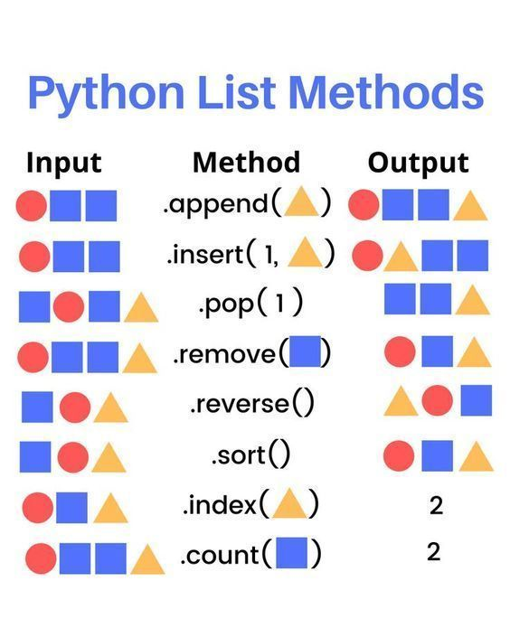

# Лекция 2. Обработка исключений. Списки, строки детальнее, срезы, циклы.

### Оглавление курса

<details open>
  <summary>Блок 1 — Python Basic (1–6)</summary>

  - [Лекция 1. Введение. Типизации. Переменные. Строки и числа. Булева алгебра. Ветвление](lesson01.md)
  - ▶ **Лекция 2. Обработка исключений. Списки, строки детальнее, срезы, циклы.**
  - [Лекция 3: None. Range, list comprehension, sum, max, min, len, sorted, all, any. Работа с файлами](lesson03.md)
  - [Лекция 4. Хэш таблицы. Set, frozenset. Dict. Tuple. Немного об импортах. Namedtuple, OrderedDict](lesson04.md)
  - [Лекция 5. Функции, типизация, lambda. Map, zip, filter.](lesson05.md)
  - [Лекция 6. Алгоритмы и структуры данных](lesson06.md)
</details>

<details>
  <summary>Блок 2 — Git (7–8)</summary>

  - [Лекция 7. Git. История системы контроля версий. Локальный репозиторий. Базовые команды управления репозиторием.](lesson07.md)
  - [Лекция 8. Git. Удаленный репозиторий. Remote, push, pull. GitHub, Bitbucket, GitLab, etc. Pull request.](lesson08.md)
</details>

<details>
  <summary>Блок 3 — Python Advanced (9–14)</summary>

  - [Лекция 9. Введение в ООП. Основные парадигмы ООП. Классы и объекты. Множественное наследование.](lesson09.md)
  - [Лекция 10. Magic methods. Итераторы и генераторы.](lesson10.md)
  - [Лекция 11. Imports. Standard library. PEP8](lesson11.md)
  - [Лекция 12. Декораторы. Декораторы с параметрами. Декораторы классов (staticmethod, classmethod, property)](lesson12.md)
  - [Лекция 13. Тестирование](lesson13.md)
  - [Лекция 14. Проектирование. Паттерны. SOLID.](lesson14.md)
</details>

<details>
  <summary>Блок 4 — SQL (15–17)</summary>

  - [Лекция 15. СУБД. PostgreSQL. SQL. DDL. Пользователи. DCL. DML. Связи.](lesson15.md)
  - [Лекция 16. СУБД. DQL. SELECT. Индексы. Group by. Joins.](lesson16.md)
  - [Лекция 17. СУБД. Нормализация. Аномалии. Транзакции. ACID. TCL. Backup](lesson17.md)
</details>

- [Лекция 18. Virtual env. Pip. Устанавливаемые модули. Pyenv.](lesson18.md)

<details>
  <summary>Блок 5 — Django (19–26)</summary>

  - [Лекция 19. Знакомство с Django](lesson19.md)
  - [Лекция 20. Templates. Static](lesson20.md)
  - [Лекция 21. Модели. Связи. Meta. Abstract, proxy.](lesson21.md)
  - [Лекция 22. Django ORM.](lesson22.md)
  - [Лекция 23. Forms, ModelForms. User, Authentication.](lesson23.md)
  - [Лекция 24. ClassBaseView](lesson24.md)
  - [Лекция 25. NoSQL. Куки, сессии, кеш](lesson25.md)
  - [Лекция 26. Логирование. Middleware. Signals. Messages. Manage commands](lesson26.md)
</details>

<details>
  <summary>Блок 6 — Django Rest Framework (27–30)</summary>

  - [Лекция 27. Что такое API. REST и RESTful. Django REST Framework.](lesson27.md)
  - [Лекция 28. @api_view, APIView, ViewSets, Pagination, Routers](lesson28.md)
  - [Лекция 29. REST аутентификация. Авторизация. Permissions. Фильтрация.](lesson29.md)
  - [Лекция 30. Тестирование. Django, REST API.](lesson30.md)
</details>

<details>
  <summary>Блок 7 — Python async (31–33)</summary>

  - [Лекция 31. Celery. Multithreading. GIL. Multiprocessing](lesson31.md)
  - [Лекция 32. Asyncio. Aiohttp. Асинхронное программирование на практике.](lesson32.md)
  - [Лекция 33. Сокеты. Django channels.](lesson33.md)
</details>

<details>
  <summary>Блок 8 — Deployment (34–35)</summary>

  - [Лекция 34. Linux. Все что нужно знать для деплоймента.](lesson34.md)
  - [Лекция 35. Deployment](lesson35.md)
</details>

- [Лекция 36. Методологии разработки. CI/CD. Монолит и микросервисы. Docker](lesson36.md)


## Что такое исключение?

Исключения — это события, которые нарушают нормальный поток выполнения программы. Они возникают, когда программа
сталкивается с ошибкой, которую она не может обработать в обычном режиме. Например, попытка деления на ноль или
преобразование строки к числу, когда она не является числом, могут вызвать исключения.

Если говорить доступным языком, то исключения — это попытка выполнить то, что у языка выполнить не получится.

Иерархия исключений выглядит вот так:


Это очень примерная картинка, актуальный список всех исключений всегда можно посмотреть
вот [тут](https://docs.python.org/3/library/exceptions.html#exception-hierarchy), выбрав актуальную для вас версию
Python.

Начнём со знакомства с самыми обычными исключениями, которые вы увидите в Python. Обратите внимание на то, что ошибка и
исключение – два разных слова, описывающих одно и то же в контексте обработки исключений.

## Основные исключения на данном этапе

Их прям много, детально разберём, с чем мы можем столкнуться на данном этапе.

`Exception` – то, на чем фактически строятся все остальные ошибки;

`KeyboardInterrupt` – возникает, когда пользователь нажимает клавишу прерывания (обычно Ctrl+C);

`NameError` – возникает, когда локальное или глобальное имя не найдено;

`SyntaxError` — возникает, когда синтаксическая ошибка встречается синтаксическим анализатором;

`TypeError` – возникает, когда операция или функция применяется к объекту несоответствующего типа. Связанное значение
представляет собой строку, в которой приводятся подробные сведения о несоответствии типов;

`ValueError` – возникает, когда встроенная операция или функция получают аргумент, тип которого правильный, но
неправильное значение, и ситуация не может быть описана более точно, как при возникновении `IndexError` (Дальше опишу это
человекочитаемым языком, не пугаемся);

`ZeroDivisionError` – возникает, когда второй аргумент операций деления или остатка от деления равен нулю;

По мере изучения разных аспектов и типов данных мы будем разбирать и какие исключения могут с ними произойти.

## В каких случаях мы уже можем столкнуться с этими исключениями?

### NameError

Эта ошибка возникает, когда вы пытаетесь обратиться к переменной, которой не существует.

```python
some_variable = 123
print(variable_doesnt_exist)
```

Вы увидите ошибку:

```shell
NameError: name 'variable_doesnt_exist' is not defined
```

Эта ошибка явно означает, что вам надо проверить имена своих переменных и скорее всего вы или где-то опечатались, или
просто явно совершили ошибку.

### SyntaxError

Эта ошибка возможна в любом случае, когда вы пытаетесь набрать что-либо, что недопустимо в Python, и он вас просто не
понимает, не знает, что именно ему делать.

```python
5 +
*5
```

Или например:

```python
if:
    print('aaa')
```

Вариантов очень много, любые синтаксические ошибки будут вызывать это исключение. (Кстати, из-за чего ошибка в последнем
примере?)

Пояснение: в последнем примере после `if` пропущено условие, поэтому возникает синтаксическая ошибка.


Исключение:

```
SyntaxError: invalid syntax
```

Это исключение всегда обозначает, что вы где-то не то напечатали, внимательно посмотрите на то место, о котором пытается
сообщить вам Python, и постарайтесь исправить ошибку.

### TypeError

Происходит в случае, когда вы пытаетесь произвести недопустимые действия с объектами разного типа, например, сложить
строку и число.

```python
"a" + 5
```

Исключение:

```shell
TypeError: can only concatenate str (not "int") to str
```

### ValueError

Это исключение пока что вы будете видеть только в случае, когда пытаетесь преобразовать что-то, что невозможно
преобразовать. На самом деле это исключение случается гораздо чаще, что вы и увидите при дальнейшем изучении.

```python
int("abc")
```

Исключение:

```shell
ValueError: invalid literal for int() with base 10: 'abc'
```

### ZeroDivisionError

Всё очень просто, появляется при попытке делить на 0.

```python
1 / 0
```

Исключение:

```shell
ZeroDivisionError: division by zero
```

## Как обрабатывать исключения? Можно ли что-то с этим сделать?

Обработка исключений в Python – это очень просто. Потратим немного времени и напишем несколько примеров, которые их
вызовут. Мы начнём с одной из самых элементарных проблем: деление на ноль.

```python
1 / 0
```

За обработку исключений в Python отвечают ключевые слова **try**/**except**.

```python
try:
    1 / 0
except ZeroDivisionError:
    print("You cannot divide by zero!")

```

Если мы обратимся к урокам элементарной математики, то вспомним, что на ноль делить нельзя. В Python данная операция
вызовет ошибку, как мы можем видеть в примере выше. Чтобы поймать ошибку, мы завернем операцию в оператор try/except.

В блоке **try** должен выполняться код, в котором мы ожидаем какое-либо исключение. И если исключение происходит, то код
перестаёт выполняться и переходит к блоку/блокам **except**, и пытается понять, произошло ли то исключение, которое
описано в блоке **except**.

Блоков **except** может быть любое количество, также в одном блоке **except** может быть больше одного исключения, если
вам для разных ошибок нужны одинаковые действия, такие исключения должны быть указаны в скобках и через запятую.
Рассмотрим такой пример:

```python
bottles_of_beer = 10
try:
    amount_of_people = int(input("Please input amount of people:"))
    bottle_per_person = bottles_of_beer / amount_of_people
    print(bottle_per_person)
except (ValueError, ZeroDivisionError):
    print('Incorrect amount of people!')
```

В этом случае, когда мы введём не число или введём 0, программа продолжит работу, потому что мы обработали исключение и описали, что код должен сделать.

Или вот такой:

```python
bottles_of_beer = 10
try:
    amount_of_people = int(input("Please input amount of people:"))
    bottle_per_person = bottles_of_beer / amount_of_people
    print(bottle_per_person)
except ValueError:
    print('Your input is not a number')
except ZeroDivisionError:
    print('You are trying to divide by zero')
```

Как и тут, мы тоже всё обработали.

Комбинировать можно любое количество исключений.

А что произойдёт, если сделать вот так?

```python
try:
    bottles_of_beer = 10
    amount_of_people = int(input("Please input amount of people:"))
    bottle_per_person = bottles_of_beer / amount_of_people
    print(bottle_per_person)
except SyntaxError:
    print('Your input is not a number')
```

Произойдёт следующее: если мы не введём буквы или 0, то ничего страшного, ведь исключение не произошло. А если ввели, то
Python попытается обработать исключение, но не найдёт подходящий except и просто завершит программу с ошибкой, как
будто исключение и не было обработано.

### «Голое» исключение

Есть ещё один способ поймать ошибку:

```python
try:
    1 / 0
except:
    print("You cannot divide by zero!")
# ЭТО СРАБОТАЕТ, НО ТАК ДЕЛАТЬ НЕЛЬЗЯ
```

На жаргоне Python это известно как "голое исключение", что означает, что будут найдены вообще все исключения. Причина,
по которой так делать не рекомендуется, заключается в том, что вы не узнаете, что именно за исключение вы выловите.
Когда у вас возникло что-то в духе `ZeroDivisionError`, вы хотите выявить фрагмент, в котором происходит деление на
ноль. В написанном выше коде вы не можете указать, что именно вам нужно выявить. Хорошие программисты чётко указывают,
какую ошибку ожидают и что с ней делать.

## Оператор finally

Оператор `finally` очень прост в использовании. Давайте взглянем на нижеизложенный пример:

```python

try:
    value = int("ABC")
except ValueError:
    print("A ValueError occurred!")
finally:
    print("The finally statement has executed!")
```

Что произойдёт? Часть `finally` выполнится в любом случае — попали мы в исключение или нет.

## Оператор else

Оператор `try/except` также имеет блок `else`. Он работает только в том случае, если в вашем коде нет ни единой ошибки.
Давайте потратим немного времени и взглянем на парочку примеров:

```python

try:
    value = int(input("Please enter value"))
except ValueError:
    print("A ValueError occurred!")
else:
    print("No error occurred!")
```

В этом примере, если мы введём число, то исключения не случится, и это именно тот случай, когда мы попадём в `else`.

## Вся конструкция целиком try-except-else-finally:

Целиком вся конструкция состоит из 4 блоков

```python

try:
    value = int(input("Please enter value"))
except ValueError:
    print("A ValueError occurred!")
else:
    print("No error occurred!")
finally:
    print("The finally statement ran!")
```

В данном коде работают и оператор `else`, и `finally`, если введёте число, или `except` и `finally`, если букву. Большую
часть времени вы не будете сталкиваться с оператором `else`, используемым в том или ином коде, который следует за
оператором `try/except`, если ни одна ошибка не была найдена. Единственное полезное применение оператора `else`, которое
я видел, — это когда вы хотите запустить вторую часть кода, в которой может быть ошибка. Конечно, если ошибка возникает
в `else`, то она не будет поймана.

### Оператор raise

Если в вашем коде какие-либо данные не соответствуют вашим ожиданиям, вы всегда можете вызвать исключение, если вам это
необходимо, для этого используется ключевое слово `raise`.

```python
number = int(input("Введите нечётное число: "))
if number % 2 != 1:
    raise ValueError("Did not get an odd number")
```

> Эта конструкция и ключевое слово нам понадобится после того, как мы разберём функции. Пока я могу показать только одно
> полезное применение.

Технически всегда можно обработать исключение и вызвать его же ещё раз. Зачем такое может быть надо? В случае, когда нам
не надо предотвращать ошибку, а только записать о том, что ошибка случилась (так часто делается), тогда можно записать
информацию и вызвать эту же ошибку ещё раз.

```python
try:
    5 / 0
except ZeroDivisionError as e:
    raise ZeroDivisionError("Got an error") from e
```

в переменной `e` будет храниться вся информация об исключении, и таким способом мы вызовем нужный нам тип исключения, с
нашим комментарием и всей системной информацией, делать это через ключевое слово `as` не обязательно, можно и без этого,
но такой способ даёт нам больше возможностей.

В качестве практики нужно взять все задания из прошлой лекции и попробовать покрыть весь код возможными исключениями.

## Списки (Lists)

Список — это упорядоченная коллекция элементов, которая может содержать объекты разных типов. Списки очень полезны при работе с множеством данных.

Вместе со списками в нашу жизнь приходят такие термины как изменяемые и неизменяемые типы данных. Пока что нам не очень важно знать детали того, что это такое. Но уже необходимо запомнить, что все типы данных в Python делятся на изменяемые и неизменяемые. Ранее мы работали с неизменяемыми типами, а списки — изменяемые.

> Строки, числа, булевы значения — неизменяемые; списки — изменяемые,
> это важно!
> А почему важно узнаете дальше.

### Создание списков

Создать список можно, заключив элементы в квадратные скобки `[]` и разделив их запятыми.

```python
fruits = ['яблоко', 'банан', 'груша', 'апельсин']
numbers = [1, 2, 3, 4, 5]
mixed_list = [1, 'два', 3.0, True]
```

Список может содержать в себе объекты любых типов.

### Доступ к элементам списка

Чтобы получить доступ к элементам списка, используйте индексацию (обращение к элементам по номеру). Нумерация в списках
начинается с 0. Если вам нужен 4-й элемент коллекции, его индекс будет 3. Синтаксис обращения по индексу — через
квадратные скобки `[]`.

```python
print(fruits[0])  # Вывод: 'яблоко'
print(numbers[2])  # Вывод: 3
```

### Изменение элементов списка

Списки можно изменять, например, мы можем заменить объект по индексу:

```python
fruits[1] = 'киви'
print(fruits)  # Вывод: ['яблоко', 'киви', 'груша', 'апельсин']
```

### Ремарка про методы

> Практически у любого объекта в Python есть возможность совершить с ним какие-то дополнительные действия. Обычно для этого используются методы (детально мы будем рассматривать эту тему дальше). Чтобы вызвать какой-либо метод, необходимо обратиться к объекту через точку, указать, какой именно метод вам нужен, и если необходимо — в скобках указать параметры для этого вызова.

```python
obj.method(params)  # Параметры не обязательны
```

### Добавление и удаление элементов

Чтобы добавить элемент в конец списка, используйте метод `append()`.

```python
fruits.append('ананас')
print(fruits)  # Вывод: ['яблоко', 'киви', 'груша', 'апельсин', 'ананас']
```

Чтобы удалить элемент по индексу, используйте `del`.

```python
del fruits[2]
print(fruits)  # Вывод: ['яблоко', 'киви', 'апельсин', 'ананас']
```

### Методы списков



Мы уже поговорили про `append`, но методов у списков гораздо больше, давайте их рассмотрим.

#### `clear()`

Метод очищает список. Параметров нет.

```python
l = [1, 2, 3]
l.clear()
print(l)  # []
```

#### `copy()`

Метод возвращает копию списка. Параметров нет.

```python
l = [1, 2, 3]
l2 = l.copy()
print(l is l2)  # False — вернёмся к этому оператору после функций
print(l == l2)  # True
```

#### `count(elem)`

Метод считает, сколько раз в списке встречается указанный элемент. Параметр один — что ищем.

```python
l = [1, 2, 3, 1, 1]
print(l.count(1))  # 3
print(l.count(2))  # 1
print(l.count(5))  # 0
```

#### `extend(collection)`

Метод расширяет список другой коллекцией (пока читаем другим списком). Параметр один, принимает коллекцию (например
список).

```python
l1 = [1, 2, 3]
l2 = ['a', 'b']
l1.extend(l2)
print(l1)  # [1, 2, 3, 'a', 'b']
```

#### `index(elem)`

Метод возвращает индекс указанного элемента; если элемент не найден, вызывает исключение ValueError. Параметр один — что
ищем; можно указать дополнительные параметры через запятую: от какого элемента искать и до какого.

```python
l = [1, 2, 3]
print(l.index(2))  # 1 — помним, что счёт начинается с 0
print(l.index(4))  # Вызовет ValueError
l.index(3, 0, 1)  # Вызовет ValueError, потому что в списке, ограниченном индексами 0 и 1, нет элемента 3
```

#### `insert(pos, elem)`

Метод добавляет объект на указанное место. Параметра два: на какое место и какой элемент добавить.

```python
l = [1, 2, 3]
l.insert(1, 4)
print(l)  # [1, 4, 2, 3]
```

Поддерживает механику обратных индексов, о ней дальше.

#### `pop(pos)`

Метод «вытаскивает» элемент из указанной позиции; если позиция не указана, вытаскивает последний. Параметр один — позиция
элемента, и он не обязательный.

```python
l = [1, 2, 3, 4, 5, 6, 7, 8, 9]
last_elem = l.pop()
elem_num_4 = l.pop(3)
print(l)  # [1, 2, 3, 5, 6, 7, 8]
print(last_elem)  # 9
print(elem_num_4)  # 4
```

Поддерживает механику обратных индексов, о ней дальше.

#### `remove(elem)`

Метод удаляет элемент, если находит его в списке. Параметр один — значение элемента.

```python
l = [1, 2, 3, 4, 5, 6, 7, 8, 9]
l.remove(4)
print(l)  # [1, 2, 3, 5, 6, 7, 8, 9]
l.remove('a')  # вызовет ValueError
```

#### `reverse()`

Метод разворачивает список. Параметров нет.

```python
l = [1, 2, 3, 4, 5, 6, 7, 8, 9]
l.reverse()
print(l)  # [9, 8, 7, 6, 5, 4, 3, 2, 1]
```

> Внимание reverse() ничего не возвращает, если сделать ```a=l.reverse()``` в переменной **a** не будет списка!
> Изменится оригинал

#### `sort()`

Метод сортирует список. Параметров два, но детально мы будем его рассматривать в лекции по алгоритмам, там много
деталей.

```python
l = [3, 5, 1, 2]
l.sort()
print(l)  # [1, 2, 3, 5]
```

> Тут тоже меняется оригинал

### Проверка наличия элемента в списке (оператор `in`)

Оператор `in` позволяет проверить, содержится ли элемент в списке. Возвращает `True`, если элемент найден, и `False` — если нет:

```python
fruits = ['яблоко', 'банан', 'груша']

print('банан' in fruits)   # True
print('апельсин' in fruits)  # False

# Часто используется в условиях:
if 'яблоко' in fruits:
    print('Яблоко есть в списке!')

# Можно использовать not in для проверки отсутствия:
if 'киви' not in fruits:
    print('Киви нет в списке')
```

> В лекции 1 мы уже использовали `in` для проверки вхождения подстроки в строку. Для списков он работает аналогично — проверяет наличие элемента.

### Основные возможные исключения связанные со списками

В случае работы со списками могут произойти ранее не рассмотренные исключения.

- `IndexError` — случается, когда мы пытаемся получить объект по индексу, а такого индекса не существует.

```python
l = [1, 2, 3]
print(l[5])  # IndexError
```

## Строки как коллекции

На самом деле строки в Python являются коллекциями, а это значит, что к ним применимы многие практики из списков,
например, к ним применимы методы `count` и `index`.

### Доступ к символам строки

Для доступа к символам строки используйте индексацию, так же, как и для списков.

```python
text = "Hello, World!"
print(text[0])  # Вывод: 'H'
```

У строк очень много разных полезных методов и особенностей, мы рассмотрим только основные, хотя их там много. Кто хочет
детально почитать про все — [тыц](https://www.w3schools.com/python/python_ref_string.asp) сюда.

### Умножение строк

Вы можете умножить строку на число, чтобы повторить её несколько раз.

```python
text = "Привет"
result = text * 3  # Результат: "ПриветПриветПривет"
```

Python предоставляет множество методов для работы со строками. Ниже представлены некоторые из наиболее часто
используемых методов.

### `str.upper()` и `str.lower()`

Метод `upper()` преобразует все символы строки в верхний регистр, а `lower()` — в нижний.

```python
text = "Привет, мир!"
uppercase = text.upper()  # Результат: "ПРИВЕТ, МИР!"
lowercase = text.lower()  # Результат: "привет, мир!"
```

### `str.strip()`

Метод `strip()` удаляет пробелы и символы перевода строки с начала и конца строки.


Также есть варианты для одной стороны: `lstrip()` (слева) и `rstrip()` (справа). А ещё можно указать набор символов для удаления:

```python
"  hi \n".rstrip()      # '  hi'
"__hi__".strip("_")  # 'hi'
```

```python
text = "   Текст с лишними пробелами   "
stripped_text = text.strip()  # Результат: "Текст с лишними пробелами"
```

### `str.split()`

Метод `split()` разбивает строку на список подстрок, используя разделитель.

```python
text = "Яблоки, Груши, Бананы"
fruits = text.split(", ")  # Результат: ['Яблоки', 'Груши', 'Бананы']
```

### `str.replace()`

Метод `replace()` заменяет все вхождения подстроки на другую подстроку.

```python
text = "Привет, мир!"
new_text = text.replace("мир", "вселенная")  # Результат: "Привет, вселенная!"
```

### `str.find()` и `str.index()`

Методы `find()` и `index()` находят первое вхождение подстроки в строку и возвращают индекс этого вхождения. Разница
между ними в том, что `find()` возвращает -1, если подстрока не найдена, а `index()` вызывает исключение.

```python
text = "Это пример текста с примерами"
index1 = text.find("пример")  # Результат: 4
index2 = text.index("пример")  # Результат: 4
index3 = text.find("нет")  # Результат: -1
# index4 = text.index("нет")  # Вызовет ValueError
```

### `str.count()`

Метод `count()` подсчитывает количество вхождений подстроки в строку.

```python
text = "Это пример текста с примерами"
count = text.count("пример")  # Результат: 2
```

### `str.startswith()` и `str.endswith()`

Методы `startswith()` и `endswith()` проверяют, начинается ли строка с указанной подстроки или заканчивается ей.

```python
text = "Это пример текста"
starts_with = text.startswith("Это")  # Результат: True
ends_with = text.endswith("текста")  # Результат: True
```

### `str.join()`

Метод `join()` объединяет список строк с помощью текущей строки в качестве разделителя.

```python
fruits = ['Яблоки', 'Груши', 'Бананы']
text = ', '.join(fruits)  # Результат: "Яблоки, Груши, Бананы"
```

> Split превратит строку в список, join превратит список в строку

## Форматирование строк

Мы обсудили, что строки можно конкатенировать. Это далеко не единственная возможность для форматирования строк. В Python существует несколько способов форматирования, но мы рассмотрим два основных: современный и слегка устаревший, но всё ещё часто применяемый.

### F-строки

Python 3.6 и выше поддерживают f-строки (f-strings), которые представляют собой удобный способ вставки переменных и выражений в строки. Это самый распространённый способ форматирования строк на данный момент.

```python
name = "Иван"
age = 30
text = f"Привет, меня зовут {name} и мне {age} лет."
print(text)  # Привет, меня зовут Иван и мне 30 лет.
```

F-строки начинаются с буквы `f` перед открывающей кавычкой, и в фигурных скобках `{}` можно вставлять переменные или
выражения, которые будут вычислены и подставлены в строку.

### Использование метода `str.format()`.

```python
name = "Иван"
age = 30
text = "Привет, меня зовут {} и мне {} лет.".format(name, age)
# Результат: "Привет, меня зовут Иван и мне 30 лет."
```

Для его использования вам необходимо указать в строке символы `{}` для обозначения места, куда будут подставлены данные,
и после вызвать метод `.format()`, куда передать значения, которые необходимо подставить. Количество элементов должно
совпадать с количеством скобок. Там довольно много деталей, можете изучить их самостоятельно.

> Мы будем много использовать оба способа форматирования, а иногда даже сталкиваться с более старыми способами, так что
> рекомендую разобраться как это работает

## Обратная индексация

Для многих коллекций, к которым применим индекс (для нас пока это строки и списки), можно использовать обратный индекс.
Что это такое? Это указание индекса от конца к началу.

```python
l = [1, 2, 3]
print(l[-1])  # 3
print(l[-2])  # 2
print(l[-4])  # IndexError
```

Этот инструмент даёт довольно много интересных особенностей, с которыми мы будем сталкиваться в дальнейшем.

### Срезы

Срез позволяет получить часть коллекции из коллекции, чаще всего применяются к строкам или спискам.

Синтаксис среза: `строка[начало:конец:шаг]`.

```python
text = "Hello, World!"

substring = text[2:5]  # Получение подстроки "llo"
print(substring)  # Вывод: 'llo'

substring = text[7:]  # Получение подстроки с 7-го символа до конца
print(substring)  # Вывод: 'World!'

substring = text[:5]  # Получение подстроки с начала до 5-го символа
print(substring)  # Вывод: 'Hello'

substring = text[::2]  # Получение каждого второго символа
print(substring)  # Вывод: 'Hlo ol!'

copy = text[:]  # получение копии строки
```

Срезы можно комбинировать с обратными индексами!

```python
text = "Hello, World!"

substring = text[:-3]  # Получение подстроки "Hello, Wor" (без 3-х последних символов)

substring = text[-3:]  # Получение подстроки из 3-х последних символов
print(substring)  # Вывод: 'ld!'

substring = text[-5:-1]  # Получение символов с -5 по -2 (4 символа)
print(substring)  # Вывод: 'orld'

substring = text[::-1]  # Получение строки в обратном порядке
print(substring)  # Вывод: '!dlroW ,olleH'

```

## Циклы

Циклы позволяют выполнять повторяющиеся операции.

### Цикл `for`

Цикл `for` используется для итерации по коллекциям, таким как списки и строки (и не только).

```python
fruits = ['яблоко', 'киви', 'груша', 'апельсин']

for fruit in fruits:
    print(fruit)
```

### Цикл `while`

Цикл `while` выполняется до тех пор, пока условие истинно.

```python
count = 0

while count < 5:
    print(count)
    count += 1
```

### Ключевое слово `break`

`break` используется для выхода из цикла досрочно, даже если условие цикла остаётся истинным. Обычно `break`
используется внутри условия, чтобы определить момент завершения цикла.

Пример с циклом `while`:

```python
count = 0

while count < 5:
    if count == 3:
        break  # Выход из цикла, если count равно 3
    print(count)
    count += 1
```

Пример с циклом `for`:

```python
fruits = ['яблоко', 'киви', 'груша', 'апельсин']

for fruit in fruits:
    if fruit == 'груша':
        break  # Выход из цикла при нахождении 'груши'
    print(fruit)
```

### Ключевое слово `continue`

`continue` используется для перехода к следующей итерации цикла, игнорируя оставшуюся часть текущей итерации.
Обычно `continue` используется внутри условия для пропуска определённых действий.

Пример с циклом `while`:

```python
count = 0

while count < 5:
    count += 1
    if count == 3:
        continue  # Пропустить вывод числа 3
    print(count)
```

Пример с циклом `for`:

```python
fruits = ['яблоко', 'киви', 'груша', 'апельсин']

for fruit in fruits:
    if fruit == 'груша':
        continue  # Пропустить вывод 'груши'
    print(fruit)
```

Ключевые слова `break` и `continue` полезны при создании более сложной логики в циклах и позволяют управлять потоком
выполнения программы в более гибком стиле.

### Бесконечные циклы

Иногда может потребоваться создать бесконечный цикл, который будет выполняться до тех пор, пока его не прервут. Для
этого используется конструкция `while True`.

```python
while True:
    # Этот цикл будет выполняться бесконечно
    user_input = input("Введите что-нибудь (для выхода наберите 'q'): ")
    if user_input == 'q':
        break  # Выход из цикла при вводе 'q'
```

Бесконечные циклы могут быть полезными в тех случаях, когда нужно создать программу, которая работает в фоновом режиме и
ожидает какого-либо события, либо когда нужно регулярно выполнять какую-то задачу, например, мониторинг сенсоров или
сетевых подключений.

Не забывайте, что бесконечные циклы должны иметь какой-то механизм для прерывания, иначе программа будет выполняться
бесконечно и может привести к зависанию.

## Практика

1. Создайте список numbers с числами от 1 до 10. Используя цикл for, выведите каждое число из списка numbers,
   возведённое в квадрат. Используя цикл for, найдите сумму всех чисел в списке numbers.
2. Создайте строку text с произвольным текстом. Используя цикл for, выведите каждый символ из строки text.
3. Используя срезы, выведите первые 5 символов и последние 5 символов из строки text.
4. Создайте список чисел от 1 до 20. Используя цикл for, выведите все числа из списка, которые делятся на 3 без остатка.
5. Используя цикл while, найдите сумму всех чисел от 1 до 100.
6. Создайте бесконечный цикл с использованием while True, который будет предлагать пользователю ввод числа и выводить
   квадрат этого числа. Добавьте условие для выхода из цикла
   при вводе значения "0" или "exit".
7. Создайте список слов words, включая некоторые повторяющиеся слова. Используя цикл for, выведите все уникальные слова
   из списка.
8. Подсчет гласных букв: Попросите пользователя ввести строку текста, а затем используйте методы строк для подсчета
   количества гласных букв (а, е, и, о, у) в этой строке.
9. Замена слов: Создайте строку, содержащую предложение, и попросите пользователя ввести слово. Затем замените все
   вхождения этого слова в предложении на слово «заменено». Выведите изменённое предложение.
10. Создайте список с повторяющимися элементами. Используйте методы списков для удаления дубликатов и выведите
    изменённый список.
11. Создать список с произвольными числами (придумайте сами, например `[5, -3, 12, 0, 8, -7, 15]`). Найти самое большое и самое маленькое число (пользоваться встроенными функциями `min()` и `max()` запрещено — нужно реализовать поиск самостоятельно через цикл).

12. FizzBuzz — классическая задача с лёгких собеседований. Задача заключается в написании программы, которая выводит
    числа от 1 до n, заменяя некоторые из них на определённые слова в зависимости от их делимости.
    Условия:

- Программа должна выводить числа от 1 до n (включительно).
- Для чисел, кратных 3, вместо числа должно выводиться слово "Fizz".
- Для чисел, кратных 5, вместо числа должно выводиться слово "Buzz".
- Для чисел, кратных и 3, и 5, вместо числа должно выводиться слово "FizzBuzz".
- Для всех остальных чисел должно выводиться само число.

Пример. Для n = 15 вывод программы должен быть следующим:

```
1
2
Fizz
4
Buzz
Fizz
7
8
Fizz
Buzz
11
Fizz
13
14
FizzBuzz
```

12.1 Сделать так, чтобы пользователь вводил руками оба делителя и `n`. Не 3, 5 и 15, а любые числа введенные
пользователем.

---

[← Лекция 1: Введение. Типизации. Переменные. Строки и числа. Булева алгебра. Ветвление](lesson01.md) | [Лекция 3: None. Range, list comprehension, sum, max, min, len, sorted, all, any. Работа с файлами →](lesson03.md)
