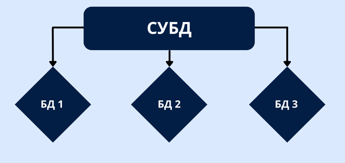

# Лекция 17. СУБД. PostgreSQL. SQL. DDL. Пользователи. DCL. DML. Связи.


## Что такое СУБД?

СУБД - Система управления базами данных. Для тех кто открывал обязательный [прошлый](before_postgres.md) материал, не
секрет, что СУБД — это программное обеспечение, предназначенное для управления, организации и
взаимодействия с базами данных. СУБД позволяет пользователям создавать, читать, обновлять и удалять данные в базе
данных, используя различные команды и запросы.

## PostgreSQL


Мы в рамках нашего курса, все что будет связанно с реляционными базами данных будем выполнять исключительно на
примерах `PostgreSQL`. Потому что при работе с питоном это практически стандарт. Большинство проектов работает именно с
этой СУБД.

### А что если у меня на проекте будет другая СУБД?

А это не страшно, большинство реляционных баз данных работают на абсолютно одинаковых принципах и с практически
идентичными командами. Различия есть, но в рамках нашего курса они настолько не значительны, что если вы поменяете
`PostgreSQL` на, допустим, `MySQL` или `OracleSQL` б вы скорее всего не заметите разницу

### СУБД и БД



В одной СУБД, можно создать бесконечно много БД (баз данных). Так же в рамках СУБД можно создавать пользователей которым
можно выдавать различные права, что бы контролировать что и кто может делать внутри вашей системы.

Обычно в рамках настоящего проекта, под него создается новая база данных и как минимум один пользователь (Как это
сделать расскажу дальше). В такой ситуации мы изолируемся от остальных БД существующих в нашей СУБД, и можем не
переживать о данных для других проектов.

## Таблицы

Главным строительным элементом для БД является `таблица`.

Таблица в БД очень похожа на обычную таблицу в excel. Каждая таблица обычно отвечает за что-то более конкретное,
например "Клиенты", "Товары", "Заказы" итд.

> Таблицы состоят из строк и столбцов. Все столбцы и строки это данные. Обычно одна таблица -> одна сущность, например
> вся информация о книгах в библиотеке

### Рекомендации к именам

Когда вы называете базу/таблицу/столбец есть определенный список негласных правил которых лучше придерживаться

- Используйте существительные там где это возможно
- Используйте маленькие буквы `user`, а не `User` или `USER`
- Если слов больше одного, то `snake_case`
- Не используйте точки, пробелы или тире в названиях
- По возможности, не используйте множественное число

## Строки

В таблицах могут быть сотни, тысячи и даже миллионы строк! Такие строки называются `запись (record)`. Каждая строка в
таблице это одна сущность. Если таблица описывает книги, то одна запись это, например, конкретный "Гарри Поттер и
философский камень" в котором допустим 321 страница.

В идеале каждая строка должна быть хоть чем то, но уникальна

Строки могут быть связаны с другими строками в этой же или других таблицах.

## Столбцы

Столбцы описывают аттрибуты сущности. Они также называются `поля (fields)`. Допустим для книги это может быть, название,
автор, год выпуска и кол-во страниц.

Каждое поле имеет свой конкретный тип данных, `строка`, `число` итд.

### Ограничения

На cтолбцы могут накладываться ограничения. Например, какое-то поле не может быть пустым, или какое-то поле не может
быть меньше определенного значения, например возраст не может быть отрицательным.

## Пример таблицы

| id | first_name | last_name    | country        | birthdate  |
|----|------------|--------------|----------------|------------|
| 1  | Letta      | Casbolt      | Poland         | 1947-04-18 |
| 2  | Robbyn     | Attwoul      | Poland         | 1954-10-17 |
| 3  | Hesther    | Kisby        | Ukraine        | 1941-07-21 |
| 4  | Gav        | Jewett       | Czech Republic | 1988-02-05 |
| 5  | Jorrie     | Klehyn       | United States  | 1941-08-07 |
| 6  | Genevieve  | Ollington    | null           | 1921-08-27 |
| 7  | Carrissa   | Arrandale    | United Kingdom | 1982-08-20 |
| 8  | Josepha    | Dominichelli | Poland         | 1976-12-03 |
| 9  | Ario       | Hepher       | Ukraine        | 2003-10-11 |
| 10 | Walker     | Grolmann     | Poland         | 1964-02-17 |

## Типы данных в БД

### Числовые типы данных

Числовые типы данных используются для хранения чисел различных диапазонов и точности.

- **INTEGER (INT, INT4)**: Хранит целые числа от -2147483648 до 2147483647.
- **BIGINT (INT8)**: Хранит целые числа от -9223372036854775808 до 9223372036854775807.
- **SMALLINT (INT2)**: Хранит целые числа от -32768 до 32767.
- **DECIMAL и NUMERIC**: Хранят числа с фиксированной точностью. Можно задавать точность и масштаб.
- **REAL (FLOAT4)**: Хранит числа с плавающей запятой одинарной точности.
- **DOUBLE PRECISION (FLOAT8)**: Хранит числа с плавающей запятой двойной точности.

> Это далеко не все, но вы должны понимать, что базы данных по сути имеют **сильную** **статическую** типизацию. Причем
> в
> SMALLINT записать значение 50000 уже не получится!

### Строковые типы данных

Строковые типы данных используются для хранения текста различных длин.

- **CHARACTER VARYING (VARCHAR)**: Хранит строки переменной длины с ограничением на длину.
- **CHARACTER (CHAR)**: Хранит строки фиксированной длины. Если длина строки меньше, она дополняется пробелами.
- **TEXT**: Хранит строки переменной длины без ограничения на длину.

### Булевый тип данных

Булевый тип данных (BOOLEAN) используется для хранения логических значений (TRUE или FALSE).

Причем у баз данных есть особенность, такой тип данных может принимать разные значения:

- `true`
- `yes`
- `on`
- `1`

Как True и:

- `false`
- `no`
- `off`
- `0`

Как False.

### Типы данных для даты и времени

Эти типы данных используются для хранения дат, времени и временных интервалов.

- **DATE**: Хранит дату (год, месяц, день).
- **TIME**: Хранит время (часы, минуты, секунды).
- **TIMESTAMP**: Хранит дату и время (год, месяц, день, часы, минуты, секунды).
- **INTERVAL**: Хранит временные интервалы.

> База данных является шикарным калькулятором для даты/времени и умеет выполнять огромное кол-во действий с этими типами
> данных

### NULL

> NULL обозначает отсутствие значения. Это не то же самое, что пустая строка или ноль. NULL используется для обозначения
> неизвестных или неприменимых значений.

### Собственные типы данных через ENUM

ENUM позволяет создавать собственные типы данных с ограниченным набором значений.

Например, если мы вызовем такую команду:

```sql
CREATE TYPE mood AS ENUM ('sad', 'ok', 'happy');
```

А после этого укажем столбцу использовать `mood` как тип данных, то мы сможем заполнить в качестве значений только 3
доступных варианта, все остальное будет просто не доступно.

### Другие типы данных

Помимо перечисленных типов данных, PostgreSQL поддерживает и другие типы, такие как массивы, JSON, XML, UUID,
геометрические типы и т.д. Эти типы данных могут быть полезны для специфических задач и расширяют возможности СУБД. Но в
реальности мы будем видеть их очень и очень редко.

## CRUD


CRUD — это акроним, который обозначает четыре основных операции, используемых при работе с данными в компьютерных
системах и базах данных. CRUD расшифровывается как Create (Создание), Read (Чтение), Update (Обновление) и Delete (
Удаление). Эти операции представляют собой фундаментальные функции, которые используются для управления данными в любой
информационной системе.

С этим акронимом мы будем встречаться абсолютно постоянно. Как в базах данных, так и в вебе целиком.

Рассмотрим каждую из них подробнее.

### Create (Создание)

Операция создания подразумевает добавление новых записей в базу данных. Это может быть регистрация нового пользователя,
добавление нового продукта в каталог или сохранение любой другой новой информации. Создание новых данных обычно требует
ввода необходимых полей, которые будут храниться в базе данных.

### Read (Чтение)

Операция чтения позволяет извлекать данные из базы данных для их просмотра или использования в приложении. Это самая
частая операция, так как большинство приложений в первую очередь предоставляют доступ к уже существующей информации.

### Update (Обновление)

Операция обновления используется для изменения существующих записей в базе данных. Это может включать обновление профиля
пользователя, изменение цены продукта или редактирование любой другой информации.

### Delete (Удаление)

Операция удаления позволяет удалять записи из базы данных. Это может быть удаление учетной записи пользователя, удаление
устаревшего товара из каталога и т.д. Удаление данных часто требует подтверждения, так как оно необратимо.

## SQL (Structured Query Language) (Структурированный язык запросов)


`SQL (Structured Query Language)` — это стандартный язык для управления и манипулирования реляционными базами данных.
Название переводится как "язык структурированных запросов". SQL используется для выполнения различных операций с
данными, таких как создание, чтение, обновление и удаление записей в базе данных. Этот язык позволяет пользователям и
приложениям взаимодействовать с данными, обеспечивая мощные и гибкие средства для работы с большими объемами информации.
SQL является основой для большинства современных СУБД и обеспечивает стандартизированный способ доступа к данным
независимо от конкретной реализации базы данных.

> Пример создания своего типа данных чуть выше как раз был написан на языке `SQL`


На самом деле язык `SQL` делится на 5 небольших подгрупп

Каждая из которых отвечает за свою часть работы с БД.

- `DDL (Data definition language)` - Отвечает за описание создания структур данных (таблиц, связей,
  полей и их типов)
- `DML (Data manipulation language)` - Отвечает за манипуляции с данными, добавить/обновить/удалить записи
- `DQL (Data query language)` - Отвечает за чтение данных из БД
- `DCL (Data control language)` - Отвечает за контроль доступа для различных пользователей
- `TCL (Transaction control language)` - Отвечает за процесс управления транзакциями

### Про синтаксис

В SQL принято указывать системные слова большими буквами, а пользовательские маленькими, технически все будет работать в
любом регистре, но если нет понимания, что какое слово делает, это сильно упрощает понимание написанной команды:

```sql
create database mydb;
```

И

```sql
CREATE DATABASE mydb;
```

Это одно и тоже.

> Каждая команда должна заканчиваться точкой с запятой (`;`) или консоль просто не поймет что вы закончили команду.

## DDL (Data definition language) (Язык определения данных)

`DDL` - подмножество языка SQL, которое отвечает за изменение структуры бд и таблиц

4 основных термина в `DDL`:

- `CREATE` - Создание новых сущностей. Баз данных, пользователей, таблиц итд.
- `ALTER` - Изменение существующих сущностей.
- `DROP` - Удаление существующих сущностей.
- `TRUNCATE` - Удаление всех объектов из базы или таблицы.

### CREATE USER (ROLE)

С чего обычно все начинается? С создания пользователя и самой базы данных.

Зачем нам создавать пользователя? Потому что ваш базовый пользователь обладает абсолютно всеми правами. А это значит,
что если мы будем использовать его в реальных условиях, то если кто-то украдет его пароль, то он получит права к
абсолютно любым действиям. Это не особо хорошо.

Поэтому обычно используется как минимум один юзер с правами к конкретной базе. Иногда их больше и у них права разные, но
как минимум один будет точно.

#### Как создать пользователя?

Для этого можно использовать две равнозначные команды.

```sql
CREATE ROLE new_user;
CREATE USER new_user;
```

Они абсолютно равнозначны.

Юзеры создаются обычно все таки с каким либо паролем, и какими то правами. Для этого используется ключевое слово `WITH`:

```sql
CREATE ROLE name WITH LOGIN SUPERUSER PASSWORD 'password';
```

Тут `LOGIN` и `SUPERUSER` - это права доступа, так мы создали пользователя, который может залогинится в `psql` и у него
будут такие же права как у вашего базового юзера `postgres`. Плюс мы назначили ему пароль.

Про все существующие права можно почитать в документации.

Но все таки самым частым случаем создания пользователя будет просто пользователь с паролем:

```sql
CREATE ROLE my_user WITH PASSWORD 'password';
```

### CREATE DATABASE

Когда мы создали пользователя (А можно и до этого), мы должны создать базу данных. Без базы будет невозможно работать с
базой.

Для этого используется вот эта команда:

```sql
CREATE DATABASE db_name;
```

Тут тоже есть возможные настройки. Две из них которые нас интересуют больше всего.

- ENCODING

```sql
CREATE DATABASE db_name WITH ENCODING 'UTF8';
```

Некоторые операционные системы могут создавать базы данных в своих кодировках. А это значит что при переносе базы на
другой компьютер, могут возникнуть проблемы с их чтением. Поэтому рекомендую создавать базу сразу с универсальной
кодировкой `UTF8`.

- OWNER

```sql
CREATE DATABASE db_name OWNER my_user;
```

Это можно сделать для того, что бы выдать абсолютно все права конкретному пользователю к конкретной базе.

Естественно можно комбинировать.

```sql
CREATE DATABASE db_name WITH ENCODING 'UTF8' OWNER my_user;
```

### DCL

> Тут небольшая вставка про `DCL` - это подмножество языка SQL которое отвечает за права действий различных
> пользователей
> к различным базам

Data Control Language (DCL) является важной частью SQL, предназначенной для управления правами доступа и безопасностью
данных в реляционных базах данных. Основными командами `DCL` являются `GRANT` и `REVOKE`, которые позволяют
администраторам базы данных управлять доступом пользователей к данным и привилегиями на выполнение различных операций.
DCL играет ключевую роль в обеспечении безопасности и защиты данных.

- `GRANT` - предоставить доступ
- `REVOKE` - забрать доступ

#### Что может быть указано после `GRANT` или `REVOKE`

На самом деле там можно указать 13 различных вариантов. Которые позволяют контролировать любые действия связанные с
базами данных/функциями/процедурами/индексами итд.

Вот полный список

- `ALL` - выдать все права
- `SELECT` - разрешить читать данные
- `INSERT` - разрешить создавать данные
- `UPDATE` - разрешить обновлять данные
- `DELETE` - разрешить удалять данные
- `EXECUTE` - разрешить исполнять функции
- `USAGE` - разрешить использовать схемы и секвенции
- `ALTER` - разрешить изменять структуру базы
- `INDEX` - разрешить создавать индексы
- `CREATE` - разрешить создавать сущности
- `DROP` - разрешить удалять сущности
- `REFERENCES` - разрешить изменять связи
- `TRIGGER` - разрешить вызывать триггеры

> Большую часть из них вы пока и не должны понимать. В рамках курса мы изучим большую часть списка.

Примеры:

```sql
GRANT ALL ON DATABASE mydatabase TO admin;
```

Это пример выдачи пользователю `admin` всех прав к базе данных `mydatabase`. Именно так команда нам пока нужна. Что бы
выдать все права пользователю к базе данных.

## Продолжим DDL

Для подключения к базе данных в PostgreSQL используется такая команда:

```sql
\c dbname
```

### CREATE TABLE

Создание таблиц.

Для создания таблицы нужно указать команду `CREATE TABLE`, название таблицы, и описать названия полей и их тип данных.

```sql
CREATE TABLE table_name
(
    first_column  INTEGER,
    second_column NUMERIC,
    third_column  VARCHAR(32),
    fourth_column TEXT
);
```

#### Значение по умолчанию

При создании таблицы мы можем указать, какое значение должно быть в таблице, если оно не указано явно. Например, если не
выбран никакой другой язык использовать английский

```sql
CREATE TABLE profile
(
    name      TEXT,
    last_name TEXT,
    language  TEXT DEFAULT 'English'
);
```

> В SQL для строк используются только одинарные кавычки!! (`'`)

Если значение по умолчанию не указано, и в момент создания не указанно, то таким значением будет `NULL`, но только если
поле может быть налом, иначе вы увидите ошибку.

Так же дефолтными значениями могут быть различные встроенные в базу функции:

```sql
CREATE TABLE product
(
    product_no INTEGER   DEFAULT nextval('product_no_seq'),
    created_at TIMESTAMP DEFAULT CURRENT_TIMESTAMP
);
```

В данном примере в поле `product_no` при каждом новом создании объекта будет записываться следующее целое число начиная
с 1.
А в поле `created_at` время создания этой записи.

#### id

В большинстве таблиц которые вы увидите или создадите, так или иначе будет присутствовать какой-либо уникальный
идентификатор чаще всего он будет называться `id`

Для таких идентификаторов придумали специальное ключевое слово `SERIAL`, которое обозначает, что в этом поле хранится,
не пустое, уникальное целое число. Которое будет генерироваться автоматически. Это очень удобно.

```sql
CREATE TABLE product
(
    id         SERIAL,
    created_at TIMESTAMP DEFAULT CURRENT_TIMESTAMP
);
```

#### Виртуальные столбцы

Часто есть необходимость хранить данные сразу в нескольких форматах (цельсий и фаренгейт, сантиметры и дюймы), в этой
ситуации нет никакого смысла хранить сразу несколько значений, можно создать виртуальное поле при помощи
слова `GENERATED`:

```sql
CREATE TABLE person
(
    height_cm NUMERIC,
    height_in NUMERIC GENERATED ALWAYS AS (height_cm / 2.54) STORED
);
```

Такое поле не занимает места в памяти, а только вычисляется на этапе чтения данных.

#### Ограничения

На поле в БД можно накладывать ограничения, и это невероятно важная часть SQL.

Для этого используются ключевые слова `CONSTRAINT` и `CHECK`

```sql
CREATE TABLE product
(
    product_no       INTEGER,
    name             TEXT,
    price            NUMERIC
        CONSTRAINT price_positive CHECK (price > 0),
    discounted_price NUMERIC CHECK (discounted_price > 0),
    CHECK (price > discounted_price)
);
```

Ограничения можно накладывать как на поле, так и на всю таблицу указав `CHECK` после всех полей.
`CONSTRAINT` - задает ограничению имя и является не обязательным. `CHECK` указывает условие ограничения.

##### NOT NULL

Специальным ограничением является запрел для поля иметь значение `NULL` и оно пишется как `NOT NULL`

```sql
CREATE TABLE product
(
    name TEXT NOT NULL CHECK (length(name) > 0)
);
```

Мы запретили значению `name` быть пустым и запретили записать туда пустую строку.

#### UNIQUE

Так же мы можем заставить базу хранить только уникальные значения.

```sql
CREATE TABLE example
(
    a INTEGER,
    b INTEGER UNIQUE,
    c INTEGER,
    UNIQUE (a, c)
);
```

Так же как и с `CHECK`, можно указать уникальность конкретного поля, так и совокупность полей.

Например в отеле у вас номер и дата заезда должны быть только уникальны вместе. Потому что нельзя заселить в номер 211
разных гостей в одну дату. Но в эту дату можно заселить в другой номер, и в этот номер можно заселить в другую дату.

### ALTER (Изменить)

Ключевое слово `ALTER` используется когда нам нужно изменить структуру существующей таблицы.

Используется для:

- Добавить поля
- Изменить тип данных поля
- Добавить ограничение
- Изменить значение по умолчанию
- Переименовать поле
- Переименовать таблицу

Давайте смотреть примеры:

#### Добавить поле

```sql
CREATE TYPE book_genre AS ENUM (
    'Adventure',
    'Biography',
    'Comedy',
    'Crime',
    'Drama'
    );


CREATE TABLE book
(
    id         SERIAL,
    title      VARCHAR(255) NOT NULL,
    language   VARCHAR(64),
    page_count INTEGER
);

ALTER TABLE book
    ADD COLUMN genre book_genre;
```

Я создал свой тип данных, создал таблицу и добавил поле с типом данных который сам же и создал.

> Обратите внимание на все ключевые слова! Они написаны большими буквами

### Кстати для любой таблицы и любой колонки можно добавить комментарий для других разработчиков

```sql
COMMENT
    ON TABLE book IS 'table for books';
COMMENT
    ON COLUMN book.title IS 'title of book';
COMMENT
    ON COLUMN book.language IS 'language of book';
COMMENT
    ON COLUMN book.page_count IS 'amount of pages';
```

#### Изменить тип данных

```sql
ALTER TABLE book
    ALTER COLUMN language TYPE TEXT;
```

#### Добавить ограничение

```sql
ALTER TABLE book
    ADD CONSTRAINT title_constraint UNIQUE (title);
```

#### Изменить значение по умолчанию

```sql
ALTER TABLE book
    ALTER COLUMN language SET DEFAULT 'English';
```

#### Переименовать поле или ограничение

```sql
ALTER TABLE book
    RENAME COLUMN language TO yazik;
ALTER TABLE book
    RENAME CONSTRAINT title_constraint TO t_cnst;
```

### DROP

Удаление чего-либо из структуры СУБД

Используется для:

- Удалить ограничение
- Удалить значение по умолчанию
- Удалить поле
- Удалить таблицу
- Удалить базу данных

#### Удалить ограничение

```sql
ALTER TABLE book
    DROP CONSTRAINT t_cnst;
```

#### Удалить значение по умолчанию

```sql
ALTER TABLE book
    ALTER COLUMN language
        DROP DEFAULT;
```

#### Удалить поле

```sql
ALTER TABLE book
    DROP COLUMN language;
```

#### Удалить таблицу

```sql
DROP TABLE book;
```

#### Удалить базу

```sql
DROP DATABASE mydb;
```

## DML (Data manipulating language) (Язык манипулирования данными)

`DML` - подмножество языка `SQL`, которое отвечает за добавление, изменение и удаление данных.

Ключевые слова:

- `INSERT` - используется для добавления данных.
- `UPDATE` - используется для обновления данных.
- `DELETE` - используется для удаления данных.

### Создание новых записей

Когда таблица создана, в ней нет каких записей (данных). Вставка (`INSERT`) данных заполнит таблицу. Записи можно
добавлять как по одной, так и по несколько. Но нельзя добавить не целую запись.

> Для добавления записи в таблицу используется `INSERT`

Значения в записях перечисляются через запятую в том порядке, в котором они находятся в таблице. Если вы не знаете этого
порядка, то вы можете указать какое значение соответствует какому полю явно. Если вы указываете не все значения, то база
автоматически попытается заполнить значением по умолчанию.

```sql
CREATE TABLE publisher
(
    id      SERIAL,
    name    VARCHAR(128) NOT NULL CHECK (LENGTH(name) > 0),
    website VARCHAR(255) UNIQUE,
    email   VARCHAR(255),
    phone   VARCHAR(32) UNIQUE
);
```

Пример вставки данных:

- 1 способ с указанием полей как строк
- 2 способ указание полей прямо
- 3 способ без указания полей, но соблюдая порядок

```sql
INSERT INTO "publisher" ("id", "name", "website", "email", "phone")
VALUES (1, 'Zoonoodle', 'https://sfgate.com', 'bhaile0@blogtalkradio.com', '+55 (465) 224-8652');
INSERT INTO publisher (id, name, website, email, phone)
VALUES (2, 'Brainlounge', 'http://php.net', 'bfindlow1@paginegialle.it', '+389 (482) 470-2463');
INSERT INTO publisher
VALUES (3, 'Tanoodle', 'http://dyndns.org', 'cfleisch2@scribd.com', '+23 (852) 867-5041');
```

#### Создание записей массово (bulk creation)

Так же можно вставлять более одной записи за один запрос:

```sql
CREATE TABLE author
(
    id         SERIAL,
    first_name VARCHAR(128) NOT NULL,
    last_name  VARCHAR(128) NOT NULL,
    country    VARCHAR(255),
    dob        DATE CHECK (dob < NOW() - INTERVAL '10 years'),
    CHECK (LENGTH(first_name) > 0),
    CHECK (LENGTH(last_name) > 0)
);
-- вставка множества записей за одну команду 
INSERT INTO author (first_name, last_name, country, dob)
VALUES ('Letta', 'Casbolt', 'Poland', '1947-04-18'),
       ('Robbyn', 'Attwoul', 'Poland', '1954-10-17'),
       ('Hesther', 'Kisby', 'Ukraine', '1941-07-21'),
       ('Gav', 'Jewett', 'Czech Republic', '1988-02-05'),
       ('Jorrie', 'Klehyn', 'United States', '1941-08-07'),
       ('Genevieve', 'Ollington', 'United States', '1921-08-27'),
       ('Carrissa', 'Arrandale', 'United Kingdom', '1982-08-20'),
       ('Josepha', 'Dominichelli', 'Poland', '1976-12-03'),
       ('Montague', 'Duerden', 'Poland', '2003-11-09');
```

#### Создание записей из файла

База данных умеет читать некоторые форматы файлов, для того что бы превратить строки файла в записи в базе данных:

```sql
-- require superuser access or `pg_read_server_files` role priveleges
COPY book (id, title, synopsis, isbn, publisher_id, publication_date, genre, language, page_count,
           keywords) FROM '/var/lib/postgresql/assets/book.csv' DELIMITER ',' CSV HEADER;
-- update id sequence value
SELECT SETVAL('book_id_seq', (SELECT MAX(id) FROM book));
```

### Изменение записей

Для того что бы обновить данные нужно знать 3 вещи.

1. Какая таблица и какое поле будет обновлено
2. Какое будет новое значение
3. Какую именно запись мы обновляем

Синтаксис выглядит так:

```sql
UPDATE book
SET language = 'uk'
WHERE id = 3;
```

Где `book` - таблица, `language` - поле, `uk` - новое значение, `WHERE id = 3` - выбор объекта для обновления.

> Внутри `SET` может быть указано больше одного поля

> `WHERE` является не обязательным атрибутом. Но если вы не укажете его, то вы обновите поля для **ВСЕХ** записей в
> таблице.

### Удаление записей

Все очень просто. Что бы удалить запись используется вот такой синтаксис:

```sql
DELETE
FROM book
WHERE id = 3;
```

Для удаления записи с `id` = 3 из таблицы `book`.

> Если не указать `WHERE` то вы удалите все записи!!!

```sql
DELETE
FROM book;
```

### Возврат значений после записи

Если вам нужно сразу после создания записей получить какие-то данных от них это можно сделать через слово `RETURNING`:

```sql
INSERT INTO author (first_name, last_name, country, birthdate)
VALUES ('Wendye', 'Rowbotham', 'Poland', '1932-12-16'),
       ('Grannie', 'Kidner', 'United States', '1940-02-21'),
       ('Godart', 'Van Driel', 'United Kingdom', '1980-01-02'),
       ('Meara', 'Meenehan', 'United States', '1994-12-13')
RETURNING id;
```

Такая запись вернет все `id` для созданных объектов.

## Связи


Настало время поговорить о связях в базе данных. Не просто так они называются реляционные (relate - отношение)

### Ключевые слова

#### PRIMARY KEY

Ключевое слово `PRIMARY KEY` используется для определения уникального идентификатора записи в таблице. Каждая таблица
может иметь только один первичный ключ, и значения в этом ключе должны быть уникальными и не NULL.

> Чаще всего PK (`PRIMARY KEY`) является `id`. Это не всегда так, но это очень частый случай.

#### FOREIGN KEY

Ключевое слово `FOREIGN KEY` используется для создания связи между таблицами. Внешний ключ — это столбец или набор
столбцов в одной таблице, которые ссылаются на первичный ключ другой таблицы. Внешний ключ обеспечивает ссылочную
целостность данных, гарантируя, что значения в этом столбце соответствуют значениям в связанном столбце другой таблицы.

#### REFERENCES

Ключевое слово `REFERENCES` используется в сочетании с `FOREIGN KEY` для указания таблицы и столбца, на которые
ссылается внешний ключ. Это позволяет PostgreSQL следить за тем, чтобы значения внешнего ключа соответствовали значениям
первичного ключа в другой таблице.

### Основные концепции связей в реляционных базах данных

Для базы данных существует только одна связь. Через `FOREIGN KEY`. Все остальное является абстракциями, но мы будем ими
очень много пользоваться, поэтому нам надо познакомиться с 3(с половиной) видами связей.

#### Типы связей

1. **Связь "один к одному" (One-to-One)**
2. **Связь "один ко многим" (One-to-Many)**
3. **Связь "многие ко многим" (Many-to-Many)**
4. **Самоссылочные связи (Self-Referenced Relationships)** (Технически это тоже 1 ко многим)

#### Примеры использования

1. **"Один к одному":** Каждый сотрудник имеет один уникальный паспорт.
2. **"Один ко многим":** Один пользователь может сделать много заказов.
3. **"Многие ко многим":** Студенты записываются на несколько курсов, и каждый курс имеет много студентов.
4. **Самоссылочные связи:** Сотрудник может быть подчиненным другого сотрудника. (А комментарий ответом на другой
   комментарий)

### Реализация связей в PostgreSQL

#### Связь "один к одному" (One-to-One)

Для создания связи "один к одному" можно использовать уникальные ключи и внешние ключи.

Пример:

```sql
CREATE TABLE employee
(
    id   SERIAL PRIMARY KEY,
    name VARCHAR(100) NOT NULL
);

CREATE TABLE passport
(
    id              SERIAL PRIMARY KEY,
    employee_id     INT UNIQUE  NOT NULL,
    passport_number VARCHAR(20) NOT NULL,
    FOREIGN KEY (employee_id) REFERENCES employee (id)
);
```

Обратите внимание, поле `employee_id` содержит модификатор `UNIQUE` именно он обеспечивает нам связь `1-to-1`, без него
это была бы `1-to-many` как в следующем примере.

### Связь "один ко многим" (One-to-Many)

Это самая распространенная связь, которая создается с помощью внешнего ключа.

Пример:

```sql
CREATE TABLE user
(
    id   SERIAL PRIMARY KEY,
    name VARCHAR(100) NOT NULL
);

CREATE TABLE order
(
    id         SERIAL PRIMARY KEY,
    order_date DATE NOT NULL,
    user_id    INT  NOT NULL,
    FOREIGN KEY (user_id) REFERENCES user (id)
);
```

### Связь "многие ко многим" (Many-to-Many)


Для реализации связи "многие ко многим" необходимо создать промежуточную таблицу.

Пример:

```sql
CREATE TABLE student
(
    id   SERIAL PRIMARY KEY,
    name VARCHAR(100) NOT NULL
);

CREATE TABLE course
(
    id          SERIAL PRIMARY KEY,
    course_name VARCHAR(100) NOT NULL
);

CREATE TABLE student_course
(
    student_id INT NOT NULL,
    course_id  INT NOT NULL,
    PRIMARY KEY (student_id, course_id),
    FOREIGN KEY (student_id) REFERENCES student (id),
    FOREIGN KEY (course_id) REFERENCES course (id)
);
```

### Самоссылочные связи (Self-Referenced Relationships)


Самоссылочные связи используются, когда строки в таблице могут ссылаться на другие строки в той же таблице. Это полезно
для создания иерархических структур, таких как отношения "начальник-подчиненный".

> Технически это такой же `FOREIGN KEY` просто в качестве 2 таблиц используется одна и та же

Пример:

```sql
CREATE TABLE employee
(
    id         SERIAL PRIMARY KEY,
    name       VARCHAR(100) NOT NULL,
    manager_id INT,
    FOREIGN KEY (manager_id) REFERENCES employee (id)
);
```

В данном примере `manager_id` ссылается на `id` в той же таблице, создавая иерархию сотрудников.

Обратите внимание тут `manager_id` может быть `NULL` потому что иначе мы не сможем создать `директора`, того у кого
начальника нет.

### Важность соблюдения ссылочной целостности

Ссылочная целостность обеспечивает корректность и непротиворечивость данных. В PostgreSQL для этого используются
ограничения внешних ключей (FOREIGN KEY), которые позволяют следить за тем, чтобы ссылки между таблицами оставались
корректными.

Пример нарушения ссылочной целостности:

```sql
-- Попытка вставки записи в таблицу orders с несуществующим user_id
INSERT INTO order (order_date, user_id)
VALUES ('2024-07-30', 999);
```

> Этот запрос вызовет ошибку, так как user_id = 999 отсутствует в таблице users.

### ON DELETE

Когда мы создаем внешний ключ, мы можем указать различные параметры для `ON DELETE`, чтобы определить поведение системы
при удалении записей в родительской таблице. Рассмотрим основные из них.

#### CASCADE

Параметр `ON DELETE CASCADE` означает, что при удалении записи в родительской таблице, автоматически будут удалены все
связанные записи в дочерней таблице.

**Пример:**

```sql
CREATE TABLE orders
(
    id         SERIAL PRIMARY KEY,
    student_id INT,
    order_date DATE,
    FOREIGN KEY (student_id) REFERENCES students (id) ON DELETE CASCADE
);
```

**Работа:**

```sql
-- Удаляем студента с id = 1
DELETE
FROM students
WHERE id = 1;
-- Автоматически удаляются все заказы, связанные с этим студентом
```

#### SET NULL

Параметр `ON DELETE SET NULL` устанавливает значение внешнего ключа в `NULL` при удалении записи в родительской таблице.
Это полезно, если нужно сохранить связанные записи, но удалить связь с родительской записью.

**Пример:**

```sql
CREATE TABLE orders
(
    id         SERIAL PRIMARY KEY,
    student_id INT,
    order_date DATE,
    FOREIGN KEY (student_id) REFERENCES students (id) ON DELETE SET NULL
);
```

**Работа:**

```sql
-- Удаляем студента с id = 1
DELETE
FROM students
WHERE id = 1;
-- Поле student_id в таблице orders для всех связанных записей становится NULL
```

#### SET DEFAULT

Параметр `ON DELETE SET DEFAULT` устанавливает значение внешнего ключа в значение по умолчанию при удалении записи в
родительской таблице. Это значение должно быть указано при создании таблицы.

**Пример:**

```sql
CREATE TABLE orders
(
    id         SERIAL PRIMARY KEY,
    student_id INT DEFAULT 0,
    order_date DATE,
    FOREIGN KEY (student_id) REFERENCES students (id) ON DELETE SET DEFAULT
);
```

**Работа:**

```sql
-- Удаляем студента с id = 1
DELETE
FROM students
WHERE id = 1;
-- Поле student_id в таблице orders для всех связанных записей устанавливается в 0
```

#### RESTRICT

Параметр `ON DELETE RESTRICT` предотвращает удаление записи в родительской таблице, если существуют связанные записи в
дочерней таблице. Это полезно для предотвращения удаления данных, которые еще используются.

**Пример:**

```sql
CREATE TABLE orders
(
    id         SERIAL PRIMARY KEY,
    student_id INT,
    order_date DATE,
    FOREIGN KEY (student_id) REFERENCES students (id) ON DELETE RESTRICT
);
```

**Работа:**

```sql
-- Попытка удаления студента с id = 1, если есть связанные заказы
DELETE
FROM students
WHERE id = 1;
-- Возвращает ошибку и предотвращает удаление
```

#### NO ACTION

Параметр `ON DELETE NO ACTION` является значением по умолчанию и ведет себя аналогично `RESTRICT`. Он также
предотвращает удаление записи в родительской таблице, если существуют связанные записи в дочерней таблице. Однако
проверка ограничения выполняется после попытки удаления, что позволяет выполнение других операций до проверки
ограничения.

**Пример:**

```sql
CREATE TABLE orders
(
    id         SERIAL PRIMARY KEY,
    student_id INT,
    order_date DATE,
    FOREIGN KEY (student_id) REFERENCES students (id) ON DELETE NO ACTION
);
```

**Работа:**

```sql
-- Попытка удаления студента с id = 1, если есть связанные заказы
DELETE
FROM students
WHERE id = 1;
-- Возвращает ошибку и предотвращает удаление
```
