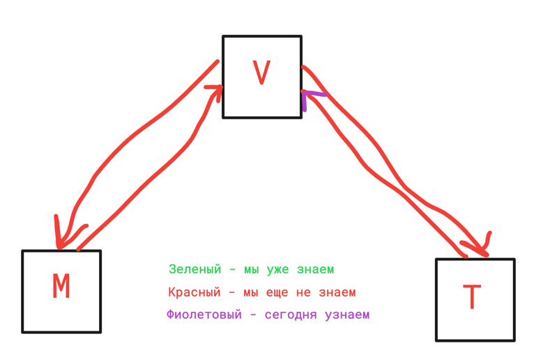

# Лекция 19. Знакомство с Django

### Оглавление курса

<details>
  <summary>Блок 1 — Python Basic (1–6)</summary>

  - [Лекция 1. Введение. Типизации. Переменные. Строки и числа. Булева алгебра. Ветвление](lesson01.md)
  - [Лекция 2. Обработка исключений. Списки, строки детальнее, срезы, циклы.](lesson02.md)
  - [Лекция 3. None. Range, list comprehension, sum, max, min, len, sorted, all, any. Работа с файлами](lesson03.md)
  - [Лекция 4. Хэш-таблицы. Set, frozenset. Dict. Tuple. Немного об импортах. Namedtuple, OrderedDict](lesson04.md)
  - [Лекция 5. Функции, типизация, lambda. Map, zip, filter.](lesson05.md)
  - [Лекция 6. Алгоритмы и структуры данных](lesson06.md)
</details>

<details>
  <summary>Блок 2 — Git (7–8)</summary>

  - [Лекция 7. Git. История системы контроля версий. Локальный репозиторий. Базовые команды управления репозиторием.](lesson07.md)
  - [Лекция 8. Git. Удаленный репозиторий. Remote, push, pull. GitHub, Bitbucket, GitLab, etc. Pull request.](lesson08.md)
</details>

<details>
  <summary>Блок 3 — Python Advanced (9–14)</summary>

  - [Лекция 9. Введение в ООП. Основные парадигмы ООП. Классы и объекты. Множественное наследование.](lesson09.md)
  - [Лекция 10. Magic methods. Итераторы и генераторы.](lesson10.md)
  - [Лекция 11. Imports. Standard library. PEP 8](lesson11.md)
  - [Лекция 12. Декораторы. Декораторы с параметрами. Декораторы классов (staticmethod, classmethod, property)](lesson12.md)
  - [Лекция 13. Тестирование](lesson13.md)
  - [Лекция 14. Проектирование. Паттерны. SOLID.](lesson14.md)
</details>

<details>
  <summary>Блок 4 — SQL (15–17)</summary>

  - [Лекция 15. СУБД. PostgreSQL. SQL. DDL. Пользователи. DCL. DML. Связи.](lesson15.md)
  - [Лекция 16. СУБД. DQL. SELECT. Индексы. Group by. Joins.](lesson16.md)
  - [Лекция 17. СУБД. Нормализация. Аномалии. Транзакции. ACID. TCL. Backup](lesson17.md)
</details>

- [Лекция 18. Virtual env. Pip. Устанавливаемые модули. Pyenv.](lesson18.md)

<details open>
  <summary>Блок 5 — Django (19–26)</summary>

  - ▶ **Лекция 19. Знакомство с Django**
  - [Лекция 20. Templates. Static](lesson20.md)
  - [Лекция 21. Модели. Связи. Meta. Abstract, proxy.](lesson21.md)
  - [Лекция 22. Django ORM.](lesson22.md)
  - [Лекция 23. Forms, ModelForms. User, Authentication.](lesson23.md)
  - [Лекция 24. ClassBaseView](lesson24.md)
  - [Лекция 25. NoSQL. Куки, сессии, кеш](lesson25.md)
  - [Лекция 26. Логирование. Middleware. Signals. Messages. Manage commands](lesson26.md)
</details>

<details>
  <summary>Блок 6 — Django Rest Framework (27–30)</summary>

  - [Лекция 27. Что такое API. REST и RESTful. Django REST Framework.](lesson27.md)
  - [Лекция 28. @api_view, APIView, ViewSets, Pagination, Routers](lesson28.md)
  - [Лекция 29. REST-аутентификация. Авторизация. Permissions. Фильтрация.](lesson29.md)
  - [Лекция 30. Тестирование. Django, REST API.](lesson30.md)
</details>

<details>
  <summary>Блок 7 — Python async (31–33)</summary>

  - [Лекция 31. Celery. Multithreading. GIL. Multiprocessing](lesson31.md)
  - [Лекция 32. Asyncio. Aiohttp. Асинхронное программирование на практике.](lesson32.md)
  - [Лекция 33. Сокеты. Django Channels.](lesson33.md)
</details>

<details>
  <summary>Блок 8 — Deployment (34–35)</summary>

  - [Лекция 34. Linux. Все что нужно знать для деплоймента.](lesson34.md)
  - [Лекция 35. Deployment](lesson35.md)
</details>

- [Лекция 36. Методологии разработки. CI/CD. Монолит и микросервисы. Docker](lesson36.md)


## Как работает интернет, и что именно мы будем изучать?

В рамках этого курса мы изучим то, как можно создавать сайты и приложения. Я надеюсь, ни для кого не окажется секретом,
что любой сайт или приложение работают в сети интернет. Но как именно?

На самом деле большая часть работы — это результат выполнения различных запросов, и в первую очередь — запросов по
протоколу `http` (скорее, `https`, о чём мы поговорим значительно позже).

Когда вы набираете в браузере URL или просто переходите по закладкам или ссылкам, на самом деле вы заставляете браузер
создавать и отправлять `GET` HTTP-запрос. А когда вводите имя пользователя и пароль, чаще всего после кнопки, например,
«Войти», вы формируете и отправляете `POST` HTTP-запрос.

## Request-response, он же клиент-сервер

Чаще всего при работе с веб-ресурсами мы будем иметь дело с так называемым
взаимодействием `запрос-ответ`, что на английском звучит как `request-response`.

А это значит, что у нас есть кто-то, кто "спрашивает". И кто-то, кто "отвечает".

### Кто может спрашивать?

На самом деле спрашивать может любое устройство или приложение, которое способно
сформировать `http` запрос, а в современном мире это уже почти любое устройство, включая чайники, часы и стиральные
машины.

Но в самом распространённом варианте это всё-таки будут:

- Веб-браузеры (Chrome, Mozilla, Opera, их мобильные аналоги и т. п.)
- Приложения (Instagram, Telegram и т. п. Приложения бывают не только мобильные, но и для компьютера или планшета, и мы
  даже будем ими пользоваться в рамках курса)


### Кто может отвечать?

Отвечать может только сервер.

В отличие от задающего вопрос, отвечать может только специально подготовленный сервер.
Сервером может являться любое электронное устройство, на котором можно запустить необходимый набор программ или
команд. В рамках обучения вы будете запускать сервер прямо на ваших компьютерах, при разработке так обычно и делается,
но реальные сайты и приложения обычно располагаются на специально подготовленных, изолированных или облачных
компьютерах, и в случае веб-приложения на python это практически всегда будет компьютер с операционной системой
Linux, зачем и как это настроить, мы поговорим ближе к концу нашего курса.

## HTTP

### Что такое HTTP?


HTTP (HyperText Transfer Protocol) — это протокол передачи данных, который используется для общения между клиентом
и сервером в интернете. Когда вы открываете сайт в браузере, браузер отправляет HTTP-запрос на сервер, а сервер
отвечает HTTP-ответом.

Представьте HTTP как язык общения между вашим браузером и сервером. Как в обычном разговоре есть правила (поздороваться,
задать вопрос, получить ответ), так и в HTTP есть чёткая структура общения.

#### Структура HTTP-запроса

Каждый HTTP-запрос состоит из нескольких частей:

1. **Стартовая строка (Request Line)** — содержит:
   - Метод (GET, POST и т.д.) — что мы хотим сделать
   - URL — куда мы обращаемся
   - Версия протокола (HTTP/1.1, HTTP/2)

2. **Заголовки (Headers)** — служебная информация:
   - `Host` — адрес сервера
   - `User-Agent` — информация о браузере
   - `Content-Type` — тип передаваемых данных
   - И многие другие

3. **Тело запроса (Body)** — данные, которые мы отправляем (не всегда присутствует)

Пример простого GET-запроса:
```
GET /articles/1/ HTTP/1.1
Host: example.com
User-Agent: Mozilla/5.0
```

#### Структура HTTP-ответа

Сервер отвечает похожей структурой:

1. **Стартовая строка** — содержит:
   - Версия протокола
   - Код статуса (200, 404, 500 и т.д.)
   - Текстовое описание статуса

2. **Заголовки** — служебная информация ответа

3. **Тело ответа** — сами данные (HTML-страница, JSON, картинка и т.д.)

Пример ответа:
```
HTTP/1.1 200 OK
Content-Type: text/html

<html>...</html>
```

### HTTP-методы


Метод HTTP определяет, какое действие мы хотим выполнить. Это ответ на вопрос **"Как?"** мы обращаемся к серверу.

#### GET — получить данные

Самый распространённый метод. Используется для получения информации с сервера.

Когда вы:
- Открываете любой сайт в браузере
- Смотрите список статей в блоге
- Читаете комментарии под постом
- Открываете видео на YouTube

...браузер отправляет GET-запрос.

GET-запрос может содержать **query-параметры** — дополнительные данные в URL после знака `?`:

```
https://www.youtube.com/watch?v=dQw4w9WgXcQ&t=42s
```

Здесь `v=dQw4w9WgXcQ` и `t=42s` — это query-параметры. Они используются для уточнения запроса (фильтры, сортировка,
идентификаторы).

> **Важно:** GET-запросы не должны изменять данные на сервере. Они только читают.

#### POST — отправить данные

Используется для отправки данных на сервер и создания новых ресурсов.

Когда вы:
- Входите на сайт (логин/пароль)
- Оставляете комментарий
- Отправляете сообщение
- Оформляете заказ в интернет-магазине
- Загружаете файл

...браузер отправляет POST-запрос.

Данные передаются в теле запроса, а не в URL, поэтому POST безопаснее для передачи конфиденциальной информации.

#### PUT и PATCH — обновить данные

- **PUT** — полная замена ресурса (отправляем все поля)
- **PATCH** — частичное обновление (отправляем только изменённые поля)

Примеры: изменить текст статьи, обновить профиль пользователя, изменить пароль.

Подробно будем разбираться с ними в следующем блоке курса.

#### DELETE — удалить данные

Используется для удаления ресурсов: удалить комментарий, удалить статью, удалить аккаунт.

Подробно рассмотрим в следующем блоке.

#### Другие методы

Существуют и другие методы (HEAD, OPTIONS, TRACE), которые используются реже. О некоторых из них расскажу позже
на практических примерах.

### URL — куда отправляем запрос


Мы разобрались с HTTP-методами — это ответ на вопрос **"Как?"** мы обращаемся к серверу. Но есть ещё один
важный вопрос — **"Куда?"**. На него отвечает URL.

URL (Uniform Resource Locator) — это унифицированный указатель ресурса, который используется для идентификации и доступа
к ресурсам в Интернете. URL указывает на адрес ресурса и способ его получения. URL состоит из нескольких частей, каждая
из которых имеет своё предназначение.

#### Структура URL

Вот основные компоненты URL:

1. **Схема (Scheme)**:
    - Определяет протокол, используемый для доступа к ресурсу. Наиболее распространённые схемы
      включают `http`, `https`, `ftp`, `mailto` и другие.
    - Пример: `https`
   > Мы будем практически до конца курса использовать только `http`

2. **Имя хоста (Hostname)**:
    - Указывает на доменное имя или IP-адрес сервера, на котором размещен ресурс.
    - Пример: `www.example.com`
   > Мы будем использовать `127.0.0.1` тоже практически до конца
3. **Порт (Port)** (необязательный):
    - Определяет порт, через который происходит соединение. Если порт не указан, используются порты по умолчанию для
      соответствующих схем (например, 80 для HTTP и 443 для HTTPS).
    - Пример: `:443`
   > Мы будем использовать `8000` тоже практически до конца

4. **Путь (Path)**:
    - Указывает на конкретный ресурс на сервере, такой как файл или страница.
    - Пример: `/path/to/resource`

   > Вот эта та часть, которую мы сегодня и научимся программировать

5. **Запрос (Query)** (необязательный):
    - Содержит дополнительные параметры, передаваемые на сервер. Запрос начинается с символа `?`, и параметры
      разделяются символами `&`.
    - Пример: `?key1=value1&key2=value2`

6. **Фрагмент (Fragment)** (необязательный):
    - Указывает на часть ресурса, такую как якорь внутри страницы. Фрагмент начинается с символа `#`.
    - Пример: `#section1`

#### Пример полного URL

```plaintext
https://www.example.com:443/path/to/resource?key1=value1&key2=value2#section1
```

#### Использование URL

URL используется во многих контекстах:

- Веб-браузеры используют URL для доступа к веб-страницам.
- API используют URL для отправки запросов к веб-сервисам.
- Программы и скрипты используют URL для загрузки файлов или доступа к удаленным ресурсам.

URL является важной частью Интернета, обеспечивая стандартизированный способ указания на ресурсы и взаимодействия с
ними.

### Коды статусов HTTP


Когда сервер отвечает на запрос, он возвращает **код статуса** — число, которое говорит о результате обработки запроса.

- **1xx — Информационные**
  - `100 Continue` — сервер получил начало запроса, клиент может продолжать
  - `101 Switching Protocols` — сервер переключается на другой протокол (например, WebSocket)

- **2xx — Успех**
  - `200 OK` — всё хорошо, запрос выполнен
  - `201 Created` — ресурс успешно создан

- **3xx — Перенаправление**
  - `301 Moved Permanently` — ресурс переехал навсегда
  - `302 Found` — временное перенаправление

- **4xx — Ошибка клиента**
  - `400 Bad Request` — неправильный запрос
  - `401 Unauthorized` — требуется авторизация
  - `403 Forbidden` — доступ запрещён
  - `404 Not Found` — ресурс не найден

- **5xx — Ошибка сервера**
  - `500 Internal Server Error` — ошибка на сервере
  - `503 Service Unavailable` — сервер временно недоступен

> Подробнее о структуре HTTP-сообщений можно почитать
> [тут](https://developer.mozilla.org/ru/docs/Web/HTTP/Messages).

---

Таким образом, каждый HTTP-запрос и ответ можно описать тремя ключевыми элементами:
- **Метод** — что мы хотим сделать (GET, POST, PUT, DELETE)
- **URL** — куда мы обращаемся (адрес ресурса)
- **Код статуса** — что получилось (200, 404, 500 и т.д.)

## Шаблон проектирования MVC


Для разработки сложных решений используются шаблоны проектирования (`patterns`).

> Если вы собираетесь строить дом, я сомневаюсь, что нужно придумывать собственный способ его постройки. Залить
> фундамент, на него поставить каркас, в каркасе провести коммуникации и сделать отделку.

> Придумывание своих путей постройки дома, скорее всего, приведёт либо к неудовлетворительному результату, либо к
> невозможности достичь результата
> вообще.

Так вот, в программировании тоже все стандартные решения придумали за нас. Называются они паттерны, и вы уже слышали
этот термин, когда обсуждали такие вещи как ООА\ООД\ООП.

В данный момент для нас с точки зрения создания веб-ресурсов самым важным из них является `MVC` **(Model - View -
Controller) (Модель - Отображение - Контроллер)**

### Что же это такое?

Это архитектурный паттерн.

А по сути это разделение обязанностей между тремя зависимыми блоками.

#### Ресторан


Давайте посмотрим на работу обычного ресторана.

Клиент приходит, садится за столик и видит только меню и официанта.
Выбрав что-то из меню, через официанта он отправляет запрос на кухню на приготовление его блюда. Официант в свою очередь
идёт к поварам, чтобы сообщить о
заказе, а повар, получив заказ, должен сначала понять, есть ли у него необходимые продукты и работает ли плита или
духовка. В том случае, если всё хорошо, то повар готовит блюдо и после отдаёт его официанту, который и выносит блюдо
клиенту.

Получается, что клиент видел только меню и конечное блюдо, но не видел повара или, тем более, склад с продуктами, но
ожидаемый результат всё-таки получил.

Большая часть сайтов или приложений так же делится на три компонента, `Model` - `View` - `Controller`

Если рассматривать пример с рестораном, то зал, в котором находится клиент, его столик и его тарелка будут
являться `Отображением`, оно же `View`, В случае с сайтом или приложением, этим элементом является всё что может увидеть
пользователь.

Официант, который принимает заказ и выносит блюдо, является в этой аналогии `http` запросами и ответами. И общается
только с `Контроллером`, он же `Controller`

Кухня и повара на ней будут являться `Контроллером`, так как они могут принимать запросы от официантов, но при этом
могут сходить и на склад посмотреть, например, на наличие продуктов, а склад в нашем случае будет являться
моделью, `Model`. При написании веб-приложения, контроллером будет являться та часть кода, которая отвечает за обработку
запросов. И так же выполнять действия и с отображением, и с моделью.

Склад в этой конструкции будет являться моделью, `Model`, официант или клиент, не могут пойти на склад и взять себе
продуктов, это может сделать только повар, так же только повар может принять продукты у поставщика и добавить их на
склад. В случае с веб-приложениями моделью является абстракция над `базой данных`, и код, который отвечает за
взаимодействие с ней.

При этом клиент не может заказать всё, что ему захочется, ему нужно будет выбрать из `меню`.

Сегодня мы изучим, как именно формируется `меню` для Django, и что это вообще.


По этому же принципу работает и Django, но с немного другими названиями, паттерн
называется `MVT` (`Model` - `View` - `Template`)

- `View` играет роль `Controller`
- `Template` играет роль `View`

> Но это точно такая же идея, изменились только названия блоков.

## Django


**Django** — это веб-фреймворк, а фреймворк — это конструктор, который помогает нам собирать блоки, часто даже
не задумываясь, как именно это работает под капотом.


Основной информационный ресурс [Django](https://www.djangoproject.com/)

## Наконец-то практика

> Всё, что мы делаем, мы делаем со свежим, только что созданным, активированным `ВИРТУАЛЬНЫМ ОКРУЖЕНИЕМ!!`

### Создадим новый проект

Для создания проекта создаём виртуальное окружение и активируем его (описание в прошлой лекции).

После чего необходимо выполнить два действия:

- Установить Django
- Перейти в папку, где мы собираемся создать проект, в котором будем писать код.

Порядок этих двух действий не имеет значения, ведь установка пакета Django через `pip` установит пакет в папку
виртуального окружения, независимо от того, где вы находитесь.

Чтобы установить последнюю версию Django, необходимо выполнить команду:

```bash
python -m pip install django
```

Если необходимо установить конкретную версию, нужно добавить `==x.y`, например

```bash
python -m pip install django==x.y
```

После установки django и перехода в папку, в которой вы собираетесь работать, необходимо создать проект, сделать это
можно через такую команду:

```bash
django-admin startproject blog_project
```

Или создать проект в текущей директории, добавив точку в конце:

```bash
django-admin startproject blog_project .
```

`blog_project` — это название вашего проекта, может быть таким, как вам необходимо. Мы будем создавать блог, поэтому
назовём проект соответствующе.

Эта команда создаёт новый проект и заполняет его базово нужными файлами. Давайте рассмотрим их.

Структура файлов:

```
blog_project/
    manage.py
    blog_project/
        __init__.py
        settings.py
        urls.py
        wsgi.py
        asgi.py
```

**manage.py** — файл, являющийся точкой входа, при помощи которого мы будем взаимодействовать со многими частями Django
из консоли.

Внутри папки `blog_project`:

**\_\_init__.py** — пустой файл, который говорит Python, что этот каталог должен рассматриваться как пакет Python.

**settings.py** — настройки и конфигурации проекта.

**urls.py** — URL-ы для этого проекта; «меню» вашего сайта на платформе Django.

**wsgi.py** — файл, отвечающий за входную точку сервера (позволяет запускать код как сайт), разберём почти в самом конце
курса.

**asgi.py** — файл, отвечающий за входную точку сервера асинхронно (позволяет запускать код как сайт), разберём почти в
самом конце курса.

Проверим работоспособность.

В консоли запустим локальный «сервер» из папки с нашим «сайтом» (в моём примере `blog_project`).

Если вы только что создали проект, то ```cd blog_project```.

> Необходимо находиться в консоли в той же папке, где находится `manage.py` с включённым виртуальным окружением.

```python manage.py runserver```

Что произойдёт в этой ситуации? Вы сообщили консоли, что хотите запустить `python` из виртуального окружения, через него
запустить файл `manage.py` с параметром `runserver`.

В консоли должна появиться примерно такая надпись.


> Эта команда запускает ваш `сервер`. И если вы хотите, чтобы ваш сайт работал, сервер должен быть запущен!

Не закрывая консоль (сервер должен работать), открываем в браузере http://127.0.0.1:8000/

А браузер будет клиентом (помним о взаимодействии «клиент-сервер»?).

При таком подходе наш компьютер сразу является и клиентом (браузер), и сервером (скрипт запущенный в консоли).

`127.0.0.1` — это локальный хост (обращаться к вашему же собственному компьютеру),

а `:8000` — это номер порта, на котором запущен процесс (если не указывать порт, то по умолчанию будет использоваться 80
порт для `http` и 443 для `https`).

Когда вы открываете любой сайт, на самом деле, вы скрытым образом указываете порт. Для разработки часто используют те
порты, на которых точно не будет ничего полезного (других программ работающих на вашем компьютере), для Django по
умолчанию используется порт 8000, если нужно, его можно изменить.

`localhost` и `127.0.0.1` — эквивалентны (доступ с этого же компьютера). `0.0.0.0` — адрес привязки сервера; его используют при запуске: `python manage.py runserver 0.0.0.0:8000`. В браузере заходите по `http://127.0.0.1:8000/` или по `http://<IP_машины>:8000`.

Если вы всё сделали правильно, то в браузере должны увидеть что-то такое:


## Создаём приложение

Настройки и конфигурации — это замечательно, но разработка подразумевает использование отдельных
модулей как части сайта (бывает один на весь сайт, а бывают и тысячи), такие модули называются приложениями, и именно в
них пишется «суть» сайта.

Через консоль и уже известную нам `manage.py` создадим приложение для нашего блога:

```python manage.py startapp blog```

Команда создаст вам папку с вашим приложением. Давайте разберём её подробнее.

```
blog_project/
    manage.py
    blog_project/
        ...
    blog/
        __init__.py
        admin.py
        apps.py
        migrations/
            __init__.py
        models.py
        tests.py
        views.py
```

**\_\_init__.py** — пустой файл, который говорит Python, что этот каталог должен рассматриваться как пакет Python.

**admin.py** — заготовка под страницу для администратора, удобный встроенный инструмент, разберём на следующих занятиях.

**apps.py** — информация о приложении, этот файл нам не мешает, как его можно использовать — тоже сильно дальше расскажу.

**папка migrations** — тут будут миграции базы данных.

**models.py** — модели.

**tests.py** — тесты.

**views.py** — контроллер приложения.

> Все эти файлы нам пока не известны и, на самом деле, пока даже не нужны. Если вы удалите все, кроме `views.py`, всё
> будет работать точно так же. А `views.py` нам сегодня ещё понадобится.

### Подключаем приложение к проекту

После создания приложения его нужно добавить в настройки проекта:

```python
# blog_project/settings.py
INSTALLED_APPS = [
    # ...
    "blog",
]
```

## Что сегодня учим?



## Наш первый URL

Теперь у нас всё готово для того, чтобы начать создавать наш сайт. Сегодня мы будем разбираться, как работают `urls`.

В рамках обучения мы будем запускать сервер через `manage.py`, и описание работы будет для него же. На самом деле, когда
запускаются сервера, они этот файл не используют, но логика полностью сохраняется.

### manage.py

Если вы откроете файл `manage.py`, то там вы увидите что-то такое:

```python
#!/usr/bin/env python
"""Django's command-line utility for administrative tasks."""
import os
import sys


def main():
    """Run administrative tasks."""
    os.environ.setdefault("DJANGO_SETTINGS_MODULE", "blog_project.settings")
    try:
        from django.core.management import execute_from_command_line
    except ImportError as exc:
        raise ImportError(
            "Couldn't import Django. Are you sure it's installed and "
            "available on your PYTHONPATH environment variable? Did you "
            "forget to activate a virtual environment?"
        ) from exc
    execute_from_command_line(sys.argv)


if __name__ == "__main__":
    main()
```

> Кстати обратите внимание и `__main__`, использование `sys`, `os`. Все как мы учили.

Нас в данный момент интересует строчка:

```python
os.environ.setdefault("DJANGO_SETTINGS_MODULE", "blog_project.settings")
```

Она сообщает всей системе, что в качестве настроек нужно использовать файл `settings.py` из папки `blog_project`

Поэтому при любом запросе к запущенному Django приложению при обработке запроса запущенный сервер в первую очередь
заходит в файл `settings.py` и ищет там переменную `ROOT_URLCONF`, по умолчанию там будет указан файл `urls.py`, который
находится в той же папке, где и `settings.py`.

Внутри этого файла Django ожидает наличие переменной `urlpatterns`, которая содержит коллекцию (например, список),
состоящую из специальных объектов `path` или `re_path`.

На самом деле эти объекты появились в Django только после версии 2.0, сейчас актуальная версия — это 6+, но потенциально
вы можете встретить и версии ниже, например, 1.11, поэтому ниже мы разберём и более старые варианты урлов. До 2.0 там
были коллекции из объектов `url`, и все они работали на регулярных выражениях, о них позже.

Вся основная логика обработки запросов пишется в приложениях в файлах `views.py`, у нас всего одно приложение, поэтому
всю логику (сегодня она будет простейшая) мы будем писать в файл `blog/views.py`.

### Самый простой пример

Давайте начнём с самого простого — функция, которая возвращает текст «Hello, World!»:

```python
# blog/views.py
from django.http import HttpResponse


def hello(request):
    return HttpResponse("Hello, World!")
```

Мы создали функцию, которая принимает один параметр `request` и возвращает объект типа `HttpResponse`.

Это нужно, потому что вся веб-инфраструктура работает на `request-response` системе, мы тоже не будем её нарушать, и
будем принимать запросы и возвращать ответы.

Объект `HttpResponse` мы импортировали из Django, и на данном этапе нас совершенно не интересует, как он работает, как и
то, что именно находится в переменной `request`.

По сути, эта функция является контроллером, но не спешите, контроллеры мы будем подробно изучать дальше.

Для использования этого контроллера в качестве логики, он должен быть описан в файле `urls.py`:

```python
# blog_project/urls.py
from django.urls import path
from blog.views import hello

urlpatterns = [
    path('hello/', hello),
]
```

Мы импортировали `path` из Django и функцию `hello` из нашего `views.py`

Объект `path` принимает два обязательных параметра:

- Строка, которая содержит `путь`
- Обработчик, что именно должно происходить при запросе по такому пути.

### Строка пути

Строка, которая указывает, как именно можно выполнить запрос к данному `url`.

Например, если указать там `hello/` и запустить сервер на локалхосте на 8000 порту, то запросы нужно выполнять по
адресу `127.0.0.1:8000/hello/`

Если указать пустую строку `''`, то это будет главная страница: `127.0.0.1:8000/`

Не может содержать пробелов, может содержать `/`

### Обработчик

Что угодно, что можно вызвать `()`, на данном этапе это функции, дальше мы будем использовать классы. При вызове
добавляем в качестве аргумента переменную `request`.

Объект `path` так же может принимать атрибут `name=`, который нужен для автоматической генерации адресов, будем изучать
на следующем занятии, и некоторые другие необязательные атрибуты.

Если мы перезапустим (ну или запустим) сервер и откроем [страницу](http://127.0.0.1:8000/hello/), то мы увидим текст «Hello, World!».

Список урлов проекта называется `routing` (маршрутизация). Маршрутизацию можно строить так, как вам удобно, или как того
требует задание.

### Главная страница блога

Теперь создадим что-то более осмысленное — главную страницу и страницу «О блоге»:

```python
# blog/views.py
from django.http import HttpResponse


def hello(request):
    return HttpResponse("Hello, World!")


def home(request):
    return HttpResponse("Добро пожаловать в наш блог!")


def about(request):
    return HttpResponse("Это блог о программировании на Python и Django")
```

А в файле `blog_project/urls.py` импортируем эти функции и добавим маршруты:

```python
# blog_project/urls.py
from django.urls import path
from blog.views import hello, home, about

urlpatterns = [
    path('', home, name='home'),
    path('hello/', hello, name='hello'),
    path('about/', about, name='about'),
]
```

Теперь у нас есть три страницы:
- `http://127.0.0.1:8000/` — главная страница блога
- `http://127.0.0.1:8000/hello/` — наш первый тестовый URL
- `http://127.0.0.1:8000/about/` — страница «О блоге»

## Урлы с параметрами

URL может принимать параметры — динамические части адреса. Это очень важно для блога: нам нужно показывать разные
статьи по разным адресам.

### Простейший пример с параметром

Синтаксис параметра: `<тип:имя_переменной>`

```python
# blog/views.py
def article_detail(request, pk):
    return HttpResponse(f"Статья #{pk}")
```

```python
# blog_project/urls.py
from django.urls import path
from blog.views import home, about, article_detail

urlpatterns = [
    path('', home, name='home'),
    path('about/', about, name='about'),
    path('articles/<int:pk>/', article_detail, name='article-detail'),
]
```

Теперь при переходе на `http://127.0.0.1:8000/articles/1/` мы увидим «Статья #1», а на `http://127.0.0.1:8000/articles/42/` — «Статья #42».

### Типы параметров

Всего существует 5 встроенных типов:

- **str** — непустая строка без символа `/`. Используется по умолчанию.

- **int** — ноль или любое положительное целое число.

- **slug** — строка из букв, цифр, дефисов и подчёркиваний. Например: `my-first-article`, `python-django-tutorial`.
  Идеально подходит для человекочитаемых URL статей.

- **uuid** — UUID в формате `075194d3-6885-417e-a8a8-6c931e272f00`.

- **path** — строка, которая может содержать `/`.

### Применение к блогу

Добавим URL для списка статей и просмотра статьи по slug:

```python
# blog/views.py
from django.http import HttpResponse


def home(request):
    return HttpResponse("Добро пожаловать в наш блог!")


def about(request):
    return HttpResponse("Это блог о программировании на Python и Django")


def article_list(request):
    return HttpResponse("Список всех статей")


def article_detail(request, pk):
    return HttpResponse(f"Статья #{pk}")


def article_by_slug(request, slug):
    return HttpResponse(f"Статья: {slug}")
```

```python
# blog_project/urls.py
from django.urls import path
from blog.views import home, about, article_list, article_detail, article_by_slug

urlpatterns = [
    path('', home, name='home'),
    path('about/', about, name='about'),
    path('articles/', article_list, name='article-list'),
    path('articles/<int:pk>/', article_detail, name='article-detail'),
    path('articles/<slug:slug>/', article_by_slug, name='article-by-slug'),
]
```

Примеры URL:
- `http://127.0.0.1:8000/articles/` — список статей
- `http://127.0.0.1:8000/articles/1/` — статья с id=1
- `http://127.0.0.1:8000/articles/my-first-post/` — статья со slug «my-first-post»

> **Важно:** URL проверяются сверху вниз. Если URL подходит под несколько паттернов, будет использован первый
> подходящий. Поэтому более специфичные URL должны быть выше.

### include

На самом деле path может принимать не только обработчик, но и специальный параметр `include`, который позволяет
добавить urls из другого файла к основному.

Например, все URL, связанные со статьями, начинаются на `articles/`. Удобно вынести их в отдельный файл внутри
приложения `blog`. Это стандартная практика в Django.

Создадим файл `blog/urls.py`:

```python
# blog/urls.py
from django.urls import path
from blog.views import article_list, article_detail, article_by_slug

urlpatterns = [
    path('', article_list, name='article-list'),
    path('<int:pk>/', article_detail, name='article-detail'),
    path('<slug:slug>/', article_by_slug, name='article-by-slug'),
]
```

Теперь изменим главный файл `blog_project/urls.py`:

```python
# blog_project/urls.py
from django.urls import path, include
from blog.views import home, about

urlpatterns = [
    path('', home, name='home'),
    path('about/', about, name='about'),
    path('articles/', include('blog.urls')),
]
```

**После этого изменения ни один URL не изменился** — они просто стали по-другому располагаться в коде.

> Когда у вас 20 приложений и тысячи URL, такая структура становится критически важной. Правило хорошего тона в Django —
> создавать файл `urls.py` в каждом приложении, а в основном файле хранить только команды `include`.

## re_path

### Регулярные выражения


Как говорит нам
википедия [Регуля́рные выраже́ния](https://ru.wikipedia.org/wiki/%D0%A0%D0%B5%D0%B3%D1%83%D0%BB%D1%8F%D1%80%D0%BD%D1%8B%D0%B5_%D0%B2%D1%8B%D1%80%D0%B0%D0%B6%D0%B5%D0%BD%D0%B8%D1%8F) (англ. regular expressions) — это формальный язык поиска и манипуляций с подстроками в тексте, основанный на
использовании метасимволов.

По факту это механизм, который позволяет понять, соответствует ли наша строка заданному шаблону.


Иногда стандартных типов параметров (`int`, `str`, `slug`) недостаточно. Например, нам нужен URL с датой в формате
`YYYY-MM-DD`. Для таких случаев используется `re_path`.

### Практический пример: архив статей по дате

Допустим, мы хотим показывать статьи за определённую дату. URL должен выглядеть так:
`/articles/2024-01-15/` — статьи за 15 января 2024 года.

Для проверки регулярных выражений рекомендую [regex101.com](https://regex101.com/).

```python
# blog/views.py
from django.http import HttpResponse


def home(request):
    return HttpResponse("Добро пожаловать в наш блог!")


def about(request):
    return HttpResponse("Это блог о программировании на Python и Django")


def article_list(request):
    return HttpResponse("Список всех статей")


def article_detail(request, pk):
    return HttpResponse(f"Статья #{pk}")


def articles_by_date(request, year, month, day):
    return HttpResponse(f"Статьи за {day}.{month}.{year}")
```

```python
# blog_project/urls.py
from django.urls import path, include, re_path
from blog.views import home, about, articles_by_date

urlpatterns = [
    path('', home, name='home'),
    path('about/', about, name='about'),
    path('articles/', include('blog.urls')),
    re_path(
        r'^articles/(?P<year>\d{4})-(?P<month>\d{2})-(?P<day>\d{2})/$',
        articles_by_date,
        name='articles-by-date'
    ),
]
```

Разберём регулярное выражение:
- `^articles/` — URL начинается с "articles/"
- `(?P<year>\d{4})` — именованная группа `year`, ровно 4 цифры
- `-` — дефис-разделитель
- `(?P<month>\d{2})` — именованная группа `month`, ровно 2 цифры
- `-` — дефис-разделитель
- `(?P<day>\d{2})` — именованная группа `day`, ровно 2 цифры
- `/$` — URL заканчивается слешем

Теперь при переходе на `http://127.0.0.1:8000/articles/2024-01-15/` мы увидим «Статьи за 15.01.2024».

> **Важно:** Все параметры из `re_path` приходят как строки. Если нужны числа, конвертируйте их в контроллере:
> `year = int(year)`.

Бывают и более сложные конструкции, рассмотрите их
по [вот этой ссылке](https://docs.djangoproject.com/en/stable/topics/http/urls/)

На практике `re_path` используется редко — обычно хватает стандартных типов параметров в `path`.

Как сдавать домашку?

[Тут](pr_explanation_django.md) ссылка с подробностями.

## Домашки на весь блок по web

[Ссылка](web_homeworks.md)

---

[← Лекция 18: Virtual env. Pip. Устанавливаемые модули. Pyenv.](lesson18.md) | [Лекция 20: Templates. Static →](lesson20.md)
