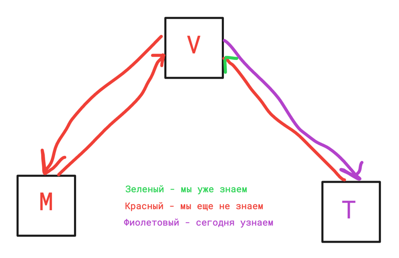

# Лекция 20. Templates. Static

### Оглавление курса

<details>
  <summary>Блок 1 — Python Basic (1–6)</summary>

  - [Лекция 1. Введение. Типизации. Переменные. Строки и числа. Булева алгебра. Ветвление](lesson01.md)
  - [Лекция 2. Обработка исключений. Списки, строки детальнее, срезы, циклы.](lesson02.md)
  - [Лекция 3. None. Range, list comprehension, sum, max, min, len, sorted, all, any. Работа с файлами](lesson03.md)
  - [Лекция 4. Хэш-таблицы. Set, frozenset. Dict. Tuple. Немного об импортах. Namedtuple, OrderedDict](lesson04.md)
  - [Лекция 5. Функции, типизация, lambda. Map, zip, filter.](lesson05.md)
  - [Лекция 6. Алгоритмы и структуры данных](lesson06.md)
</details>

<details>
  <summary>Блок 2 — Git (7–8)</summary>

  - [Лекция 7. Git. История системы контроля версий. Локальный репозиторий. Базовые команды управления репозиторием.](lesson07.md)
  - [Лекция 8. Git. Удаленный репозиторий. Remote, push, pull. GitHub, Bitbucket, GitLab, etc. Pull request.](lesson08.md)
</details>

<details>
  <summary>Блок 3 — Python Advanced (9–14)</summary>

  - [Лекция 9. Введение в ООП. Основные парадигмы ООП. Классы и объекты. Множественное наследование.](lesson09.md)
  - [Лекция 10. Magic methods. Итераторы и генераторы.](lesson10.md)
  - [Лекция 11. Imports. Standard library. PEP 8](lesson11.md)
  - [Лекция 12. Декораторы. Декораторы с параметрами. Декораторы классов (staticmethod, classmethod, property)](lesson12.md)
  - [Лекция 13. Тестирование](lesson13.md)
  - [Лекция 14. Проектирование. Паттерны. SOLID.](lesson14.md)
</details>

<details>
  <summary>Блок 4 — SQL (15–17)</summary>

  - [Лекция 15. СУБД. PostgreSQL. SQL. DDL. Пользователи. DCL. DML. Связи.](lesson15.md)
  - [Лекция 16. СУБД. DQL. SELECT. Индексы. Group by. Joins.](lesson16.md)
  - [Лекция 17. СУБД. Нормализация. Аномалии. Транзакции. ACID. TCL. Backup](lesson17.md)
</details>

- [Лекция 18. Virtual env. Pip. Устанавливаемые модули. Pyenv.](lesson18.md)

<details open>
  <summary>Блок 5 — Django (19–26)</summary>

  - [Лекция 19. Знакомство с Django](lesson19.md)
  - ▶ **Лекция 20. Templates. Static**
  - [Лекция 21. Модели. Связи. Meta. Abstract, proxy.](lesson21.md)
  - [Лекция 22. Django ORM.](lesson22.md)
  - [Лекция 23. Forms, ModelForms. User, Authentication.](lesson23.md)
  - [Лекция 24. ClassBaseView](lesson24.md)
  - [Лекция 25. NoSQL. Куки, сессии, кеш](lesson25.md)
  - [Лекция 26. Логирование. Middleware. Signals. Messages. Manage commands](lesson26.md)
</details>

<details>
  <summary>Блок 6 — Django Rest Framework (27–30)</summary>

  - [Лекция 27. Что такое API. REST и RESTful. Django REST Framework.](lesson27.md)
  - [Лекция 28. @api_view, APIView, ViewSets, Pagination, Routers](lesson28.md)
  - [Лекция 29. REST-аутентификация. Авторизация. Permissions. Фильтрация.](lesson29.md)
  - [Лекция 30. Тестирование. Django, REST API.](lesson30.md)
</details>

<details>
  <summary>Блок 7 — Python async (31–33)</summary>

  - [Лекция 31. Celery. Multithreading. GIL. Multiprocessing](lesson31.md)
  - [Лекция 32. Asyncio. Aiohttp. Асинхронное программирование на практике.](lesson32.md)
  - [Лекция 33. Сокеты. Django Channels.](lesson33.md)
</details>

<details>
  <summary>Блок 8 — Deployment (34–35)</summary>

  - [Лекция 34. Linux. Всё, что нужно знать для деплоймента.](lesson34.md)
  - [Лекция 35. Deployment](lesson35.md)
</details>

- [Лекция 36. Методологии разработки. CI/CD. Монолит и микросервисы. Docker](lesson36.md)


## Что сегодня учим?



## Шаблоны

Что же такое шаблон? В бытовом понимании — это заготовка под что-то, что потом будет использоваться, в Django это почти
так же.

Шаблонами мы называем заготовленные HTML-страницы, в которые мы можем добавить необходимые нам данные и логику.

Но как это работает?

Откроем начатый проект с прошлого занятия.

Создадим новую папку на уровне корня проекта и назовём её `templates` (название может быть любым, но принято называть именно так). Структура проекта:

```
blog_project/
    blog_project/
        settings.py
        urls.py
        ...
    blog/
        views.py
        ...
    templates/
    manage.py
```

Чтобы обрабатывать шаблоны, мы должны «рассказать» Django, где именно искать эти самые шаблоны. Для этого нужно открыть `blog_project/settings.py` и отредактировать переменную `TEMPLATES`.

В ключ `DIRS` добавим нашу папку с шаблонами:

```python
# blog_project/settings.py
TEMPLATES = [
    {
        'BACKEND': 'django.template.backends.django.DjangoTemplates',
        'DIRS': [BASE_DIR / "templates"],  # <-- добавляем путь к папке templates
        'APP_DIRS': True,
        'OPTIONS': {
            # ...
        },
    },
]
```

> Для шаблонов приложений удобно использовать неймспейсы: `blog/templates/blog/home.html` и вызывать `render(request, 'blog/home.html')`.

Ключи:

- `BACKEND`: путь к классу, который отвечает за обработку шаблонов. (Замена требуется очень редко.)
- `DIRS`: список папок, в которых Django будет искать шаблоны.
- `APP_DIRS`: если `True`, Django также ищет шаблоны в папках `templates` внутри каждого приложения (например, `blog/templates/`).
- `OPTIONS`: дополнительные настройки.

Мы «рассказали» Django, где искать шаблоны, но пока ни одного не создали. Давайте сделаем это!

В папке `templates` создадим файл `home.html`:

```
blog_project/
    blog_project/
    blog/
    templates/
        home.html
    manage.py
```

Содержимое файла `home.html`:

```html
<!DOCTYPE html>
<html lang="ru">
<head>
    <meta charset="UTF-8">
    <title>Мой блог</title>
</head>
<body>
    <h1>Добро пожаловать в блог!</h1>
</body>
</html>
```

Итак, теперь у нас есть шаблон, но мы его не используем. Давайте переделаем нашу view для обработки шаблонов.

## Что такое рендеринг?

**Рендеринг (rendering)** — это процесс преобразования шаблона в готовый HTML, который будет отправлен браузеру.

Когда мы «рендерим» шаблон, Django:
1. Находит файл шаблона по указанному пути
2. Подставляет переданные данные (контекст) вместо переменных в шаблоне
3. Выполняет логику шаблона (циклы, условия)
4. Возвращает готовую HTML-строку

Для рендеринга используется функция `render()` из `django.shortcuts`:

```python
# blog/views.py
from django.shortcuts import render

def home(request):
    return render(request, 'home.html')
```

Функция `render()` принимает:
- `request` — объект запроса (обязательно)
- `template_name` — путь к шаблону относительно папки `templates`
- `context` — словарь с данными для шаблона (опционально)

> Функция `render()` возвращает объект `HttpResponse` с отрендеренным HTML.

Перезапустим сервер и увидим результат на главной странице `http://127.0.0.1:8000/`.

Мы отрендерили шаблон! Но в нём нет никаких переданных данных. Для передачи данных нужно добавить третий аргумент — словарь (context):

```python
# blog/views.py
from django.shortcuts import render

def home(request):
    return render(request, 'home.html', {
        'site_name': 'Мой блог',
        'articles_count': 42,
    })
```

Для вывода данных в Django-шаблоне используются двойные фигурные скобки `{{ }}`:

```html
<h1>{{ site_name }}</h1>
<p>Всего статей: {{ articles_count }}</p>
```

Для доступа к вложенным структурам используется точка:

```html
{{ article.title }}       {# атрибут объекта #}
{{ article.author.username }}  {# вложенный атрибут #}
{{ topics.0 }}            {# первый элемент списка #}
{{ config.debug }}        {# значение словаря #}
```

Пример с передачей разных типов данных:

```python
# blog/views.py
def home(request):
    # Пока у нас нет моделей, используем словари для имитации данных
    articles = [
        {'title': 'Первая статья', 'author': 'Иван'},
        {'title': 'Вторая статья', 'author': 'Мария'},
    ]
    return render(request, 'home.html', {
        'site_name': 'Мой блог',
        'articles': articles,
        'topics': ['Python', 'Django', 'Web'],
    })
```

```html
{# templates/home.html #}
<h1>{{ site_name }}</h1>
<p>Первая тема: {{ topics.0 }}</p>
<p>Автор первой статьи: {{ articles.0.author }}</p>
```

## Логика в шаблонах


Для логических условий и циклов используются специальные скобки ``.

> После всех логических операторов и циклов в шаблонах нужно ставить соответствующий закрывающий тег!
> Например, ` `, ` `.

### Условия (if/else)

В шаблонах можно использовать условную логику. Это полезно, например, чтобы показывать разный контент залогиненным и незалогиненным пользователям:

```html

    <p>Добро пожаловать, {{ user.username }}!</p>
    <a href="">Выйти</a>

    <a href="">Войти</a>
    <a href="">Регистрация</a>

```

Ещё пример — показываем кнопку редактирования только автору статьи:

```html

    <a href="">Редактировать</a>
    <a href="">Удалить</a>

```

> Отступы в шаблонах не имеют значения для Django, но делают код читаемее.

#### Использование elif

Для множественных условий используется ``:

```html

    <span class="badge">Администратор</span>

    <span class="badge">Модератор</span>

    <span>Добро пожаловать, {{ user.username }}!</span>

    <a href="">Войти</a>

```

Также можно использовать логические операторы `and`, `or`, `not`:

```html

    <p>Активный пользователь</p>



    <p>Список пуст</p>



    <p>Контент</p>

```

### Циклы (for)

В шаблонах можно использовать только цикл `for` — цикла `while` не существует.

Пример — выводим список статей на главной странице:

```html
{# templates/home.html #}
<h1>Все статьи</h1>
<ul>

    <li>
        <a href="">{{ article.title }}</a>
        <span>— {{ article.author }}</span>
    </li>

</ul>
```

> Напоминание: логика через ``, данные через `{{ }}`

Вложенный цикл — выводим темы для каждой статьи:

```html

    <div class="article">
        <h2>{{ article.title }}</h2>
        <div class="topics">
            
                <span class="badge">{{ topic }}</span>
            
        </div>
    </div>

```

#### Переменные forloop

Внутри цикла доступны следующие переменные:

| Переменная            | Описание                                           |
|-----------------------|----------------------------------------------------|
| `forloop.counter`     | Номер текущей итерации (начиная с 1)               |
| `forloop.counter0`    | Номер текущей итерации (начиная с 0)               |
| `forloop.revcounter`  | Номер итерации с конца (до 1)                      |
| `forloop.revcounter0` | Номер итерации с конца (до 0)                      |
| `forloop.first`       | True, если это первая итерация                     |
| `forloop.last`        | True, если это последняя итерация                  |
| `forloop.parentloop`  | Ссылка на родительский цикл (для вложенных циклов) |

Пример использования:

```html
<ul>

    <li class="first last">
        {{ forloop.counter }}. {{ article.title }}
    </li>

</ul>
```

#### Тег empty

Тег `` позволяет отобразить альтернативный контент, если список пуст:

```html
<ul>

    <li>{{ article.title }}</li>

    <li>Статей пока нет</li>

</ul>
```

Это эквивалентно:

```html

    <ul>
    
        <li>{{ article.title }}</li>
    
    </ul>

    <p>Статей пока нет</p>

```

Но `` — более лаконичный и читаемый способ.

## Template Tags

На самом деле все ключевые слова, используемые внутри ``, называются template tags, и их существует огромное
множество.

[Ссылка на документацию](https://docs.djangoproject.com/en/stable/ref/templates/builtins/)

Их очень много, часть мы рассмотрим, часть вам придётся изучить самостоятельно.

### Тег url

Тег `url` позволяет сгенерировать URL по его имени. Это очень удобно: если адрес меняется, а его имя остаётся прежним, ссылки продолжат работать.

Примеры использования в блоге:

```html
{# Ссылка на главную #}
<a href="">Главная</a>

{# Ссылка на статью с параметром #}
<a href="">{{ article.title }}</a>

{# Ссылка на тему #}
<a href="">{{ topic.name }}</a>

{# Ссылка на профиль #}
<a href="">Мой профиль</a>
```

### Наследование шаблонов (extends, block)


Наследование шаблонов позволяет не дублировать общие части страниц (шапка, навигация, подвал). Вы создаёте базовый шаблон с «дырками» (блоками), а дочерние шаблоны заполняют эти блоки своим контентом.

Создадим базовый шаблон для нашего блога:

`templates/base.html`

```html
<!DOCTYPE html>
<html lang="ru">
<head>
    <meta charset="UTF-8">
    <title>Мой блог</title>
    
</head>
<body>
    <header>
        <nav>
            <a href="">Главная</a>
            <a href="">Темы</a>
            
                <a href="">Моя лента</a>
                <a href="">Профиль</a>
                <a href="">Выйти</a>
            
                <a href="">Войти</a>
                <a href="">Регистрация</a>
            
        </nav>
    </header>

    <main>
        
    </main>

    <footer>
        <p>&copy; 2024 Мой блог</p>
    </footer>

    
</body>
</html>
```

Теперь создадим страницы, которые наследуются от базового шаблона:

`templates/home.html`

```html


Главная — Мой блог


<h1>Все статьи</h1>
<ul>

    <li><a href="">{{ article.title }}</a></li>

    <li>Статей пока нет</li>

</ul>

```

`templates/about.html`

```html


О нас — Мой блог


<h1>О нашем блоге</h1>
<p>Это учебный проект для изучения Django.</p>

```

Что произошло?

Мы создали базовый шаблон `base.html`, в котором описали общую структуру всех страниц: навигацию, шапку, подвал. Тег `` определяет «дырку», которую дочерние шаблоны заполняют своим контентом.

В `home.html` мы указали `` — это означает, что шаблон наследуется от базового. Затем мы переопределили блоки `title` и `content`.

> Блоков может быть сколько угодно, главное — давать им разные имена.

#### Использование {{ block.super }}

Иногда нужно не заменить содержимое родительского блока, а дополнить его. Для этого используется `{{ block.super }}`:

```html
{# base.html #}

<div class="container">


{# child.html #}



{{ block.super }}
    <h1>Мой контент</h1>
</div>

```

Результат будет содержать и `<div class="container">` из родителя, и `<h1>` из дочернего шаблона.

### Включение шаблонов (include)

Тег `include` позволяет вставить один шаблон внутрь другого. Это полезно для переиспользуемых компонентов: карточка статьи, форма комментария, блок навигации.

Создадим компонент карточки статьи:

`templates/components/article_card.html`

```html
<article class="article-card">
    <h2><a href="">{{ article.title }}</a></h2>
    <p class="meta">
        Автор: {{ article.author }} |
        
            <a href="">{{ topic.name }}</a>, 
        
    </p>
    <p>{{ article.content|truncatechars:100 }}</p>
</article>
```

Теперь используем этот компонент на главной странице:

`templates/home.html`

```html



<h1>Все статьи</h1>

    

    <p>Статей пока нет</p>


```

#### Передача переменных в include

Можно передать переменные в подключаемый шаблон с помощью `with`:

```html

```

Пример — компонент кнопки подписки на тему:

`templates/components/subscribe_button.html`

```html

    
        <a href="">Отписаться</a>
    
        <a href="">Подписаться</a>
    

```

Использование:

```html

```

### Другие полезные теги

#### Комментарии

```html
{# Однострочный комментарий #}


    Многострочный комментарий.
    Этот код не будет отображаться.

```

#### CSRF Token

Тег `` обязателен для всех POST-форм. Он защищает от CSRF-атак:

```html
<form method="post" action="">
    
    <input type="text" name="title">
    <textarea name="content"></textarea>
    <button type="submit">Создать статью</button>
</form>
```

> Без `` POST-запросы будут отклонены с ошибкой 403 Forbidden.

## Фильтры


Фильтры позволяют преобразовать данные перед отображением. Синтаксис: `{{ переменная|фильтр }}`

Примеры для блога:

```html
{# Обрезаем текст статьи до 100 символов #}
<p>{{ article.content|truncatechars:100 }}</p>

{# Форматируем дату создания #}
<span>{{ article.created_at|date:"d.m.Y" }}</span>

{# Показываем темы через запятую #}
<span>Темы: {{ article.topic_names|join:", " }}</span>

{# Значение по умолчанию #}
<p>Автор: {{ article.author.username|default:"Аноним" }}</p>
```

### Часто используемые фильтры

| Фильтр          | Описание                                      | Пример                                   |
|-----------------|-----------------------------------------------|------------------------------------------|
| `default`       | Значение по умолчанию, если переменная пустая | `{{ value\|default:"ничего" }}`          |
| `length`        | Длина строки или списка                       | `{{ articles\|length }}`                 |
| `truncatechars` | Обрезает строку до N символов                 | `{{ text\|truncatechars:50 }}`           |
| `truncatewords` | Обрезает строку до N слов                     | `{{ text\|truncatewords:10 }}`           |
| `date`          | Форматирование даты                           | `{{ created\|date:"d.m.Y" }}`            |
| `time`          | Форматирование времени                        | `{{ created\|time:"H:i" }}`              |
| `join`          | Объединяет список в строку                    | `{{ tags\|join:", " }}`                  |
| `add`           | Сложение чисел или конкатенация               | `{{ value\|add:5 }}`                     |
| `capfirst`      | Первая буква заглавная                        | `{{ name\|capfirst }}`                   |
| `lower`         | Все буквы строчные                            | `{{ name\|lower }}`                      |
| `upper`         | Все буквы заглавные                           | `{{ name\|upper }}`                      |
| `title`         | Каждое слово с заглавной                      | `{{ name\|title }}`                      |
| `slugify`       | Преобразует в slug                            | `{{ title\|slugify }}`                   |
| `linebreaks`    | Переносы строк в `<p>` и `<br>`               | `{{ text\|linebreaks }}`                 |
| `linebreaksbr`  | Переносы строк в `<br>`                       | `{{ text\|linebreaksbr }}`               |
| `yesno`         | Преобразует True/False/None                   | `{{ flag\|yesno:"да,нет,неизвестно" }}`  |
| `pluralize`     | Склонение для чисел                           | `{{ count }} item{{ count\|pluralize }}` |

Примеры использования:

```html
{# Обрезка текста #}
<p>{{ article.content|truncatewords:30 }}...</p>

{# Длина списка #}
<p>Всего статей: {{ articles|length }}</p>

{# Сложение #}
<p>Следующая страница: {{ page|add:1 }}</p>

{# Форматирование даты #}
<p>Опубликовано: {{ article.created_at|date:"d F Y" }}</p>
```

Полный список встроенных фильтров можно посмотреть в [документации](https://docs.djangoproject.com/en/stable/ref/templates/builtins/).

### Автоэкранирование и безопасность

Django автоматически экранирует HTML в переменных для защиты от XSS-атак (Cross-Site Scripting). Это означает, что если пользователь введёт `<script>alert('hack')</script>`, это будет отображено как текст, а не выполнено как код.

```html
{# Если user_input = "<script>alert('XSS')</script>" #}
{{ user_input }}
{# Результат: &lt;script&gt;alert('XSS')&lt;/script&gt; #}
```

#### Фильтр safe

Если вы уверены, что HTML безопасен (например, это контент из WYSIWYG-редактора администратора), используйте фильтр `|safe`:

```html
{{ article.content|safe }}
```

> ⚠️ **Внимание!** Используйте `|safe` только для доверенного контента. Никогда не применяйте его к пользовательскому вводу!

#### Фильтр escape

Фильтр `|escape` явно экранирует HTML (полезно, если автоэкранирование отключено):

```html
{{ user_input|escape }}
```

#### Тег autoescape

Можно управлять автоэкранированием для блока кода:

```html

    {# Здесь автоэкранирование отключено #}
    {{ trusted_html }}



    {# Здесь автоэкранирование включено (по умолчанию) #}
    {{ user_input }}

```

#### Фильтр striptags

Удаляет все HTML-теги из строки:

```html
{{ user_input|striptags }}
{# "<p>Hello</p>" → "Hello" #}
```

### Кастомные теги и фильтры

На самом деле, стандартным набором дело не ограничивается, и в случае необходимости можно дописать свои теги и фильтры.
Подробнее об этом можно почитать в [документации](https://docs.djangoproject.com/en/stable/howto/custom-template-tags/).


## Статические файлы

### Что такое статические файлы?

Прежде чем перейти к рассмотрению template tag, давайте разберёмся, что такое статические файлы. В контексте
веб-разработки статические файлы — это те файлы, которые не изменяются на сервере, а напрямую передаются пользователю. К
ним относятся:

- CSS-файлы, отвечающие за стилизацию веб-страниц.
- JavaScript-файлы, добавляющие интерактивность страницам.
- Изображения, иконки, шрифты и другие медиафайлы.

В Django эти файлы не хранятся в базе данных и не генерируются динамически, как HTML-контент. Они должны быть доступны
для всех клиентов в неизменном виде.

### Настройка статики в Django

Прежде чем мы сможем использовать ``, необходимо правильно настроить Django для работы со статическими
файлами. Основные шаги включают:

- Указание директории для хранения статических файлов.
- Настройка URL для доступа к статическим файлам.

В файле `settings.py` вы найдете (или добавите) следующие параметры:

- `STATIC_URL`: Этот параметр определяет URL, по которому будут доступны статические файлы. Обычно это `/static/`.
- Убедитесь, что приложение 'django.contrib.staticfiles' есть в INSTALLED_APPS (в новых проектах добавляется по умолчанию).

  ```python
  STATIC_URL = '/static/'
  ```

> Этот параметр, скорее всего, указан автоматически, он отвечает за то, чтобы ваши статические файлы можно было бы
> получить по адресу `http://127.0.0.1:8000/static/`. На самом деле там много деталей и нюансов, но их мы будем
> рассматривать гораздо позже.

> Для того чтобы у вас отрабатывали статические файлы, нужно чтобы у вас в `settings.py` был указан `DEBUG=True`, что
> это и зачем — опять же дальше по курсу.

- `STATICFILES_DIRS`: Этот параметр указывает на дополнительные директории, в которых Django будет искать статические
  файлы. Это полезно, если у вас есть несколько источников для статических файлов.

  ```python
  STATICFILES_DIRS = [BASE_DIR / "static"]
  ```

```text
project/
  static/
    css/styles.css
  templates/
    base.html
```

> Просто указываете папку, куда вы сложили свои статические файлы.

- `STATIC_ROOT`: Этот параметр используется для указания директории, куда Django будет собирать все статические файлы
  при выполнении команды `collectstatic`. Это полезно для деплоя на продакшн сервер.

  ```python
  STATIC_ROOT = BASE_DIR / "staticfiles"
  ```

> Этот параметр вам пока не нужен! Он используется для запуска приложений на реальных серверах.

### Использование тега 

Теперь, когда мы настроили Django для работы со статическими файлами, давайте рассмотрим, как используется template
tag ``. Этот тег позволяет нам генерировать правильные URL для статических файлов в шаблонах.

#### Загрузка библиотеки static

Прежде чем использовать тег ``, необходимо загрузить соответствующую библиотеку в вашем шаблоне. Это
делается с помощью тега ``. Этот тег должен быть расположен в верхней части вашего шаблона, как
правило, до использования ``.

> Обычно записывается в самом верху, по аналогии с `import` в Python.

Пример:

```html

```

#### Основной синтаксис

Синтаксис тега `` выглядит следующим образом:

```html

```

Здесь `'path/to/your/static/file.ext'` — это путь к файлу относительно одной из директорий, указанных
в `STATICFILES_DIRS`.

#### Пример использования

Предположим, у вас есть файл `styles.css`, находящийся в директории `static/css/`. Чтобы подключить этот файл в шаблоне,
вам нужно использовать следующий код:

```html

<link rel="stylesheet" type="text/css" href="">
```

Django автоматически преобразует это в правильный URL, который будет выглядеть как `/static/css/styles.css`.

#### Использование в различных контекстах

Тег `` можно использовать не только для CSS, но и для других типов файлов, например, изображений или
JavaScript:

```html


<script src=""></script>
```

### Практические рекомендации

1. **Всегда загружайте библиотеку static.** Не забывайте добавлять `` в начало ваших шаблонов, где
   используются статические файлы.

2. **Не хардкодьте пути к статическим файлам.** Всегда используйте `` для создания ссылок на статические
   файлы.

3. **Организуйте свои статические файлы логически.** Размещайте их в соответствующих поддиректориях,
   например: `css`, `js`, `images`.

Преимущество использования `` заключается в том, что он обеспечивает правильное разрешение путей к
статическим файлам независимо от того, где они находятся. Это особенно важно при деплое приложения, когда может
измениться базовый URL для статических файлов.

## Домашнее задание

Продолжаем работу над проектом блога. На этом этапе страницы всё ещё заполнены абстрактным контентом — работать должен только переход между страницами.

### Задание

1. **Создайте базовый шаблон `base.html`** с общей структурой:
   - Навигация (ссылки на главную, список тем, профиль и т.д.)
   - Место для основного контента (``)
   - Подвал страницы

2. **Все остальные страницы должны наследоваться от `base.html`**. Создайте шаблоны для всех URL, у которых в задании указано слово «страница»:
   - Главная страница (`/`)
   - Моя лента (`/my-feed/`)
   - Страница статьи (`/<article_id>/`)
   - Страница редактирования статьи (`/<article_id>/update/`)
   - Страница создания статьи (`/create/`)
   - Список тем (`/topics/`)
   - Страница темы (`/topics/<topic_id>/`)
   - Профиль (`/profile/`)
   - Регистрация (`/register/`)
   - Смена пароля (`/set-password/`)
   - Вход (`/login/`)
   - Статьи по дате (`/<year>/<month>/`)

3. **У всех страниц должен быть разный `<title>`** — используйте блок ``.

4. **Используйте тег `` для всех ссылок** между страницами.

5. **(Опционально)** Добавьте CSS-файл для базовой стилизации и подключите его через ``.

> На данном этапе контент страниц может быть заглушкой (placeholder). Главное — правильная структура шаблонов и работающая навигация.

---

[← Лекция 19: Знакомство с Django](lesson19.md) | [Лекция 21: Модели. Связи. Meta. Abstract, proxy. →](lesson21.md)
