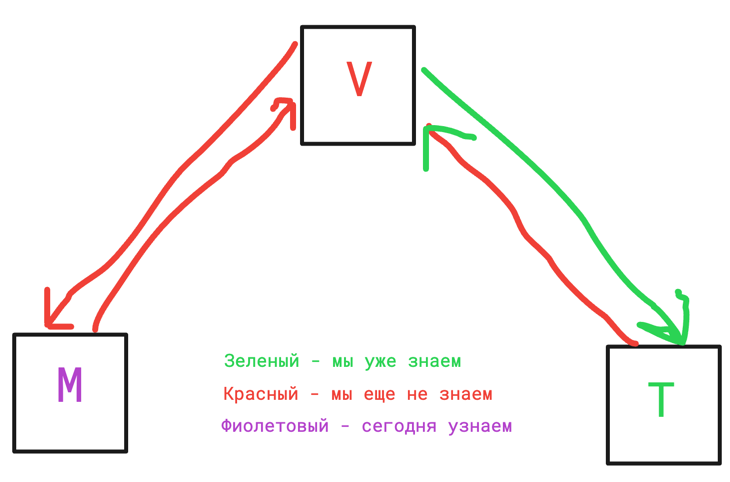

# Лекция 21. Модели. Связи. Meta. Abstract, proxy.

### Оглавление курса

<details>
  <summary>Блок 1 — Python Basic (1–6)</summary>

  - [Лекция 1. Введение. Типизации. Переменные. Строки и числа. Булева алгебра. Ветвление](lesson01.md)
  - [Лекция 2. Обработка исключений. Списки, строки детальнее, срезы, циклы.](lesson02.md)
  - [Лекция 3. None. Range, list comprehension, sum, max, min, len, sorted, all, any. Работа с файлами](lesson03.md)
  - [Лекция 4. Хэш-таблицы. Set, frozenset. Dict. Tuple. Немного об импортах. Namedtuple, OrderedDict](lesson04.md)
  - [Лекция 5. Функции, типизация, lambda. Map, zip, filter.](lesson05.md)
  - [Лекция 6. Алгоритмы и структуры данных](lesson06.md)
</details>

<details>
  <summary>Блок 2 — Git (7–8)</summary>

  - [Лекция 7. Git. История системы контроля версий. Локальный репозиторий. Базовые команды управления репозиторием.](lesson07.md)
  - [Лекция 8. Git. Удаленный репозиторий. Remote, push, pull. GitHub, Bitbucket, GitLab, etc. Pull request.](lesson08.md)
</details>

<details>
  <summary>Блок 3 — Python Advanced (9–14)</summary>

  - [Лекция 9. Введение в ООП. Основные парадигмы ООП. Классы и объекты. Множественное наследование.](lesson09.md)
  - [Лекция 10. Magic methods. Итераторы и генераторы.](lesson10.md)
  - [Лекция 11. Imports. Standard library. PEP 8](lesson11.md)
  - [Лекция 12. Декораторы. Декораторы с параметрами. Декораторы классов (staticmethod, classmethod, property)](lesson12.md)
  - [Лекция 13. Тестирование](lesson13.md)
  - [Лекция 14. Проектирование. Паттерны. SOLID.](lesson14.md)
</details>

<details>
  <summary>Блок 4 — SQL (15–17)</summary>

  - [Лекция 15. СУБД. PostgreSQL. SQL. DDL. Пользователи. DCL. DML. Связи.](lesson15.md)
  - [Лекция 16. СУБД. DQL. SELECT. Индексы. Group by. Joins.](lesson16.md)
  - [Лекция 17. СУБД. Нормализация. Аномалии. Транзакции. ACID. TCL. Backup](lesson17.md)
</details>

- [Лекция 18. Virtual env. Pip. Устанавливаемые модули. Pyenv.](lesson18.md)

<details open>
  <summary>Блок 5 — Django (19–26)</summary>

  - [Лекция 19. Знакомство с Django](lesson19.md)
  - [Лекция 20. Templates. Static](lesson20.md)
  - ▶ **Лекция 21. Модели. Связи. Meta. Abstract, proxy**
  - [Лекция 22. Django ORM.](lesson22.md)
  - [Лекция 23. Forms, ModelForms. User, Authentication.](lesson23.md)
  - [Лекция 24. ClassBaseView](lesson24.md)
  - [Лекция 25. NoSQL. Куки, сессии, кеш](lesson25.md)
  - [Лекция 26. Логирование. Middleware. Signals. Messages. Manage commands](lesson26.md)
</details>

<details>
  <summary>Блок 6 — Django Rest Framework (27–30)</summary>

  - [Лекция 27. Что такое API. REST и RESTful. Django REST Framework.](lesson27.md)
  - [Лекция 28. @api_view, APIView, ViewSets, Pagination, Routers](lesson28.md)
  - [Лекция 29. REST-аутентификация. Авторизация. Permissions. Фильтрация.](lesson29.md)
  - [Лекция 30. Тестирование. Django, REST API.](lesson30.md)
</details>

<details>
  <summary>Блок 7 — Python async (31–33)</summary>

  - [Лекция 31. Celery. Multithreading. GIL. Multiprocessing](lesson31.md)
  - [Лекция 32. Asyncio. Aiohttp. Асинхронное программирование на практике.](lesson32.md)
  - [Лекция 33. Сокеты. Django Channels.](lesson33.md)
</details>

<details>
  <summary>Блок 8 — Deployment (34–35)</summary>

  - [Лекция 34. Linux. Всё, что нужно знать для деплоймента.](lesson34.md)
  - [Лекция 35. Deployment](lesson35.md)
</details>

- [Лекция 36. Методологии разработки. CI/CD. Монолит и микросервисы. Docker](lesson36.md)


### Нет, не такие

На этом этапе вы должны были уже выполнить все инструкции из
вот [этой](https://github.com/PonomaryovVladyslav/PythonCourses/blob/master/before_postgres.md) ссылки

Но на всякий случай вкратце ещё раз.

## Установка базы

В наших примерах мы будем использовать PostgreSQL, для этого предварительно нужно эту базу установить.

Скачать, если не установлена: [Тут](https://www.postgresql.org/download/)

### Создание базы и пользователя базы

[Прекрасная статья по этому поводу под Linux](https://medium.com/coding-blocks/creating-user-database-and-adding-access-on-postgresql-8bfcd2f4a91e)

Предположим, что база у вас установлена и пароль для пользователя `postgres` создан.

Заходим в консоль базы данных

Под Windows:

`psql -U postgres`

Под Linux:

`sudo -u postgres psql`

Под Windows вы должны увидеть нечто похожее:


Создаём базу с кодировкой 'UTF8', чтобы избежать проблем с русским и другими языками в базе.

`create database blog_db with encoding 'UTF8';`

Создаём пользователя для пользования этой базой.

`create user blog_user with password 'mypass';`

Даём новому пользователю права на использование новой базы.

`grant all on database blog_db to blog_user;`

Консоль в конце должна выглядеть так:


**Если вы используете Postgres 15 и новее**

Необходимо выполнить дополнительное действие после предоставления прав к базе данных.

Нужно предоставить вашему пользователю права к схеме `public` в новой базе данных.

Для этого нужно подключиться к новой базе:

`\c blog_db` - где `blog_db` это имя созданной базы данных

После чего выполнить команду:

`grant all on schema public to blog_user;`

Для выхода из консоли наберите `\q` и нажмите Enter.

## Что сегодня учим?



## Конфигурация Django

Открываем проект и в нём файл `settings.py`

Находим строку `DATABASES`

Если вы ничего не меняли, то выглядеть она должна так:


Заменяем на

```python
DATABASES = {
    'default': {
        'ENGINE': 'django.db.backends.postgresql',
        'NAME': 'blog_db',
        'USER': 'blog_user',
        'PASSWORD': 'mypass',
        'HOST': 'localhost',
        'PORT': '5432',
    }
}
```

Где `ENGINE` — это «движок», он же модуль, отвечающий за работу базы данных.

`NAME` — это имя базы,

`USER` — это имя пользователя,

`PASSWORD` — это пароль пользователя,

`HOST` — это хост (URL, расположение базы),

`PORT` — это порт (5432 — стандартный порт для PostgreSQL, если вы его изменили при установке, укажите свой).

Чтобы это работало, нужно установить тот самый «движок», соответствующий вашей операционной системе:

```
python -m pip install "psycopg[binary]"  # актуальный драйвер (psycopg 3)
# альтернативно: python -m pip install psycopg2-binary
```

**Не забывайте про venv**

Если вы всё сделали правильно, то при запуске сервера (`python manage.py runserver`) вы должны увидеть что-то такое:


## Команда migrate

Обратите внимание на вот эту надпись:


Когда мы создаём Django проект, мы создаём приложения для своих нужд, но на самом деле внутри уже есть несколько
приложений для общих нужд, `admin`, `auth`, `contenttype`, `session`.

Все их мы разберем немного позже. В данный момент критичным является то, что в каждом из этих приложений находится
информация о том, что должно храниться в базе. А наша свежая, только что созданная база не имеет нужных таблиц, в
соответствии с моделями, описанными в этих приложениях. Описания того, что должно быть в базе, называются **миграции**.

При применении миграций в базе создаются нужные таблицы, поля, связи и т. д.

Для применения нужно выполнить команду

`python manage.py migrate`

Если всё ок, то результат выполнения должен выглядеть примерно так:


## Приложения

Чтобы Django увидела какие-либо изменения, нужно добавлять каждое своё приложение в `settings.py`

Находим в файле `settings.py` раздел `INSTALLED_APPS` и дописываем наше приложение, чтобы получилось:

```python
INSTALLED_APPS = [
    'django.contrib.admin',
    'django.contrib.auth',
    'django.contrib.contenttypes',
    'django.contrib.sessions',
    'django.contrib.messages',
    'django.contrib.staticfiles',
    'blog',
]
```

Теперь всё готово для того, чтобы начинать разработку собственных моделей.


## Создание моделей

Ничего лучше, чем официальная документация, никто не придумал, офф
дока [Тут](https://docs.djangoproject.com/en/stable/topics/db/models/)

Что такое класс модель? Это таблица для базы данных, где атрибуты — это её поля.

Давайте создадим модель! Для нашего блога начнём с модели `Topic` — темы, на которые можно подписываться.

В файле `blog/models.py`

Напишем вот это:

```python
from django.db import models


class Topic(models.Model):
    name = models.CharField(max_length=100)
    created_at = models.DateTimeField(auto_now_add=True)
```

Мы создали нашу первую модель, состоящую из **3** полей: `name`, `created_at` и `id`, причём поле `id` было создано
автоматически без нашего участия, и оно автоматически стало primary key. Поле `name` не может содержать более 100
символов. Поле `created_at` автоматически заполнится текущей датой и временем при создании объекта.

> Как проконтролировать id, рассмотрим дальше

Чтобы наши изменения попали в базу, нужно создать и применить миграцию.

### Что такое миграции?

**Миграция** — это файл, который описывает изменения в **структуре** базы данных: создание таблиц, добавление/удаление полей, изменение типов данных, добавление индексов и т.д.

> По сути, миграции — это версионный контроль для схемы базы данных, как Git для кода.

**Зачем нужны миграции?**

1. **Синхронизация кода и БД** — модели в Python-коде и таблицы в базе данных всегда соответствуют друг другу
2. **История изменений** — каждое изменение структуры БД сохраняется в отдельном файле с номером версии
3. **Командная работа** — все разработчики применяют одни и те же изменения в одном порядке
4. **Откат изменений** — можно вернуться к предыдущей версии схемы БД
5. **Деплой** — на продакшене применяются те же миграции, что и в разработке

**Как это работает?**

```
Python модели  ──makemigrations──>  Файлы миграций  ──migrate──>  База данных
   (код)                              (Python)                      (SQL)
```

1. Вы изменяете модели в Python-коде
2. Django сравнивает текущее состояние моделей с последней миграцией
3. Команда `makemigrations` создаёт новый файл миграции с описанием изменений
4. Команда `migrate` применяет миграции к базе данных (выполняет SQL)

> Важно: миграции хранятся в папке `migrations/` каждого приложения и **должны коммититься в Git** вместе с кодом!

### Команда makemigrations

Теперь применим команду

`python manage.py makemigrations`

И увидим нечто похожее на:


Django радостно нам сообщает, что миграция была создана. Давайте проверим, откроем папку `blog/migrations` и увидим там
новый файл `0001_initial.py`

Выглядеть он будет вот так:


Где мы можем убедиться, что Django действительно создала за нас поле `id`

> Этот файл и является описанием изменения структуры в БД

### Команда showmigrations

> Создать миграцию не значит её применить! Мы только заготовили код, который после будет применён!

Чтобы убедиться, что миграция не применена/применена, используется команда

`python manage.py showmigrations`

Результат:


Как мы можем видеть, наша миграция существует, но не применена, давайте применим её командой

`python manage.py migrate`

Результат:


И сравним `showmigrations` теперь:


## Админка

> Django предоставляет нам возможность взаимодействия с базой данных через удобный интерфейс, вместо того чтобы
> пользоваться SQL.

Самый быстрый и удобный способ смотреть на объекты моделей (записи в БД) — это админка. Чтобы ей пользоваться, нужно
сделать две вещи:

- В `urls.py` добавить встроенный URL админки.
- Создать суперпользователя (администратора).

### Команда создания суперпользователя

`python manage.py createsuperuser`

Вводим всё, что от нас требует консоль, и пользователь будет создан:


> Email не является обязательным, можно просто нажать Enter на пустое поле.

Если вы не стирали URL для админки, то он уже у вас есть; если стирали, то допишите в `blog_project/urls.py`:

```python
from django.contrib import admin
from django.urls import path

urlpatterns = [
    path('admin/', admin.site.urls),
    # другие маршруты
]
```

Перезапускаем сервер, и заходим в [админку](http://127.0.0.1:8000/admin)


Вбиваем имя и пароль созданного пользователя и видим:


По умолчанию у Django сразу есть две модели «из коробки» — User и Group.

Но нет нашей модели, почему же? Потому что модели нужно регистрировать, чтобы не заполнять админку ненужными
данными.

Для этого нам нужно в файле `admin.py` в вашем приложении импортировать вашу модель и зарегистрировать её

```python
from django.contrib import admin
from .models import Topic

admin.site.register(Topic)
```

Открываем админку ещё раз:


Теперь наша модель появилась в админке, и мы можем добавлять, удалять, смотреть, редактировать наши модели.

Но подождите: в списке объектов мы видим что-то вроде `Topic object (1)`. Это не очень информативно. Давайте исправим это!

## Метод `__str__`

Чтобы объекты модели отображались читаемо в админке (и не только), нужно определить метод `__str__`:

```python
from django.db import models


class Topic(models.Model):
    name = models.CharField(max_length=100)
    created_at = models.DateTimeField(auto_now_add=True)

    def __str__(self):
        return self.name
```

Теперь в админке вместо `Topic object (1)` мы увидим название темы, например `Спорт` или `Кино`.

> Метод `__str__` — это стандартный Python-метод, который возвращает строковое представление объекта. Django использует его везде: в админке, в shell, при выводе в шаблонах.

## Кастомная админка

Возможности встроенной админки очень велики, но её можно дописывать, видоизменять, добавлять кастомные действия
и т. д. Подробно разбирать эту тему мы не будем. Сейчас попробуйте создать/изменить/удалить несколько объектов.

Админку можно кастомизировать. Чтобы изменить или добавить любое действие, используются специальные классы.

Ссылка на официальную документацию [тут](https://docs.djangoproject.com/en/stable/ref/contrib/admin/).

Весь функционал описан в приложении `django.contrib.admin`, о котором мы говорили выше, оно добавлено в
наш проект по умолчанию.

### Пример кастомизации

```python
from django.contrib import admin
from .models import Topic

class TopicAdmin(admin.ModelAdmin):
    list_display = ('name', 'created_at')
    search_fields = ('name',)

admin.site.register(Topic, TopicAdmin)
```

## Основные типы полей и их стандартные атрибуты.

[Ссылка на все существующие типы полей](https://docs.djangoproject.com/en/stable/ref/models/fields/)

Когда вы создаёте модель, у неё автоматически появляется атрибут `id`. Он является `Primary Key` по умолчанию, если
это не было переписано явно.

`id` — это очень удобное поле, т. к. оно является автоматическим, и когда вы создаёте новый объект, ему сразу
назначается новый идентификационный номер, на один больше предыдущего.

> Мы рассматривали, как это работает, когда изучали базы данных. Но давайте ещё раз.

> По умолчанию в Django первичный ключ — автоинкрементный BigAutoField.
> В PostgreSQL это реализуется через identity/sequence.

Также все типы полей имеют встроенный атрибут `default`, который заполняется, если нужно указать значение по умолчанию.

Параметр `null` управляет тем, как поле ведёт себя на уровне базы данных. Если для поля задан параметр `null=True`, это
означает, что в базе данных данное поле может принимать значение NULL. Важно понимать, что null применяется только к
столбцам базы данных и контролирует наличие NULL в этом столбце.

Параметр `blank`, позволяет хранить в качестве значения пустую строку (`""`)

Также любое поле может быть индексировано, используя параметр `db_index=True`.

### BooleanField

Хранит True или False

```python
my_flag = models.BooleanField()
```

### CharField

Строковое поле, принимает обязательный аргумент `max_length` — максимальное количество символов.

Часто используемые флаги `null` и `blank`: `null=True` — поле может быть `None`, `blank=True` — поле может быть пустой строкой `""`.

```python
title = models.CharField(max_length=200)
```

### TextField

Текстовое поле для хранения больших объёмов текста (без ограничения длины). Используется для контента статей, описаний, комментариев.

```python
content = models.TextField()
bio = models.TextField(blank=True)  # необязательное поле
```

> В отличие от `CharField`, `TextField` не требует `max_length`.

### DateField и DateTimeField

Поля для хранения даты и даты со временем.

Принимают аргументы `auto_now` и `auto_now_add`.
`auto_now_add` обозначает, что при создании объекта это поле будет автоматически заполнено текущей датой и временем.
`auto_now` будет обновляться каждый раз, когда объект сохраняется (и при создании и при обновлении).
(часто используют для сохранения даты создания и даты обновления объекта)

```python
created_at = models.DateTimeField(auto_now_add=True)
updated_at = models.DateTimeField(auto_now=True)
```

### DecimalField

Десятичные числа с фиксированной точностью (`Decimal`). В отличие от `FloatField` не накапливает ошибок округления — подходит для денежных значений.

Обязательные параметры: `max_digits` — общее количество цифр, `decimal_places` — количество знаков после запятой.

```python
price = models.DecimalField(max_digits=12, decimal_places=2)
```

### EmailField

Такой же текстовый, как и `CharField`, с проверкой на валидность email.

### IntegerField

Хранение целых чисел от −2147483648 до 2147483647.

```python
views_count = models.IntegerField(default=0)
```

### Параметр `choices`

Любое поле может иметь ограниченный набор допустимых значений. Для этого используется параметр `choices`. Это полезно для статусов, категорий, ролей и т.п.

```python
class Article(models.Model):
    class Status(models.TextChoices):
        DRAFT = 'draft', 'Черновик'
        PUBLISHED = 'published', 'Опубликовано'
        ARCHIVED = 'archived', 'В архиве'

    title = models.CharField(max_length=200)
    status = models.CharField(
        max_length=20,
        choices=Status.choices,
        default=Status.DRAFT
    )
```

В админке такое поле отобразится как выпадающий список. Для получения человекочитаемого значения используйте `article.get_status_display()`.

> Для числовых значений используйте `models.IntegerChoices` вместо `TextChoices`.

### SlugField

Поле для хранения «слага» — короткой метки, содержащей только буквы, цифры, подчёркивания и дефисы. Обычно используется для формирования читаемых URL.

```python
slug = models.SlugField(max_length=200, unique=True)
```

Например, для статьи «Как начать программировать» слаг может быть `kak-nachat-programmirovat`.

> Слаг можно генерировать автоматически из заголовка с помощью функции `slugify` из `django.utils.text`.

### URLField

Текстовый тип для хранения URL.

```python
website = models.URLField(blank=True)
```

### Медиа

#### Что такое медиа-файлы?

Медиа-файлы в контексте Django — это файлы, загружаемые пользователями через веб-приложение. Примеры таких файлов
включают:

- Фотографии профиля пользователя
- Загруженные документы (PDF, DOCX)
- Видео- и аудиофайлы
- Другие типы файлов, которые пользователи могут загрузить на сайт.

Эти файлы обычно хранятся отдельно от кода и статических файлов, таких как CSS и JavaScript.

#### Настройка Django для работы с медиа-файлами

Для работы с медиа-файлами в Django необходимо выполнить несколько шагов.

Как мы рассматривали, как работать со статическими файлами, так же нужно выполнить дополнительные действия для работы с медиафайлами.

#### Настройка `settings.py`

Первое, что нужно сделать, — это определить, где будут храниться ваши медиафайлы и как к ним будет осуществляться
доступ. В файле `settings.py` нужно добавить следующие параметры:

```python
from pathlib import Path
BASE_DIR = Path(__file__).resolve().parent.parent

# Путь к директории, где будут храниться загружаемые файлы
MEDIA_ROOT = BASE_DIR / 'media'

# URL, по которому файлы будут доступны
MEDIA_URL = '/media/'
```

Здесь `MEDIA_ROOT` указывает на директорию, где будут физически храниться файлы на сервере. `MEDIA_URL` — это URL, по
которому будут доступны медиафайлы.

#### Настройка URL-ов

Чтобы медиафайлы были доступны в режиме разработки, необходимо добавить обработку URL для медиафайлов в
файл `urls.py`:

```python
from django.conf import settings
from django.conf.urls.static import static

urlpatterns = [
    # Ваши URL-ы приложения
]

if settings.DEBUG:
    urlpatterns += static(settings.MEDIA_URL, document_root=settings.MEDIA_ROOT)
```

Эта настройка позволяет Django обрабатывать медиафайлы напрямую во время разработки.

> В продакшене (на боевом сервере) обычно используется отдельный сервер (например, Nginx или Apache) для обработки
> медиафайлов. Рассмотрим это в самом конце курса.

### FileField

Для хранения файлов. Можно указать `upload_to` — место для хранения файлов; если не указано, будет использовано то, что
в `settings.py`.

> Здесь `upload_to` определяет путь внутри директории `MEDIA_ROOT`, куда будут загружаться файлы. Например, если
> пользователь загружает аватар, он будет сохранен в `media/avatars/`.

```python
my_file = models.FileField()
```

### ImageField

То же, что и `FileField`, с валидацией изображения.

> И многие другие, читайте доку.

## Как сделать свой собственный параметр, который будет `primary key` вместо `id`

В Django, по умолчанию, для каждой модели создается поле `id`, которое является автоинкрементируемым целым числом и
служит в качестве первичного ключа (Primary Key). Однако, Django предоставляет гибкие возможности для управления этим
параметром, если вам нужно заменить его или использовать другой тип данных для первичного ключа.

### Использование собственного поля в качестве Primary Key

Вы можете определить собственное поле в модели и использовать его в качестве Primary Key, просто установив
параметр `primary_key=True`. Например:

```python
from django.db import models


class MyModel(models.Model):
    custom_id = models.CharField(max_length=50, primary_key=True)
    name = models.CharField(max_length=100, db_index=True)
```

В этом примере поле `custom_id` будет использоваться в качестве первичного ключа вместо стандартного `id`.

Либо использовать `AutoField`:

```python
from django.db import models


class MyModel(models.Model):
    custom_id = models.AutoField(primary_key=True)
    name = models.CharField(max_length=100)
```

Тогда ваш `custom_id` будет полной имитацией оригинального `id`.

## Встроенная модель User

Прежде чем перейти к связям между моделями, познакомимся с важной встроенной моделью — `User`. Django предоставляет готовую модель пользователя «из коробки»:

```python
from django.contrib.auth.models import User
```

Модель `User` содержит основные поля:

| Поле           | Описание                       |
|----------------|--------------------------------|
| `username`     | Уникальное имя пользователя    |
| `email`        | Email адрес                    |
| `password`     | Хэшированный пароль            |
| `first_name`   | Имя                            |
| `last_name`    | Фамилия                        |
| `is_active`    | Активен ли аккаунт             |
| `is_staff`     | Имеет ли доступ к админке      |
| `is_superuser` | Является ли суперпользователем |
| `date_joined`  | Дата регистрации               |

Для нашего блога этого достаточно — мы будем связывать с пользователем другие модели.

> Подробнее о работе с пользователями, аутентификации и расширении модели User мы поговорим в лекции 23.

## Связи


> Мы рассматривали эту тему, когда изучали базы данных. Давайте посмотрим, как это работает в Django.

Модели могут быть связаны между собой, для этого существует 3 типа связей

- `OneToOne` — связь один-к-одному

- `ForeignKey` — связь один-ко-многим

- `ManyToMany` — связь многие-ко-многим

### One to one

Связь один к одному чаще всего используется для расширения существующей модели дополнительными данными. Классический пример — профиль пользователя.

В Django уже есть встроенная модель `User`, но часто нужно хранить дополнительную информацию о пользователе (аватар, биография, ссылки на соцсети). Для этого создаётся отдельная модель `Profile`:

```python
from django.db import models
from django.contrib.auth.models import User


class Profile(models.Model):
    user = models.OneToOneField(User, on_delete=models.CASCADE)
    bio = models.TextField(blank=True)
    avatar = models.ImageField(upload_to='avatars/', blank=True)

    def __str__(self):
        return f'Профиль {self.user.username}'
```

Теперь у каждого пользователя может быть ровно один профиль, и наоборот — каждый профиль принадлежит ровно одному пользователю.

### Foreign Key

Самая распространённая связь — один ко многим. В нашем блоге:
- У статьи есть автор (один пользователь может написать много статей)
- У комментария есть автор и статья, к которой он относится

```python
from django.db import models
from django.contrib.auth.models import User


class Article(models.Model):
    title = models.CharField(max_length=200)
    slug = models.SlugField(max_length=200, unique=True)
    content = models.TextField()
    author = models.ForeignKey(User, on_delete=models.CASCADE)
    created_at = models.DateTimeField(auto_now_add=True)

    def __str__(self):
        return self.title


class Comment(models.Model):
    article = models.ForeignKey(Article, on_delete=models.CASCADE)
    author = models.ForeignKey(User, on_delete=models.CASCADE)
    text = models.TextField()
    created_at = models.DateTimeField(auto_now_add=True)

    def __str__(self):
        return f'Комментарий от {self.author.username}'
```

Один пользователь может написать много статей, но каждая статья имеет только одного автора. То же самое с комментариями.

### Many to Many

Связь многие ко многим. В нашем блоге:
- Статья может относиться к нескольким темам, и каждая тема может содержать много статей
- Пользователь может подписаться на несколько тем, и на каждую тему может быть подписано много пользователей

```python
from django.db import models
from django.contrib.auth.models import User


class Topic(models.Model):
    name = models.CharField(max_length=100)
    created_at = models.DateTimeField(auto_now_add=True)

    def __str__(self):
        return self.name


class Article(models.Model):
    title = models.CharField(max_length=200)
    content = models.TextField()
    author = models.ForeignKey(User, on_delete=models.CASCADE)
    topics = models.ManyToManyField(Topic)  # статья может быть на несколько тем
    created_at = models.DateTimeField(auto_now_add=True)

    def __str__(self):
        return self.title
```

На самом деле «под капотом» создаётся дополнительная таблица, которая хранит информацию о связи между двумя видами
моделей. Django создаёт её автоматически.

#### Параметр `through`

Если нам нужно хранить дополнительные данные о связи (например, дату подписки пользователя на тему), мы можем создать промежуточную модель явно с помощью параметра `through`:

```python
from django.db import models
from django.contrib.auth.models import User


class Topic(models.Model):
    name = models.CharField(max_length=100)
    subscribers = models.ManyToManyField(User, through='Subscription')

    def __str__(self):
        return self.name


class Subscription(models.Model):
    """Подписка пользователя на тему"""
    user = models.ForeignKey(User, on_delete=models.CASCADE)
    topic = models.ForeignKey(Topic, on_delete=models.CASCADE)
    subscribed_at = models.DateTimeField(auto_now_add=True)

    class Meta:
        # Пользователь не может подписаться на одну тему дважды
        constraints = [
            models.UniqueConstraint(fields=['user', 'topic'], name='unique_subscription')
        ]
```

Теперь мы можем узнать не только на какие темы подписан пользователь, но и когда именно он подписался.

### Самоссылочная связь (Self-referential)

Иногда модель должна ссылаться сама на себя. Классический пример — комментарии с возможностью отвечать на другие комментарии:

```python
from django.db import models
from django.contrib.auth.models import User


class Comment(models.Model):
    article = models.ForeignKey('Article', on_delete=models.CASCADE)
    author = models.ForeignKey(User, on_delete=models.CASCADE)
    text = models.TextField()
    parent = models.ForeignKey(
        'self',  # ссылка на ту же модель
        on_delete=models.CASCADE,
        null=True,
        blank=True
    )
    created_at = models.DateTimeField(auto_now_add=True)

    def __str__(self):
        return f'Комментарий от {self.author.username}'
```

Здесь `parent` — это ссылка на родительский комментарий. Если `parent=None`, это комментарий верхнего уровня (к статье). Если `parent` указывает на другой комментарий — это ответ.

> Вместо `'self'` можно использовать имя модели в кавычках: `'Comment'`. Это полезно, когда модель ещё не определена в момент объявления поля.

## Параметр `on_delete`

При создании связей `ForeignKey` и `OneToOneField` обязательно указывать параметр `on_delete`. Он определяет, что произойдёт со связанными объектами при удалении родительского объекта.

| Значение      | Описание                                                                                            |
|---------------|-----------------------------------------------------------------------------------------------------|
| `CASCADE`     | Удалить связанные объекты вместе с родительским. Если удалить статью — удалятся все её комментарии. |
| `PROTECT`     | Запретить удаление родительского объекта, пока есть связанные. Вызовет ошибку `ProtectedError`.     |
| `SET_NULL`    | Установить `NULL` в поле связи. Требует `null=True`.                                                |
| `SET_DEFAULT` | Установить значение по умолчанию. Требует `default=...`.                                            |
| `DO_NOTHING`  | Ничего не делать (может привести к ошибке целостности в БД).                                        |

Примеры:

```python
# Удаление пользователя удалит все его статьи
author = models.ForeignKey(User, on_delete=models.CASCADE)

# Нельзя удалить тему, пока есть статьи с этой темой
topic = models.ForeignKey(Topic, on_delete=models.PROTECT)

# При удалении автора, статья останется, но author станет NULL
author = models.ForeignKey(User, on_delete=models.SET_NULL, null=True)
```

## ContentTypes

На самом деле, существуют более сложные конструкции, например, фреймворк `ContentType`, который позволяет делать
зависимость полей динамической (Допустим, сделать лайк зависимым от динамического типа данных, например, хочешь ставить
к статье, а хочешь к комментарию, хотя это одна и та же модель)

Дока [Тут](https://docs.djangoproject.com/en/stable/ref/contrib/contenttypes/)

Подробно мы не будем рассматривать этот функционал, но я бы очень рекомендовал ознакомиться.

Работает, основываясь на приложении `django.contrib.contenttypes`, добавленном в наш проект по умолчанию.

## `class Meta` в моделях Django

Когда мы работаем с моделями в Django, нам часто нужно определять дополнительные настройки, которые не относятся
напрямую к полям модели, но оказывают влияние на её поведение в рамках ORM (Object-Relational Mapping). Для этого в
Django используется внутренняя классическая конструкция — `class Meta`. Этот класс позволяет нам задавать различные
метаданные для модели, такие как порядок сортировки, уникальные ограничения, имена таблиц, и многое другое.

> Например, когда нам надо создать ограничение на несколько полей, только этот синтаксис сможет нам помочь

### Основные параметры `class Meta`

`class Meta` предоставляет множество параметров, но мы сосредоточимся на трех самых часто используемых: `ordering`
и `constraints`, `indexes`.

#### Параметр `ordering`

Параметр `ordering` позволяет задать порядок сортировки объектов модели по умолчанию, когда вы извлекаете данные из базы
данных.

**Пример:**

```python
from django.db import models


class Book(models.Model):
    title = models.CharField(max_length=100)
    author = models.CharField(max_length=100)
    published_date = models.DateField()

    class Meta:
        ordering = ['published_date']

# Теперь при выборке объектов модели Book они будут сортироваться по дате публикации
```

В этом примере объекты модели `Book` будут по умолчанию отсортированы по полю `published_date`. Вы также можете
использовать префикс `-`, чтобы указать обратный порядок:

```python
class Meta:
    ordering = ['-published_date']  # Сортировка по дате публикации от новых к старым
```

#### Параметр `constraints`

Параметр `constraints` позволяет задать составные уникальные ограничения на набор полей. Это означает, что
комбинация значений этих полей должна быть уникальной для каждой записи в таблице.

**Пример:**

```python
from django.db.models import UniqueConstraint


class StoreItem(models.Model):
    store = models.CharField(max_length=100)
    item = models.CharField(max_length=100)

    class Meta:
        constraints = [
            UniqueConstraint(fields=['store', 'item'], name='unique_store_item')
        ]
```

#### Параметр `indexes`

Помимо параметров `ordering` и `constraints`, которые мы уже рассмотрели, в Django также существует параметр `indexes`,
который позволяет создавать составные индексы для повышения производительности запросов, включающих несколько полей.

`indexes` используется для создания составных индексов на уровне базы данных. Составные индексы полезны, когда вы часто
делаете запросы, фильтруя данные сразу по нескольким полям. Наличие индекса на этих полях ускоряет выполнение таких
запросов.

**Пример:**

**Пример с использованием `indexes`:**

```python
from django.db.models import Index


class StoreItem(models.Model):
    store = models.CharField(max_length=100)
    item = models.CharField(max_length=100)
    category = models.CharField(max_length=100)

    class Meta:
        indexes = [
            Index(fields=['store', 'item']),
            Index(fields=['item', 'category']),
        ]
```

Этот способ позволяет не только задавать составные индексы, но и использовать дополнительные параметры, такие как `name`
для указания имени индекса, и `condition` для создания частичных индексов.

В этом примере создаются два составных индекса:

1. Индекс по полям `store` и `item`.
2. Индекс по полям `item` и `category`.

Это может значительно улучшить производительность при выполнении запросов, которые фильтруют данные по этим комбинациям
полей.

> Точно таким же способом можно вносить и другие ограничения, которые касаются двух и более полей сразу!

## Абстрактные модели

Абстрактные модели используются в Django для того, чтобы создать базовый класс с полями и методами, который не будет
напрямую соответствовать таблице в базе данных, но может быть унаследован другими моделями. Это помогает избежать
дублирования кода и сделать проект более модульным и управляемым.

В нашем блоге и статьи, и комментарии имеют поля `created_at` и `updated_at`. Вместо дублирования кода создадим абстрактную модель:

```python
from django.db import models
from django.contrib.auth.models import User


class TimeStampedModel(models.Model):
    """Абстрактная модель с полями даты создания и обновления"""
    created_at = models.DateTimeField(auto_now_add=True)
    updated_at = models.DateTimeField(auto_now=True)

    class Meta:
        abstract = True  # Эта модель не создаст таблицу в БД


class Article(TimeStampedModel):
    title = models.CharField(max_length=200)
    slug = models.SlugField(max_length=200, unique=True)
    content = models.TextField()
    author = models.ForeignKey(User, on_delete=models.CASCADE)
    topics = models.ManyToManyField('Topic')

    def __str__(self):
        return self.title


class Comment(TimeStampedModel):
    article = models.ForeignKey(Article, on_delete=models.CASCADE)
    author = models.ForeignKey(User, on_delete=models.CASCADE)
    text = models.TextField()
    parent = models.ForeignKey('self', on_delete=models.CASCADE, null=True, blank=True)

    def __str__(self):
        return f'Комментарий от {self.author.username}'
```

Здесь `TimeStampedModel` является абстрактной моделью, поэтому Django не создаст для неё отдельную таблицу в базе
данных. Модели `Article` и `Comment` унаследуют поля `created_at` и `updated_at` от абстрактной модели.

## Прокси-модели

Прокси-модели позволяют изменять поведение существующей модели без изменения её базы данных. Прокси-модель использует ту
же таблицу базы данных, что и исходная модель, но может переопределять методы или добавлять новые.

Например, мы хотим создать отдельное представление для «популярных статей» с другой сортировкой:

```python
class Article(models.Model):
    title = models.CharField(max_length=200)
    content = models.TextField()
    views_count = models.IntegerField(default=0)
    created_at = models.DateTimeField(auto_now_add=True)

    def __str__(self):
        return self.title


class PopularArticle(Article):
    """Прокси-модель для работы с популярными статьями"""
    class Meta:
        proxy = True
        ordering = ['-views_count']  # сортировка по просмотрам

    def is_viral(self):
        return self.views_count > 10000
```

Здесь `PopularArticle` является прокси-моделью для модели `Article`. Она использует ту же таблицу в базе данных, но имеет
дополнительный метод `is_viral` и переопределяет порядок сортировки по умолчанию.

> Абстрактные и прокси модели не существуют на уровне базы данных! Это уже надстройка на уровне Django.

## Домашнее задание

Домашнее задание находится по ссылке: [Web Homeworks — Models](web_homeworks.md#models)

---

[← Лекция 20: Templates. Static](lesson20.md) | [Лекция 22: Django ORM. →](lesson22.md)