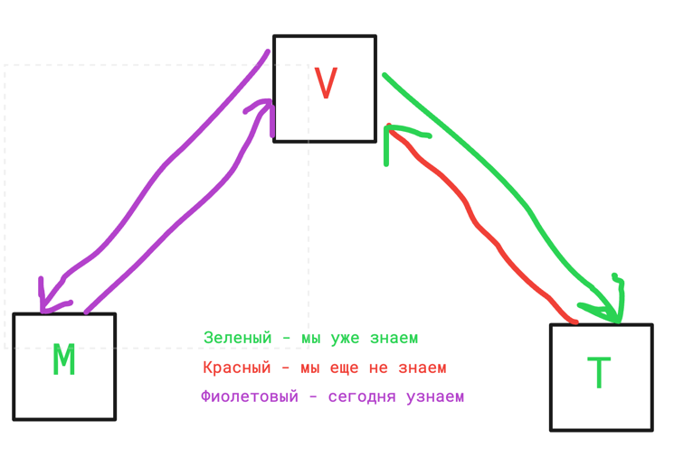

# Лекция 22. Django ORM.

### Оглавление курса

<details>
  <summary>Блок 1 — Python Basic (1–6)</summary>

  - [Лекция 1. Введение. Типизации. Переменные. Строки и числа. Булева алгебра. Ветвление](lesson01.md)
  - [Лекция 2. Обработка исключений. Списки, строки детальнее, срезы, циклы.](lesson02.md)
  - [Лекция 3. None. Range, list comprehension, sum, max, min, len, sorted, all, any. Работа с файлами](lesson03.md)
  - [Лекция 4. Хэш-таблицы. Set, frozenset. Dict. Tuple. Немного об импортах. Namedtuple, OrderedDict](lesson04.md)
  - [Лекция 5. Функции, типизация, lambda. Map, zip, filter.](lesson05.md)
  - [Лекция 6. Алгоритмы и структуры данных](lesson06.md)
</details>

<details>
  <summary>Блок 2 — Git (7–8)</summary>

  - [Лекция 7. Git. История системы контроля версий. Локальный репозиторий. Базовые команды управления репозиторием.](lesson07.md)
  - [Лекция 8. Git. Удаленный репозиторий. Remote, push, pull. GitHub, Bitbucket, GitLab, etc. Pull request.](lesson08.md)
</details>

<details>
  <summary>Блок 3 — Python Advanced (9–14)</summary>

  - [Лекция 9. Введение в ООП. Основные парадигмы ООП. Классы и объекты. Множественное наследование.](lesson09.md)
  - [Лекция 10. Magic methods. Итераторы и генераторы.](lesson10.md)
  - [Лекция 11. Imports. Standard library. PEP 8](lesson11.md)
  - [Лекция 12. Декораторы. Декораторы с параметрами. Декораторы классов (staticmethod, classmethod, property)](lesson12.md)
  - [Лекция 13. Тестирование](lesson13.md)
  - [Лекция 14. Проектирование. Паттерны. SOLID.](lesson14.md)
</details>

<details>
  <summary>Блок 4 — SQL (15–17)</summary>

  - [Лекция 15. СУБД. PostgreSQL. SQL. DDL. Пользователи. DCL. DML. Связи.](lesson15.md)
  - [Лекция 16. СУБД. DQL. SELECT. Индексы. Group by. Joins.](lesson16.md)
  - [Лекция 17. СУБД. Нормализация. Аномалии. Транзакции. ACID. TCL. Backup](lesson17.md)
</details>

- [Лекция 18. Virtual env. Pip. Устанавливаемые модули. Pyenv.](lesson18.md)

<details open>
  <summary>Блок 5 — Django (19–26)</summary>

  - [Лекция 19. Знакомство с Django](lesson19.md)
  - [Лекция 20. Templates. Static](lesson20.md)
  - [Лекция 21. Модели. Связи. Meta. Abstract, proxy](lesson21.md)
  - ▶ **Лекция 22. Django ORM**
  - [Лекция 23. Forms, ModelForms. User, Authentication.](lesson23.md)
  - [Лекция 24. ClassBaseView](lesson24.md)
  - [Лекция 25. NoSQL. Куки, сессии, кеш](lesson25.md)
  - [Лекция 26. Логирование. Middleware. Signals. Messages. Manage commands](lesson26.md)
</details>

<details>
  <summary>Блок 6 — Django Rest Framework (27–30)</summary>

  - [Лекция 27. Что такое API. REST и RESTful. Django REST Framework.](lesson27.md)
  - [Лекция 28. @api_view, APIView, ViewSets, Pagination, Routers](lesson28.md)
  - [Лекция 29. REST-аутентификация. Авторизация. Permissions. Фильтрация.](lesson29.md)
  - [Лекция 30. Тестирование. Django, REST API.](lesson30.md)
</details>

<details>
  <summary>Блок 7 — Python async (31–33)</summary>

  - [Лекция 31. Celery. Multithreading. GIL. Multiprocessing](lesson31.md)
  - [Лекция 32. Asyncio. Aiohttp. Асинхронное программирование на практике.](lesson32.md)
  - [Лекция 33. Сокеты. Django Channels.](lesson33.md)
</details>

<details>
  <summary>Блок 8 — Deployment (34–35)</summary>

  - [Лекция 34. Linux. Всё, что нужно знать для деплоймента.](lesson34.md)
  - [Лекция 35. Deployment](lesson35.md)
</details>

- [Лекция 36. Методологии разработки. CI/CD. Монолит и микросервисы. Docker](lesson36.md)


## Что сегодня учим?



## ORM

Мы уже знаем про то, как хранить данные и как связать таблицы между собой. Давайте научимся извлекать, модифицировать и
удалять данные при помощи кода.

В этой лекции мы будем работать с моделями блога, которые создали в предыдущей лекции:

```python
from django.db import models
from django.contrib.auth.models import User


class Topic(models.Model):
    """Тема/категория для статей"""
    name = models.CharField(max_length=100)
    created_at = models.DateTimeField(auto_now_add=True)

    def __str__(self):
        return self.name


class Article(models.Model):
    """Статья блога"""
    class Status(models.TextChoices):
        DRAFT = 'draft', 'Черновик'
        PUBLISHED = 'published', 'Опубликовано'
        ARCHIVED = 'archived', 'В архиве'

    title = models.CharField(max_length=200)
    slug = models.SlugField(max_length=200, unique=True)
    content = models.TextField()
    author = models.ForeignKey(User, on_delete=models.CASCADE, related_name='articles')
    status = models.CharField(max_length=20, choices=Status.choices, default=Status.DRAFT)
    topics = models.ManyToManyField(Topic, related_name='articles')
    created_at = models.DateTimeField(auto_now_add=True)
    updated_at = models.DateTimeField(auto_now=True)

    def __str__(self):
        return self.title


class Comment(models.Model):
    """Комментарий к статье"""
    article = models.ForeignKey(Article, on_delete=models.CASCADE, related_name='comments')
    author = models.ForeignKey(User, on_delete=models.CASCADE)
    text = models.TextField()
    parent = models.ForeignKey(
        'self',
        on_delete=models.CASCADE,
        null=True,
        blank=True,
        related_name='replies'
    )
    created_at = models.DateTimeField(auto_now_add=True)

    def __str__(self):
        return f'Комментарий от {self.author.username}'


class Profile(models.Model):
    """Профиль пользователя"""
    user = models.OneToOneField(User, on_delete=models.CASCADE)
    bio = models.TextField(blank=True)
    avatar = models.ImageField(upload_to='avatars/', blank=True)

    def __str__(self):
        return f'Профиль {self.user.username}'
```

## objects и shell

Для доступа или модификации любых данных, у каждой модели есть атрибут `objects`. Это **менеджер** (Manager) — специальный объект, который предоставляет интерфейс для работы с базой данных. Именно через менеджер мы вызываем методы `all()`, `filter()`, `get()`, `create()` и другие.

По умолчанию Django создаёт менеджер `objects` для каждой модели автоматически. При необходимости его можно переопределить или добавить дополнительные менеджеры (об этом подробнее в разделе «Кастомные менеджеры» ниже).

Для интерактивного использования кода используется команда

```python manage.py shell```

Эта команда открывает нам консоль с уже импортированными стандартными, но не самописными модулями Django


Предварительно я создал несколько объектов через админку.

Для доступа к моделям их нужно импортировать (после версии 5.0 больше не нужно, все модели будут доступны «из коробки»):

```python
from blog.models import Topic, Article, Comment
from django.contrib.auth.models import User
```

Рассмотрим весь CRUD и дополнительные особенности. Очень подробная информация по всем возможным
операциям [тут](https://docs.djangoproject.com/en/stable/topics/db/queries/)

### Ленивость QuerySet

Одна из ключевых особенностей Django ORM — **ленивые вычисления** (lazy evaluation). QuerySet не выполняет запрос к базе данных до тех пор, пока данные действительно не понадобятся.

```python
# Запрос к БД ещё НЕ выполнен!
articles = Article.objects.filter(status='published')
articles = articles.exclude(author__username='admin')
articles = articles.order_by('-created_at')

# Запрос выполнится только сейчас, при итерации:
for article in articles:
    print(article.title)
```

**Когда QuerySet выполняется (evaluates)?**

| Действие                            | Пример                     |
|-------------------------------------|----------------------------|
| Итерация                            | `for article in articles:` |
| Срез с шагом                        | `articles[::2]`            |
| Преобразование в список             | `list(articles)`           |
| Проверка bool                       | `if articles:`             |
| `len()`                             | `len(articles)`            |
| `repr()`                            | В shell при выводе         |
| Методы `first()`, `last()`, `get()` | `articles.first()`         |
| Методы `count()`, `exists()`        | `articles.count()`         |

**Кэширование результатов:**

После выполнения QuerySet кэширует результаты. Повторная итерация не вызывает новый запрос:

```python
articles = Article.objects.filter(status='published')

# Первая итерация — запрос к БД
for article in articles:
    print(article.title)

# Вторая итерация — данные из кэша, без запроса
for article in articles:
    print(article.slug)
```

> **Важно:** Срез без шага (`articles[:5]`) возвращает новый QuerySet и не вызывает выполнение запроса.

### R - retrieve

Функции для получения объектов в Django могут возвращать два типа данных: **объект модели** или **QuerySet**.

- **Объект** — единичная запись из базы данных
- **QuerySet** — коллекция объектов со встроенными методами для фильтрации, сортировки и т.д.

#### all()

Для получения всех данных используется метод `all()`, который возвращает QuerySet со всеми существующими объектами модели:

```python
Article.objects.all()
# <QuerySet [<Article: Первая статья>, <Article: Вторая статья>, ...]>
```

#### filter()

Для получения отфильтрованных данных используется метод `filter()`.

Если указать `filter()` без параметров, он сделает то же самое, что и `all()`.

Фильтр по полю:

```python
Article.objects.filter(status='published')
```

Фильтр по вложенным объектам выполняется через двойное подчёркивание:

```python
# Комментарии к опубликованным статьям
Comment.objects.filter(article__status='published')

# Комментарии к статьям конкретного автора
Comment.objects.filter(article__author__username='admin')

# Логическое И — через запятую
Comment.objects.filter(article__author__username='admin', article__status='published')
```

Кроме того, у каждого поля существуют встроенные системы лукапов. Синтаксис лукапов аналогичен синтаксису доступа к
вложенным
объектам `field__lookuptype=value`

Стандартные лукапы:

`lte` — меньше или равно

`gte` — больше или равно

`lt` — меньше

`gt` — больше

`startswith` — начинается с

`istartswith` — начинается с, без учёта регистра

`endswith` — заканчивается на

`iendswith` — заканчивается на, без учёта регистра

`range` — находится в диапазоне

`week_day` — день недели (для дат)

`year` — год (для дат)

`isnull` — является `null`

`contains` — частично содержит с учётом регистра («Всем привет, я — Влад» содержит слово «Влад», но не содержит «влад»)

`icontains` — то же самое, но без учёта регистра, теперь найдётся и второй вариант.

`exact` — совпадает (необязательный лукап, делает то же, что и знак равно)

`iexact` — совпадает без учёта регистра (по запросу «привет» найдёт и «Привет», и «прИвЕт»)

`in` — содержится в каком-то списке

Их намного больше, читать [ТУТ](https://docs.djangoproject.com/en/stable/ref/models/querysets/#field-lookups)

Примеры:

Заголовок статьи содержит слово 'python' без учёта регистра:

```python
Article.objects.filter(title__icontains='python')
```

Комментарии к статьям, созданным за последние сутки:

```python
from datetime import date, timedelta

Comment.objects.filter(article__created_at__gte=date.today() - timedelta(days=1))
```

Статьи с определёнными статусами:

```python
Article.objects.filter(status__in=['published', 'draft'])
```

#### exclude()

Метод `exclude()` — обратный `filter()`, возвращает всё, что **не** попадает в выборку.

Все статьи, кроме черновиков:

```python
Article.objects.exclude(status='draft')
```

`filter` и `exclude` можно комбинировать. К любому QuerySet можно применить эти методы повторно:

```python
# Опубликованные статьи, созданные за последнюю неделю, кроме статей пользователя admin
Article.objects.filter(
    status='published',
    created_at__gte=date.today() - timedelta(days=7)
).exclude(author__username='admin')
```

Все эти методы возвращают QuerySet — коллекцию записей из базы. К любому QuerySet можно применить любой метод менеджера повторно.

#### order_by()

По умолчанию модели сортируются по полю `id`. Для другой сортировки используется `order_by()`. Знак «-» означает сортировку в обратном порядке:

```python
# Статьи от новых к старым
Article.objects.filter(status='published').order_by('-created_at')

# Комментарии, отсортированные по дате создания статьи
Comment.objects.all().order_by('-article__created_at', 'created_at')
```

#### `distinct()`

Метод `distinct()` исключает дублирующиеся записи из результата запроса:

```python
# Уникальные авторы статей (только PostgreSQL поддерживает distinct по полю)
Article.objects.order_by('author').distinct('author')

# Без указания поля — убирает полные дубликаты
Comment.objects.filter(article__status='published').distinct()
```

> Примечание: `distinct('field')` доступен только в PostgreSQL и имеет ограничения при использовании с `order_by()`.

#### `values()`

Метод `values()` возвращает QuerySet словарей вместо объектов модели. Полезно, когда нужны только определённые поля:

```python
# Получить только заголовки и слаги статей
Article.objects.values('title', 'slug')
# <QuerySet [{'title': 'Первая статья', 'slug': 'pervaya-statya'}, ...]>

# Можно комбинировать с filter
Article.objects.filter(status='published').values('title', 'author__username')
```

#### `values_list()`

Метод `values_list()` похож на `values()`, но возвращает кортежи вместо словарей:

```python
Article.objects.values_list('title', 'slug')
# <QuerySet [('Первая статья', 'pervaya-statya'), ('Вторая статья', 'vtoraya-statya'), ...]>

# flat=True — для одного поля возвращает плоский список
Article.objects.values_list('title', flat=True)
# <QuerySet ['Первая статья', 'Вторая статья', ...]>

# Получить все id опубликованных статей
published_ids = list(Article.objects.filter(status='published').values_list('id', flat=True))
# [1, 3, 5, 7]
```

#### `only()` и `defer()`

Эти методы оптимизируют загрузку полей модели:

- `only()` — загружает **только** указанные поля;
- `defer()` — загружает **все поля, кроме** указанных.

```python
# Загрузить только title и slug (content не загружается)
articles = Article.objects.only('title', 'slug')

# Загрузить всё, кроме content (полезно для больших текстовых полей)
articles = Article.objects.defer('content')

# При обращении к отложенному полю — дополнительный запрос!
for article in articles:
    print(article.content)  # Каждый раз запрос к БД!
```

> **Важно:** Используйте эти методы осторожно. Обращение к отложенному полю вызывает дополнительный запрос.

#### `exists()` и `count()`

Эффективные методы для проверки существования и подсчёта:

```python
# Плохо — загружает все объекты в память
if Article.objects.filter(status='published'):
    print("Есть опубликованные статьи")

# Хорошо — выполняет SELECT EXISTS (быстрее)
if Article.objects.filter(status='published').exists():
    print("Есть опубликованные статьи")

# Плохо — загружает все объекты
count = len(Article.objects.filter(status='published'))

# Хорошо — выполняет SELECT COUNT(*) (быстрее)
count = Article.objects.filter(status='published').count()
```

#### `union()`

Метод `union()` объединяет два или более QuerySet. Результат содержит уникальные записи из всех QuerySet:

```python
# Статьи за прошлую неделю ИЛИ статьи с определённой темой
recent = Article.objects.filter(created_at__gte=date.today() - timedelta(days=7))
python_topic = Article.objects.filter(topics__name='Python')

combined = recent.union(python_topic)
```

#### `intersection()`

Метод `intersection()` возвращает пересечение QuerySet — записи, которые есть во всех:

```python
# Опубликованные статьи И статьи конкретного автора
published = Article.objects.filter(status='published')
by_admin = Article.objects.filter(author__username='admin')

published_by_admin = published.intersection(by_admin)
```

#### `difference()`

Метод `difference()` возвращает разность — записи из первого QuerySet, которых нет во втором:

```python
# Все статьи МИНУС черновики = опубликованные и архивные
all_articles = Article.objects.all()
drafts = Article.objects.filter(status='draft')

not_drafts = all_articles.difference(drafts)
```

#### `in_bulk()`

Метод `in_bulk()` получает объекты по списку id и возвращает словарь `{id: объект}`:

```python
# Получить статьи с id 1, 3, 5
articles = Article.objects.in_bulk([1, 3, 5])
# {1: <Article: Первая статья>, 3: <Article: Третья статья>, 5: <Article: Пятая статья>}

# Быстрый доступ по id
article = articles[3]
```

#### `iterator()`

Метод `iterator()` возвращает итератор, который не кэширует результаты. Полезно для работы с большими QuerySet:

```python
# Обычный QuerySet — все объекты загружаются в память
for article in Article.objects.all():
    process(article)

# С iterator() — объекты загружаются по одному, экономия памяти
for article in Article.objects.all().iterator():
    process(article)

# Можно указать размер чанка (по умолчанию 2000)
for article in Article.objects.all().iterator(chunk_size=500):
    process(article)
```

> **Важно:** После использования `iterator()` нельзя повторно итерировать по QuerySet — данные не кэшируются.

#### `explain()`

Метод `explain()` показывает план выполнения SQL-запроса (аналог `EXPLAIN` в SQL):

```python
print(Article.objects.filter(status='published').explain())
# Seq Scan on blog_article  (cost=0.00..12.50 rows=5 width=200)
#   Filter: (status = 'published')

# С подробным анализом (PostgreSQL)
print(Article.objects.filter(status='published').explain(analyze=True))
```

Полезно для оптимизации запросов и понимания, используются ли индексы.

Это далеко не всё, что можно сделать с QuerySet.

Все методы QuerySet: [документация Django](https://docs.djangoproject.com/en/stable/ref/models/querysets/#methods-that-return-new-querysets)

### Вставка объектов в методы

Помимо прочего во все фильтры (и не только) можно вставлять целые объекты, например:

```python
art = Article.objects.get(id=2)
comments = Comment.objects.filter(article=art)
```

### Объектные методы

#### get()

В отличие от `filter` и `exclude` метод `get` получает сразу объект. Этот метод работает только в том случае, когда
можно
определить объект однозначно и он существует.

Можно применять те же условия, что и для `filter` и `exclude`

Например, получения объекта по `id`

```python
Comment.objects.get(id=3)
```

Если объект не найден или найдено больше одного объекта по заданным параметрам, вы получите исключение, которое
желательно всегда обрабатывать. Исключения уже находятся в самой модели.

```python
try:
    Comment.objects.get(article__status='published', author__username='admin')
except Comment.DoesNotExist:
    return "Can't find object"
except Comment.MultipleObjectsReturned:
    return "More than one object"
```

#### first() и last()

К кверисету можно применять методы `first` и `last`, чтобы получить первый или последний элемент кверисета

Например, получить первый коммент, написанный за вчера:

```python
Comment.objects.filter(article__created_at__gte=date.today() - timedelta(days=1)).first()
```

Обратите внимание на несколько важных моментов:

**Доступ к связанным объектам через ForeignKey:**

```python
article = Article.objects.first()
print(article.author.username)  # Получаем имя автора через связь
```

В базе данных в поле `author` хранится только `id` пользователя, но Django позволяет обращаться к связанному объекту напрямую.

Информация по всем остальным
методам [Тут](https://docs.djangoproject.com/en/stable/ref/models/querysets/#methods-that-do-not-return-querysets)

### related_name

Атрибут `related_name`, который указывается для полей связи, является обратной связью и менеджером для объектов,
например, в нашей модели у поля `author` модели `Article` есть `related_name=articles`:

```python
a = Author.objects.first()
articles = a.articles.all()  # Тут будут все статьи конкретного автора в виде кверисета, т.к. all() возвращает кверисет
```

Можно ли получить объекты обратной связи без указания `related_name`? Можно. Связь появляется автоматически даже без
указания этого атрибута.

Обратный менеджер формируется из названия модели и конструкции `_set`. Допустим, у поля `article` модели `Comment` не
указано поле `related_name`:

```python
a = Article.objects.first()
a.comment_set.all()  # такой же менеджер, как в прошлом примере, вернёт кверисет комментариев, относящихся к этой статье.
```

### C - Create

Для создания новых объектов используется два варианта: метод `create()` или метод `save()`.

Создадим новые темы разными способами:

```python
# Способ 1: create() — сразу создаёт запись в БД
Topic.objects.create(name='Python')

# Способ 2: создание объекта + save()
topic = Topic(name='Django')
topic.save()
```

В чём разница? В первом случае запрос в базу отправляется сразу, во втором — только при вызове `save()`.

Метод `save()` также используется для обновления существующего объекта. Мы рассмотрим его подробнее дальше.

### U - Update

Для обновления значений полей используется метод `update()`.

**Применяется только к QuerySet, к объекту применить нельзя!**

```python
# Через update() — один SQL-запрос
Comment.objects.filter(id=3).update(text='Обновлённый текст')

# Через объект — загрузка + сохранение
comment = Comment.objects.get(id=3)
comment.text = 'Обновлённый текст'
comment.save()
```

### D - Delete

Удаление выполняется методом `delete()`:

```python
# Удалить все комментарии пользователя с id=2
Comment.objects.filter(author__id=2).delete()
```

### Совмещенные методы

#### get_or_create(), update_or_create(), bulk_create(), bulk_update()

`get_or_create()` — это метод, который попытается создать новый объект. Если он не сможет найти нужный в базе, он
возвращает сам объект и булево значение, которое обозначает, что объект был создан или получен.

`update_or_create()` — обновит, если объект существует, создаст, если не существует.

`bulk_create()` — массовое создание; необходимо для того, чтобы избежать большого количества обращений в базу.

`bulk_update()` — массовое обновление (отличие от обычного в том, что при обычном на каждый объект создаётся запрос,
в этом случае запрос делается массово).

Подробно почитать про них [Тут](https://docs.djangoproject.com/en/stable/ref/models/querysets/#get-or-create)

## Подробнее о методе save()

> `SQL` запрос выполняется именно при вызове метода `save`, метода `delete` или изменении M2M о чем ниже.

Метод `save()` применяется при любых изменениях или создании данных, но очень часто нужно, чтобы при сохранении данных
выполнялись ещё какие-либо действия, переписывание данных или запись логов и т. д. Для этого используется переписывание
метода `save()`. По сути является способом написать аналог триггера в базе данных.

Метод `save()` вызывают явно или неявно во время вызова методов создания или обновления, но без него запись в базу не
будет произведена.

Допустим, мы хотим делать время создания статьи на один день раньше, чем фактическая. Перепишем метод `save()` для
статьи:

```python
class MyAwesomModel(models.Model):
    name = models.CharField(max_length=100)
    created_at = models.DateTimeField()

    def save(self, **kwargs):
        self.created_at = timezone.now() - timedelta(days=1)
        super().save(**kwargs)
```

Переопределяем значение и вызываем оригинальный `save()`, вуаля.

Чтобы переопределить логику при создании, но не трогать при изменении, или наоборот, используется особенность
данных. У уже созданного объекта `id` существует, у нового — нет. Так что фактически наш код сейчас обновляет это поле
всегда, и когда надо, и когда не надо. Допишем его.

```python
class MyAwesomModel(models.Model):
    name = models.CharField(max_length=100)
    created_at = models.DateTimeField()

    def save(self, **kwargs):
        if not self.id:
            self.created_at = timezone.now() - timedelta(days=1)
        super().save(**kwargs)
```

Теперь поле будет переписываться только в момент создания, но не будет трогаться при обновлении.

Метод `delete()`: при удалении объекта `save()` не вызывается, а вызывается `delete()`. По аналогии мы можем его
переписать, например, для отправки email перед удалением.

```python
class MyAwesomModel(models.Model):
    name = models.CharField(max_length=100)
    created_at = models.DateTimeField()

    def delete(self, **kwargs):
        send_email(id=self.id)
        super().delete(**kwargs)
```

## Кастомные менеджеры

Как мы узнали ранее, `objects` — это менеджер модели, через который мы обращаемся к базе данных. Django позволяет создавать собственные менеджеры для добавления часто используемых запросов или изменения поведения по умолчанию.

### Зачем нужны кастомные менеджеры?

1. **Инкапсуляция часто используемых запросов** — вместо повторения `filter(status='published')` везде в коде.
2. **Изменение базового QuerySet** — например, показывать только активные записи.
3. **Добавление методов уровня таблицы** — операции, которые не относятся к конкретному объекту.
4. **Разделение логики** — разные менеджеры для разных сценариев использования.

### Создание кастомного менеджера

#### Способ 1: Добавление методов в менеджер

```python
# blog/models.py
from django.db import models


class ArticleManager(models.Manager):
    def published(self):
        """Возвращает только опубликованные статьи"""
        return self.filter(status='published')

    def drafts(self):
        """Возвращает только черновики"""
        return self.filter(status='draft')

    def by_author(self, user):
        """Статьи конкретного автора"""
        return self.filter(author=user)

    def popular(self, min_comments=10):
        """Статьи с большим количеством комментариев"""
        from django.db.models import Count
        return self.annotate(
            comment_count=Count('comments')
        ).filter(comment_count__gte=min_comments)


class Article(models.Model):
    title = models.CharField(max_length=200)
    status = models.CharField(max_length=20)
    author = models.ForeignKey('auth.User', on_delete=models.CASCADE)
    # ...

    objects = ArticleManager()  # Заменяем стандартный менеджер
```

Использование:

```python
# Вместо Article.objects.filter(status='published')
Article.objects.published()

# Цепочка вызовов работает!
Article.objects.published().order_by('-created_at')[:5]

# Кастомные методы
Article.objects.by_author(request.user)
Article.objects.popular(min_comments=5)
```

#### Способ 2: Изменение базового QuerySet

Если нужно изменить поведение **всех** запросов через менеджер:

```python
class PublishedManager(models.Manager):
    def get_queryset(self):
        """Всегда возвращает только опубликованные статьи"""
        return super().get_queryset().filter(status='published')


class Article(models.Model):
    title = models.CharField(max_length=200)
    status = models.CharField(max_length=20)
    # ...

    objects = models.Manager()  # Стандартный менеджер (все статьи)
    published = PublishedManager()  # Только опубликованные
```

Использование:

```python
# Все статьи (включая черновики)
Article.objects.all()

# Только опубликованные
Article.published.all()
Article.published.filter(author=user)  # Опубликованные статьи автора
```

### Несколько менеджеров в одной модели

Можно использовать несколько менеджеров для разных сценариев:

```python
class Article(models.Model):
    title = models.CharField(max_length=200)
    status = models.CharField(max_length=20)
    is_deleted = models.BooleanField(default=False)  # Soft delete
    # ...

    # Стандартный менеджер — первый будет использоваться по умолчанию
    objects = ArticleManager()

    # Только опубликованные
    published = PublishedManager()

    # Все записи, включая удалённые (для админки)
    all_objects = models.Manager()

    class Meta:
        default_manager_name = 'objects'  # Явно указываем менеджер по умолчанию
```

### Менеджер с кастомным QuerySet

Для более гибкого подхода можно создать кастомный QuerySet и использовать его в менеджере:

```python
class ArticleQuerySet(models.QuerySet):
    def published(self):
        return self.filter(status='published')

    def drafts(self):
        return self.filter(status='draft')

    def by_topic(self, topic):
        return self.filter(topics=topic)


class ArticleManager(models.Manager):
    def get_queryset(self):
        return ArticleQuerySet(self.model, using=self._db)

    # Проксируем методы QuerySet
    def published(self):
        return self.get_queryset().published()

    def drafts(self):
        return self.get_queryset().drafts()


# Или короче — использовать as_manager()
class Article(models.Model):
    # ...
    objects = ArticleQuerySet.as_manager()
```

Преимущество `QuerySet.as_manager()` — методы можно вызывать в цепочке:

```python
# Это работает!
Article.objects.published().by_topic(python_topic).order_by('-created_at')
```

### Практический пример: Soft Delete

Частый паттерн — «мягкое удаление», когда записи не удаляются физически:

```python
class SoftDeleteManager(models.Manager):
    def get_queryset(self):
        return super().get_queryset().filter(is_deleted=False)


class SoftDeleteModel(models.Model):
    is_deleted = models.BooleanField(default=False)
    deleted_at = models.DateTimeField(null=True, blank=True)

    objects = SoftDeleteManager()  # Только активные
    all_objects = models.Manager()  # Все, включая удалённые

    def delete(self, *args, **kwargs):
        """Мягкое удаление вместо физического"""
        self.is_deleted = True
        self.deleted_at = timezone.now()
        self.save()

    def hard_delete(self, *args, **kwargs):
        """Физическое удаление"""
        super().delete(*args, **kwargs)

    class Meta:
        abstract = True


class Article(SoftDeleteModel):
    title = models.CharField(max_length=200)
    # ...
```

> **Примечание:** В лекции 23 мы увидим пример кастомного менеджера для модели пользователя (`CustomUserManager`), который переопределяет методы `create_user()` и `create_superuser()`.

## Работа с ManyToMany

В наших моделях блога статья связана с темами через ManyToMany:

```python
class Article(models.Model):
    # ...
    topics = models.ManyToManyField(Topic, related_name='articles')
```

Для работы с M2M связями используются методы менеджера `add`, `remove`, `set` и `clear`.

Создадим несколько тем:

```python
t1 = Topic(name="Python")
t1.save()
t2 = Topic(name="Django")
t2.save()
t3 = Topic(name="Web-разработка")
t3.save()
```

> Можно использовать `Topic.objects.create()`, но здесь важно отследить SQL-запросы

```python
article = Article(title="Введение в Django", slug="intro-django", content="...", author=user)
```

### Добавление объекта

Если не сохранить статью и попытаться изменить M2M, будет ошибка:

```python
article.topics.add(t1)
# ValueError: "<Article: Введение в Django>" needs to have a value for field "id"
# before this many-to-many relationship can be used.
```

Объект `article` существует только в Python, но его ещё нет в базе данных.

Сохраним объект и добавим темы:

```python
article.save()
article.topics.add(t1)  # Выполнится отдельный SQL-запрос
```

Можно добавлять несколько объектов за раз:

```python
article2 = Article.objects.create(
    title="Django ORM", slug="django-orm", content="...", author=user
)
article2.topics.add(t1, t2)
article2.topics.add(t3)
```

При попытке добавить объект неправильного типа — ошибка:

```python
article2.topics.add(article)
# TypeError: 'Topic' instance expected
```

> Можно создать и сразу добавить объект:

```python
new_topic = article2.topics.create(name="Backend")
```

Метод создаст объект Topic, добавит его к M2M и вернёт в переменную.

### Получение объектов

Поле `topics` является менеджером, к нему применимы все методы как к `objects`:

```python
article.topics.all()
# <QuerySet [<Topic: Python>]>
article2.topics.all()
# <QuerySet [<Topic: Python>, <Topic: Django>, <Topic: Web-разработка>, <Topic: Backend>]>
```

> `all()` возвращает только те объекты, которые связаны с запрашиваемым

Через `related_name` можно получить объекты с другой стороны связи:

```python
t1.articles.all()
# <QuerySet [<Article: Введение в Django>, <Article: Django ORM>]>
t2.articles.all()
# <QuerySet [<Article: Django ORM>]>
Topic.objects.get(name="Backend").articles.all()
# <QuerySet [<Article: Django ORM>]>
```

### `filter`, `distinct`, `count`

К M2M-менеджеру применимы все методы QuerySet:

```python
Article.objects.filter(topics__id=1)
# <QuerySet [<Article: Введение в Django>, <Article: Django ORM>]>
Article.objects.filter(topics=t1)
# <QuerySet [<Article: Введение в Django>, <Article: Django ORM>]>
Article.objects.filter(topics__name__icontains="python")
# <QuerySet [<Article: Введение в Django>, <Article: Django ORM>]>

# При фильтрации по M2M могут появляться дубликаты — используйте distinct()
Article.objects.filter(topics__name__startswith="Web").distinct()
Article.objects.filter(topics__in=[t1, t2]).distinct()
Article.objects.filter(topics__in=[1, 2]).distinct().count()
```

> Любые действия с менеджером доступны как напрямую, так и через `related_name`

### Удаление объектов

```python
article.topics.remove(t1)
article.topics.all()
# <QuerySet []>
```

И с другой стороны:

```python
t2.articles.remove(article2)
t2.articles.all()
# <QuerySet []>
```

### Назначение списком или очистка

Можно назначить список, который полностью заменит связь:

```python
article.topics.all()
# <QuerySet [<Topic: Python>]>
article.topics.set([t2, t3])
article.topics.all()
# <QuerySet [<Topic: Django>, <Topic: Web-разработка>]>
```

Или очистить всю связь:

```python
t1.articles.clear()
t1.articles.all()
# <QuerySet []>
```

> Назначение и очистка работают с обеих сторон связи.

## Сложные SQL конструкции

Документация по этому разделу

[Тут](https://docs.djangoproject.com/en/stable/ref/models/expressions/#django.db.models.F)
[Тут](https://docs.djangoproject.com/en/stable/ref/models/querysets/#django.db.models.Q)

На самом деле, мы не ограничены стандартными конструкциями. Мы можем применять предвычисления на уровне базы, добавлять
логические конструкции и т. д., давайте рассмотрим подробнее.

### Q объекты

Как вы могли заметить, при фильтрации мы можем указать логическое И через запятую:

```python
Article.objects.filter(status='published', author__username='admin')
```

Это выберет статьи, у которых статус `published` **И** автор `admin`.

Но что делать, если нужно логическое **ИЛИ**?

Для этого используется Q объект:

```python
from django.db.models import Q

q1 = Q(status='published')
q2 = Q(author__username='admin')
```

Теперь можно явно использовать логические операторы:

```python
Article.objects.filter(q1 & q2)  # И — опубликованные статьи admin'а
Article.objects.filter(q1 | q2)  # ИЛИ — опубликованные ИЛИ от admin'а
Article.objects.filter(~q1)      # НЕ — всё кроме опубликованных
```

Можно комбинировать сложные условия:

```python
# Опубликованные статьи ИЛИ черновики admin'а
Article.objects.filter(
    Q(status='published') | Q(status='draft', author__username='admin')
)
```

### Aggregation (Агрегация)

Агрегация позволяет выполнять вычисления над набором данных: среднее, сумма, минимум, максимум, количество.

#### `aggregate()` — агрегация всего QuerySet

Метод `aggregate()` возвращает словарь с результатами вычислений:

```python
from django.db.models import Count, Avg, Max, Min, Sum

# Количество всех статей
Article.objects.aggregate(Count('id'))
# {'id__count': 42}

# Можно именовать результат
Article.objects.aggregate(total=Count('id'))
# {'total': 42}

# Несколько агрегаций за раз
Comment.objects.aggregate(
    total=Count('id'),
    earliest=Min('created_at'),
    latest=Max('created_at')
)
# {'total': 156, 'earliest': datetime(...), 'latest': datetime(...)}
```

#### `annotate()` — агрегация для каждого объекта

Метод `annotate()` добавляет вычисляемое поле к каждому объекту QuerySet:

```python
from django.db.models import Count

# Статьи с количеством комментариев
articles = Article.objects.annotate(comment_count=Count('comments'))

for article in articles:
    print(f"{article.title}: {article.comment_count} комментариев")

# Можно фильтровать и сортировать по аннотированному полю
popular = Article.objects.annotate(
    comment_count=Count('comments')
).filter(comment_count__gte=10).order_by('-comment_count')
```

#### Агрегация с фильтрацией

```python
from django.db.models import Count, Q

# Авторы с количеством опубликованных статей
users = User.objects.annotate(
    published_count=Count('articles', filter=Q(articles__status='published')),
    draft_count=Count('articles', filter=Q(articles__status='draft'))
)

for user in users:
    print(f"{user.username}: {user.published_count} опубликовано, {user.draft_count} черновиков")
```

#### Агрегация по связанным объектам

```python
# Темы с количеством статей
topics = Topic.objects.annotate(article_count=Count('articles'))

# Статьи с количеством тем
articles = Article.objects.annotate(topic_count=Count('topics'))

# Авторы со средним количеством комментариев на статью
from django.db.models import Avg, Count

authors = User.objects.annotate(
    avg_comments=Avg('articles__comments')  # Через связь
)
```

## F() выражения

В Django ORM (Object-Relational Mapping) для работы с базой данных часто возникает необходимость обновления полей
модели, сравнения значений полей между собой или выполнения арифметических операций на уровне базы данных. Для этих
целей в Django используется класс `F`.

### Что такое F объекты?

`F` объекты представляют собой способ обращения к полям модели без необходимости загружать их в память приложения.
Вместо этого операции с `F` объектами выполняются непосредственно на уровне базы данных, что может значительно повысить
производительность при выполнении запросов.

### Примеры использования F объектов

#### Обновление поля на основе его текущего значения

Рассмотрим простой пример: допустим, у нас есть модель `Product`, которая имеет поле `price`. Предположим, что нам нужно
увеличить цену каждого товара на 10%.

```python
from django.db.models import F

Product.objects.update(price=F('price') * 1.10)
```

Этот запрос обновит поле `price` для всех записей, увеличив его значение на 10%. При этом Django выполнит операцию
умножения на уровне базы данных, что исключит необходимость загружать все объекты в память.

#### Сравнение полей внутри одной записи

Допустим, нам нужно найти статьи, которые были обновлены после создания (т.е. редактировались):

```python
from django.db.models import F

# Статьи, где updated_at > created_at
edited_articles = Article.objects.filter(updated_at__gt=F('created_at'))
```

Этот запрос сравнивает два поля одной записи на уровне базы данных.

#### Условное обновление поля

Рассмотрим пример, когда у нас есть модель `Employee` с полем `bonus`. Мы хотим увеличить бонус на 500 для всех
сотрудников, у которых текущий бонус менее 1000.

```python
from django.db.models import F, Q

Employee.objects.filter(bonus__lt=1000).update(bonus=F('bonus') + 500)
```

Этот запрос обновит поле `bonus`, прибавив к текущему значению 500 для всех сотрудников, у которых бонус меньше 1000.

#### Агрегатные функции с F объектами

Предположим, у нас есть модель `Sale` с полями `quantity` и `unit_price`, и мы хотим узнать общую стоимость каждого
товара, умножив количество на цену за единицу.

```python
from django.db.models import F, Sum

total_sales = Sale.objects.annotate(total_price=F('quantity') * F('unit_price'))
```

Этот запрос добавит к каждому объекту `Sale` дополнительное поле `total_price`, содержащее общую стоимость товара.

#### Использование F объектов в аннотациях

В некоторых случаях удобно использовать `F` объекты в аннотациях для создания вычисляемых полей. Например, предположим,
что у нас есть модель `Invoice` с полями `subtotal` и `discount`. Мы хотим добавить аннотацию с окончательной суммой
счета, учитывая скидку.

```python
from django.db.models import F, ExpressionWrapper, FloatField

invoices = Invoice.objects.annotate(
    total=ExpressionWrapper(F('subtotal') - F('discount'), output_field=FloatField())
)
```

Здесь мы используем `ExpressionWrapper`, чтобы указать Django тип возвращаемого значения, поскольку операции с `F`
объектами могут привести к неоднозначности типов данных.

## Case/When — условные выражения

`Case` и `When` позволяют создавать условные выражения в запросах (аналог `CASE WHEN` в SQL):

```python
from django.db.models import Case, When, Value, CharField, IntegerField

# Добавить текстовую метку в зависимости от статуса
articles = Article.objects.annotate(
    status_label=Case(
        When(status='draft', then=Value('Черновик')),
        When(status='published', then=Value('Опубликовано')),
        When(status='archived', then=Value('В архиве')),
        default=Value('Неизвестно'),
        output_field=CharField()
    )
)

for article in articles:
    print(f"{article.title}: {article.status_label}")
```

#### Условное обновление

```python
from django.db.models import Case, When, F

# Увеличить приоритет статей в зависимости от количества комментариев
Article.objects.annotate(
    comment_count=Count('comments')
).update(
    priority=Case(
        When(comment_count__gte=100, then=Value(1)),
        When(comment_count__gte=50, then=Value(2)),
        When(comment_count__gte=10, then=Value(3)),
        default=Value(4),
        output_field=IntegerField()
    )
)
```

#### Условная сортировка

```python
# Сначала опубликованные, потом черновики, потом архивные
articles = Article.objects.annotate(
    status_order=Case(
        When(status='published', then=Value(0)),
        When(status='draft', then=Value(1)),
        When(status='archived', then=Value(2)),
        output_field=IntegerField()
    )
).order_by('status_order', '-created_at')
```

## Subquery и OuterRef — подзапросы

`Subquery` позволяет использовать результат одного запроса внутри другого:

```python
from django.db.models import Subquery, OuterRef

# Для каждой статьи получить дату последнего комментария
latest_comment = Comment.objects.filter(
    article=OuterRef('pk')  # Ссылка на внешний запрос
).order_by('-created_at')

articles = Article.objects.annotate(
    last_comment_date=Subquery(latest_comment.values('created_at')[:1])
)

for article in articles:
    print(f"{article.title}: последний комментарий {article.last_comment_date}")
```

#### Exists с подзапросом

```python
from django.db.models import Exists, OuterRef

# Статьи, у которых есть комментарии
has_comments = Comment.objects.filter(article=OuterRef('pk'))

articles_with_comments = Article.objects.annotate(
    has_comments=Exists(has_comments)
).filter(has_comments=True)

# Или короче
articles_with_comments = Article.objects.filter(
    Exists(Comment.objects.filter(article=OuterRef('pk')))
)
```

#### Подзапрос с агрегацией

```python
from django.db.models import Count, Subquery, OuterRef

# Количество комментариев для каждой статьи через подзапрос
comment_count = Comment.objects.filter(
    article=OuterRef('pk')
).values('article').annotate(count=Count('id')).values('count')

articles = Article.objects.annotate(
    comment_count=Subquery(comment_count)
)
```

## Raw SQL — сырые запросы

Иногда ORM недостаточно для сложных запросов. Django позволяет выполнять сырой SQL:

### `raw()` — возвращает объекты модели

```python
# Выполнить сырой SQL и получить объекты Article
articles = Article.objects.raw('SELECT * FROM blog_article WHERE status = %s', ['published'])

for article in articles:
    print(article.title)  # Это объект Article
```

### `connection.cursor()` — полный контроль

```python
from django.db import connection

with connection.cursor() as cursor:
    cursor.execute("""
        SELECT author_id, COUNT(*) as article_count
        FROM blog_article
        WHERE status = 'published'
        GROUP BY author_id
        HAVING COUNT(*) > 5
    """)
    rows = cursor.fetchall()

for author_id, count in rows:
    print(f"Автор {author_id}: {count} статей")
```

> **Важно:** При использовании сырого SQL будьте осторожны с SQL-инъекциями. Всегда используйте параметризованные запросы (`%s`), никогда не вставляйте пользовательские данные напрямую в строку запроса.

## Select related и Prefetch related

### Введение

Когда вы работаете с базой данных в Django, важно учитывать, сколько запросов вы выполняете и насколько эффективны эти
запросы. Один из частых антипаттернов — проблема «N+1 запросов», когда для получения данных выполняется множество
запросов, что замедляет работу приложения. Django предоставляет два мощных инструмента для оптимизации
запросов: `select_related` и `prefetch_related`.

### Проблема «N+1 запросов»

Рассмотрим на примере наших моделей блога. Если мы хотим вывести список статей с именами авторов:

```python
articles = Article.objects.all()
for article in articles:
    print(article.title, article.author.username)  # Каждый раз запрос к User!
```

Это проблема «N+1 запросов»: один запрос для получения всех статей, а затем для каждой статьи — отдельный запрос для получения автора. При 100 статьях — 101 запрос!

### Использование `select_related`

Метод `select_related` выполняет запрос с `JOIN`, получая связанные объекты за один запрос. Используется для **ForeignKey** и **OneToOne**.

#### Пример использования `select_related`

```python
# Один SQL-запрос с JOIN
articles = Article.objects.select_related('author').all()
for article in articles:
    print(article.title, article.author.username)  # Данные уже загружены!
```

Можно указать несколько связей и вложенные связи:

```python
# Комментарии с авторами и статьями (и авторами статей)
comments = Comment.objects.select_related('author', 'article__author').all()
for comment in comments:
    print(f"{comment.author.username} прокомментировал статью {comment.article.title}")
```

#### Как это работает?

Django выполняет SQL-запрос с `INNER JOIN` или `LEFT OUTER JOIN`, получая все связанные объекты за один запрос. Эффективно для отношений «один к одному» и «многие к одному».

### Использование `prefetch_related`

Метод `prefetch_related` используется для **ManyToMany** и обратных **ForeignKey** связей. Он выполняет отдельные запросы, но объединяет результаты в Python.

#### Пример использования `prefetch_related`

```python
# Статьи с их темами (M2M)
articles = Article.objects.prefetch_related('topics').all()
for article in articles:
    print(article.title)
    for topic in article.topics.all():  # Данные уже загружены!
        print(f"  - {topic.name}")
```

Здесь `prefetch_related` выполнит два запроса: один для статей, второй — для всех связанных тем. Django затем связывает темы со статьями в Python.

#### Загрузка обратных связей

```python
# Статьи с комментариями (обратная FK связь)
articles = Article.objects.prefetch_related('comments').all()
for article in articles:
    print(f"{article.title}: {article.comments.count()} комментариев")
```

### Сравнение `select_related` и `prefetch_related`

| Метод              | Тип связи               | Как работает                            |
|--------------------|-------------------------|-----------------------------------------|
| `select_related`   | ForeignKey, OneToOne    | SQL JOIN, один запрос                   |
| `prefetch_related` | ManyToMany, обратные FK | Отдельные запросы, объединение в Python |

### Практические примеры

#### Комбинирование обоих методов

На практике часто нужно использовать оба метода вместе:

```python
# Статьи с авторами (FK) и темами (M2M)
articles = Article.objects.select_related('author').prefetch_related('topics').all()

for article in articles:
    topics_str = ', '.join(t.name for t in article.topics.all())
    print(f"{article.title} by {article.author.username} [{topics_str}]")
```

#### Сложный пример с комментариями

```python
# Статьи с авторами, темами и комментариями (с авторами комментариев)
from django.db.models import Prefetch

articles = Article.objects.select_related('author').prefetch_related(
    'topics',
    Prefetch('comments', queryset=Comment.objects.select_related('author'))
).filter(status='published')

for article in articles:
    print(f"\n{article.title} by {article.author.username}")
    for comment in article.comments.all():
        print(f"  💬 {comment.author.username}: {comment.text[:50]}...")
```

`Prefetch` позволяет настроить `QuerySet` для prefetch — например, добавить `select_related` для вложенных связей.

## Как управлять транзакциями?

В Django ORM управление транзакциями можно осуществлять с помощью встроенных инструментов, таких
как `atomic`, `transaction.on_commit`, а также с помощью ручного управления транзакциями через API транзакций.
Рассмотрим примеры для каждого из этих подходов.

### Управление транзакциями с использованием `atomic`

`atomic` — это контекстный менеджер или декоратор, который гарантирует, что все операции внутри блока будут выполнены в
одной транзакции. Если внутри блока возникает исключение, транзакция откатывается.

#### Пример с использованием контекстного менеджера:

```python
from django.db import transaction
from blog.models import Article, Topic


def create_article_with_topics(user):
    try:
        with transaction.atomic():
            article = Article.objects.create(
                title="Новая статья",
                slug="new-article",
                content="Контент...",
                author=user
            )
            topic = Topic.objects.create(name="Новая тема")
            article.topics.add(topic)
            # Если здесь возникнет исключение, ни статья, ни тема не будут созданы
    except Exception as e:
        print(f"Transaction failed: {e}")
```

#### Пример с использованием декоратора:

```python
from django.db import transaction
from blog.models import Article


@transaction.atomic
def publish_articles(article_ids):
    Article.objects.filter(id__in=article_ids).update(status='published')
    # Если здесь возникнет исключение, все изменения откатятся
```

### Управление транзакциями с использованием `transaction.on_commit`

`on_commit` позволяет зарегистрировать функцию, которая будет выполнена только после успешного завершения транзакции.

#### Пример:

```python
from django.db import transaction
from blog.models import Article


def send_notification(article_id):
    print(f"Статья {article_id} опубликована!")


def publish_article(article):
    with transaction.atomic():
        article.status = 'published'
        article.save()
        # Уведомление отправится только если транзакция успешна
        transaction.on_commit(lambda: send_notification(article.id))
```

### Ручное управление транзакциями

Можно управлять транзакциями вручную с помощью `transaction.commit()` и `transaction.rollback()`.

#### Пример:

```python
from django.db import transaction
from blog.models import Article, Comment


def bulk_import_comments(article, comments_data):
    try:
        transaction.set_autocommit(False)
        for data in comments_data:
            Comment.objects.create(article=article, **data)
        transaction.commit()
    except Exception as e:
        transaction.rollback()
        print(f"Import failed: {e}")
    finally:
        transaction.set_autocommit(True)
```

> Использование транзакций в Django ORM позволяет вам контролировать целостность данных, обеспечивая атомарность
> операций.
> Вы можете использовать контекстный менеджер или декоратор `atomic` для автоматического управления транзакциями, либо
> вручную управлять транзакциями для более точного контроля над процессом.

---

## Практика на занятии

Используя модели блога (Article, Comment, Topic, User), выполните в Django shell:

1. **Базовые запросы:**
   - Получите все опубликованные статьи
   - Найдите статьи, созданные за последнюю неделю
   - Получите комментарии к статьям конкретного автора

2. **Фильтрация и сортировка:**
   - Найдите статьи, заголовок которых содержит слово «Django» (без учёта регистра)
   - Отсортируйте статьи по количеству комментариев (используйте `annotate`)
   - Получите топ-5 самых комментируемых статей

3. **Работа с M2M:**
   - Добавьте несколько тем к статье
   - Найдите все статьи с темой «Python»
   - Получите темы, у которых больше 3 статей

4. **Оптимизация:**
   - Выведите список статей с именами авторов, используя `select_related`
   - Выведите статьи с их темами, используя `prefetch_related`
   - Сравните количество запросов с и без оптимизации (используйте `django-debug-toolbar` или `connection.queries`)

## Домашнее задание

### Задание 1: Аналитика блога

Напишите функции для получения статистики блога:

```python
def get_blog_stats():
    """
    Вернуть словарь со статистикой:
    - total_articles: общее количество статей
    - published_articles: количество опубликованных
    - total_comments: общее количество комментариев
    - avg_comments_per_article: среднее количество комментариев на статью
    - most_active_author: автор с наибольшим количеством статей
    """
    pass

def get_popular_topics(limit=5):
    """
    Вернуть топ-N тем по количеству статей.
    Каждый элемент: {'name': ..., 'article_count': ...}
    """
    pass

def get_author_stats(username):
    """
    Статистика по автору:
    - total_articles: количество статей
    - published_articles: количество опубликованных
    - total_comments_received: количество комментариев к его статьям
    - topics_used: список тем, которые он использовал
    """
    pass
```

### Задание 2: Сложные запросы

Реализуйте следующие запросы:

1. **Статьи без комментариев** — найдите все опубликованные статьи, у которых нет ни одного комментария

2. **Активные авторы** — найдите авторов, у которых есть хотя бы одна опубликованная статья за последний месяц

3. **Популярные темы** — темы, статьи которых в сумме имеют более 50 комментариев

4. **Статьи с ответами** — статьи, у которых есть комментарии с ответами (parent != null)

### Задание 3: Оптимизация запросов

Дан код с проблемой N+1:

```python
def get_articles_with_info():
    articles = Article.objects.filter(status='published')
    result = []
    for article in articles:
        result.append({
            'title': article.title,
            'author': article.author.username,
            'topics': [t.name for t in article.topics.all()],
            'comment_count': article.comments.count(),
            'last_comment': article.comments.order_by('-created_at').first()
        })
    return result
```

**Задача:** Оптимизируйте этот код, чтобы он выполнял минимальное количество SQL-запросов. Используйте `select_related`, `prefetch_related`, `annotate`, `Prefetch`.

### Задание 4: Case/When и Subquery

1. Добавьте к статьям поле `popularity_level`:
   - «hot» — более 100 комментариев
   - «popular» — от 20 до 100 комментариев
   - «normal» — от 5 до 20 комментариев
   - «new» — менее 5 комментариев

2. Для каждого автора получите дату его последней публикации (используя `Subquery`).

3. Найдите статьи, у которых количество комментариев больше среднего по всем статьям.

---

**Ссылки:**
- [Django QuerySet API](https://docs.djangoproject.com/en/stable/ref/models/querysets/)
- [Aggregation](https://docs.djangoproject.com/en/stable/topics/db/aggregation/)
- [Query Expressions](https://docs.djangoproject.com/en/stable/ref/models/expressions/)
- [Database optimization](https://docs.djangoproject.com/en/stable/topics/db/optimization/)

---

[← Лекция 21: Модели. Связи. Meta. Abstract, proxy.](lesson21.md) | [Лекция 23: Forms, ModelForms. User, Authentication. →](lesson23.md)