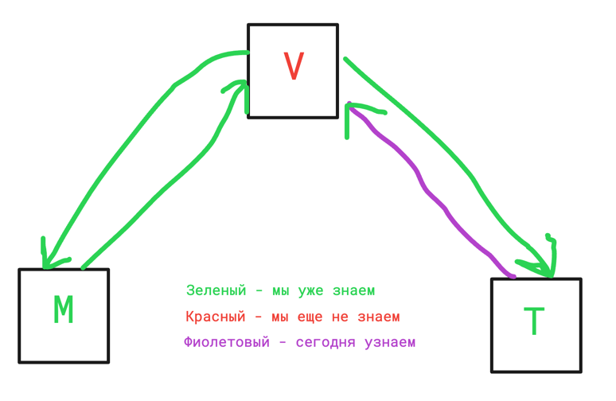

# Лекция 23. Forms, ModelForms. User, Authentication.

### Оглавление курса

<details>
  <summary>Блок 1 — Python Basic (1–6)</summary>

  - [Лекция 1. Введение. Типизации. Переменные. Строки и числа. Булева алгебра. Ветвление](lesson01.md)
  - [Лекция 2. Обработка исключений. Списки, строки детальнее, срезы, циклы.](lesson02.md)
  - [Лекция 3. None. Range, list comprehension, sum, max, min, len, sorted, all, any. Работа с файлами](lesson03.md)
  - [Лекция 4. Хэш-таблицы. Set, frozenset. Dict. Tuple. Немного об импортах. Namedtuple, OrderedDict](lesson04.md)
  - [Лекция 5. Функции, типизация, lambda. Map, zip, filter.](lesson05.md)
  - [Лекция 6. Алгоритмы и структуры данных](lesson06.md)
</details>

<details>
  <summary>Блок 2 — Git (7–8)</summary>

  - [Лекция 7. Git. История системы контроля версий. Локальный репозиторий. Базовые команды управления репозиторием.](lesson07.md)
  - [Лекция 8. Git. Удаленный репозиторий. Remote, push, pull. GitHub, Bitbucket, GitLab, etc. Pull request.](lesson08.md)
</details>

<details>
  <summary>Блок 3 — Python Advanced (9–14)</summary>

  - [Лекция 9. Введение в ООП. Основные парадигмы ООП. Классы и объекты. Множественное наследование.](lesson09.md)
  - [Лекция 10. Magic methods. Итераторы и генераторы.](lesson10.md)
  - [Лекция 11. Imports. Standard library. PEP 8](lesson11.md)
  - [Лекция 12. Декораторы. Декораторы с параметрами. Декораторы классов (staticmethod, classmethod, property)](lesson12.md)
  - [Лекция 13. Тестирование](lesson13.md)
  - [Лекция 14. Проектирование. Паттерны. SOLID.](lesson14.md)
</details>

<details>
  <summary>Блок 4 — SQL (15–17)</summary>

  - [Лекция 15. СУБД. PostgreSQL. SQL. DDL. Пользователи. DCL. DML. Связи.](lesson15.md)
  - [Лекция 16. СУБД. DQL. SELECT. Индексы. Group by. Joins.](lesson16.md)
  - [Лекция 17. СУБД. Нормализация. Аномалии. Транзакции. ACID. TCL. Backup](lesson17.md)
</details>

- [Лекция 18. Virtual env. Pip. Устанавливаемые модули. Pyenv.](lesson18.md)

<details open>
  <summary>Блок 5 — Django (19–26)</summary>

  - [Лекция 19. Знакомство с Django](lesson19.md)
  - [Лекция 20. Templates. Static](lesson20.md)
  - [Лекция 21. Модели. Связи. Meta. Abstract, proxy](lesson21.md)
  - [Лекция 22. Django ORM](lesson22.md)
  - ▶ **Лекция 23. Forms, ModelForms. User, Authentication**
  - [Лекция 24. ClassBaseView](lesson24.md)
  - [Лекция 25. NoSQL. Куки, сессии, кеш](lesson25.md)
  - [Лекция 26. Логирование. Middleware. Signals. Messages. Manage commands](lesson26.md)
</details>

<details>
  <summary>Блок 6 — Django Rest Framework (27–30)</summary>

  - [Лекция 27. Что такое API. REST и RESTful. Django REST Framework.](lesson27.md)
  - [Лекция 28. @api_view, APIView, ViewSets, Pagination, Routers](lesson28.md)
  - [Лекция 29. REST-аутентификация. Авторизация. Permissions. Фильтрация.](lesson29.md)
  - [Лекция 30. Тестирование. Django, REST API.](lesson30.md)
</details>

<details>
  <summary>Блок 7 — Python async (31–33)</summary>

  - [Лекция 31. Celery. Multithreading. GIL. Multiprocessing](lesson31.md)
  - [Лекция 32. Asyncio. Aiohttp. Асинхронное программирование на практике.](lesson32.md)
  - [Лекция 33. Сокеты. Django Channels.](lesson33.md)
</details>

<details>
  <summary>Блок 8 — Deployment (34–35)</summary>

  - [Лекция 34. Linux. Всё, что нужно знать для деплоймента.](lesson34.md)
  - [Лекция 35. Deployment](lesson35.md)
</details>

- [Лекция 36. Методологии разработки. CI/CD. Монолит и микросервисы. Docker](lesson36.md)


## Что сегодня учим?



## HTML формы

`HTML-форма` — это специальный тег, который «сообщает» браузеру, что данные из этого тега нужно сгруппировать и
подготовить
к отправке на сервер.

Принимает два параметра `action` и `method`.

`action` описывает, куда форма по результату должна обращаться (в нашем случае это будет URL); если не указан явно, то
форма будет отправлена на тот же URL, на котором сейчас находится.

`method` отвечает за метод отправки, варианты — `get` и `post`. `get` будет использован по умолчанию, если не указан
явно.

Формы с методом `POST` используются для передачи данных, не подлежащих огласке, например, логин и пароль.
Формы с методом `GET` используются для общедоступной информации, например, строки поиска.

Внутри формы мы указываем нужное количество тегов `<input>` с нужными типами. Именно эти данные будут впоследствии
переданы
серверу.

[Ссылка на общее описание форм](https://www.w3schools.com/html/html_forms.asp)

#### Основные типы инпутов

**number** — ввод числа

**text** — ввод текста

**checkbox** — чекбокс (выбор нескольких элементов через галочки)

**radio** — радиобаттон (выбор только одного элемента из списка)

**button** — классическая кнопка (если в форме есть один такой элемент, но нет сабмита, браузер автоматически посчитает
его сабмитом)

**hidden** — скрытое поле, чаще всего нужно для целей безопасности или добавления информации и данных, не отображая их
(не отображается)

**submit** — отправка формы

Это далеко не все типы инпутов, которые могут быть.
[Ссылка на типы инпутов](https://www.w3schools.com/html/html_form_input_types.asp)

## GET форма

Создадим простейшую форму. Для этого создадим url, функцию для обработки и HTML страницу.

В urls.py

```python
...
from .views import form_view

...

...
path('form-url/', form_view, name='form-view'),
...
```

Во views.py

```python
def form_view(request):
    return render(request, 'form.html')
```

В form.html

```html



<form method="get" action="">
    <label>
        <input type="text" name="my_name">
    </label>
    <button type="submit">Send name</button>
</form>

```

Обратите внимание, мы указали `GET`-форму, `action` — URL на эту же страницу, который обрабатывается нашей же
функцией `form_view`.

В форме у нас один `input`, которому мы указали 2 атрибута `type` и `name`.

Атрибут `name` нам необходим для того, чтобы мы смогли обработать данные во view.

Также у нас есть кнопка `submit`, она необходима для того, чтобы отправить запрос на сервер.

При нажатии на кнопку формируется и отправляется request.

Примерно вот так будет выглядеть наша страница если зайти на адрес http://127.0.0.1:8000/form-url/:


### request

Объект `request` мы принимаем первым параметром функции обработчика и его же передаём первым в
функцию `render`. Зачем он нужен и из чего он состоит?

#### Зачем нужен?

Чтобы обрабатывать любые пользовательские или служебные данные, которые были переданы.

#### Из чего состоит?

Состоит из переданных данных или файлов (если были переданы) и служебной информации (информации о
пользователе, методе запроса, о том, на какой url был запрос, из какого браузера, другой системной информации).

### Идемпотентность


HTTP-запрос идемпотентен тогда, когда клиенты могут делать один и тот
же вызов неоднократно при одном и том же результате на сервере. Другими словами, создание большого количества идентичных
запросов имеет такой же эффект, как и один запрос. Заметьте, что в то время, как идемпотентные операции производят один
и тот же результат на сервере, ответ сам по себе может не быть тем же самым (например, состояние ресурса может
измениться между запросами).

Методы GET, HEAD, OPTIONS и TRACE определены как безопасные. Это означает, что они предназначены только для получения
информации и не должны изменять состояние сервера. Они не должны иметь побочных эффектов, за исключением безобидных
эффектов, таких как: логирование, кеширование, показ баннерной рекламы или увеличение веб-счётчика.

По определению, безопасные операции идемпотентны, так как они приводят к одному и тому же результату на сервере.
Безопасные методы реализованы как операции только для чтения. Однако безопасность не означает, что сервер должен
возвращать тот же самый результат каждый раз.

> Пока мы рассматриваем только GET и POST. GET — идемпотентен, POST — нет.

### Давайте отправим request


Что будет после нажатия кнопки `Send name`?

Будет сформирован `GET` (метод формы) запрос со всеми заполненными нами данными и отправлен на сервер.

Обратите внимание на новый url.


`my_name` — это предварительно указанный атрибут `name` на нашей форме, а `Vlad` — значение, которое я передал в этот
инпут.

В случае `GET` запроса данные передаются явно, прям в url в виде ключ-значение. Если бы значений было больше одного,
они были бы соединены при помощи символа `&` (например, если бы я добавил к полю с указанным атрибутом `name` ещё и поле
с атрибутом `age` и заполнил бы его значением 26, то URL после запроса выглядел бы
так `/form-url/?my_name=Vlad&age=26`).
Никакой разницы между заполнением формы или записью этих данных руками прям в строке браузера для `GET` запроса нет.

### Обработка данных во view

Мы можем обработать данные во `view` при помощи переменной `request`. Данные из `GET` запроса будут находиться в
переменной `request.GET`


Данные находятся в виде словаря, где ключами являются атрибуты `name` в каждом инпуте формы.

Эти данные можно использовать для любых целей, но чаще всего через `GET` передаются данные по фильтрации или
дополнительные параметры отображения. Например, когда вы добавляете фильтры в интернет магазине, пишете текст в поиске,
или когда на YouTube пересылаете ссылку с таймкодом, она тоже передаётся как `GET` параметр.

## POST запрос

Давайте заменим метод нашей формы с `GET` на `POST`:

В `form.html`:

```html



<form method="post" action="">{# Тут я поменял метод #}
    <label>
        <input type="text" name="my_name">
    </label>
    <button type="submit">Send name</button>
</form>

```

Что произойдёт при отправке такого запроса?

Произойдёт примерно такая ошибка:


Это ошибка CSRF токена.

Чтобы понять, что это, нужно понимать разницу того, где используются разные запросы.

`GET`-запросы — это запросы общедоступные и информационные: открыть страницу, отфильтровать данные и т. д.

`POST`-запросы — это запросы с чувствительными данными: создание записей в базе, передача пароля, отправка денег со
счёта на счёт и т. д.

Так вот, если `GET` запрос отправить 5 раз подряд, то с точки зрения сервера ничего не изменится, вы просто 5 раз подряд
запросите одну и туже информацию.

Если изменить параметры, то тоже ничего страшного не произойдёт, просто запросятся другие данные.

А вот если повторить несколько раз или подделать данные в `POST` запросе, то можно совершить разные проблемные действия:
создание лишних записей в базе данных, перевод средств на счёт злоумышленников вместо ожидаемого и т. д.

Поэтому в Django изначально есть дополнительное требование к `POST`-формам — это ещё одно скрытое поле, заранее
сгенерированное сервером. Оно называется `CSRF-токен`; где он проверяется и почему мы видим ошибку, мы разберём на
следующих занятиях.

Чтобы добавить нужный токен, используется специальный темплейт тег ``. Его нужно добавить в
любом месте внутри тега `<form>`.

```html



<form method="post" action="">
    {# Тут я добавил темплейт тег #}
    <label>
        <input type="text" name="my_name">
    </label>
    {# А мог и тут #}
    <button type="submit">Send name</button>
    {# Или тут, не имеет значения #}
</form>

```

Что изменится с точки зрения `HTML`:


Появилось поле типа `hidden`. Это значит, что оно не будет отображаться, но эти данные все равно попадут на сервер. Это
часто используется, когда вам нужно передать данные, которые у вас уже есть при отрисовке, но их не видно явно.
Допустим,
если мы пишем комментарий к комментарию, то чтобы грамотно его создать, нам нужен `id` родителя, его обычно и передают
как `hidden` поле.

Теперь наш запрос отправится успешно.

Обратите внимание, что url не изменится!

Потому что данные отправленные через `POST` не должны быть общедоступны.

### Обработка во view

Обработать данные из `POST` запроса можно точно также, данные будут находиться в переменной `request.POST`, если это
просто данные, и в `request.FILES`, если были переданы файлы.


Обратите внимание, что вместе с нашими данными был передан и `csrf` токен. Обычно при обработке данных он не нужен, но
данные были переданы, а значит они придут на сервер.

## Django Forms

Django предоставляет нам возможность генерировать `HTML` формы из кода на Python!

Что для этого нужно? Создадим в нашем приложении файл `forms.py`

Внутри этого файла укажем:

`forms.py`

```python
from django import forms


class MyForm(forms.Form):
    nickname = forms.CharField(label='My nickname', max_length=100)
    age = forms.IntegerField(label='My age')
```

Обработчик для урла заменим на:

Во views.py заменим нашу функцию на:

```python
from django.shortcuts import render

from .forms import MyForm


def form_view(request):
    # if this is a POST request we need to process the form data
    if request.method == 'POST':
        # create a form instance and populate it with data from the request:
        form = MyForm(request.POST)
        # check whether it's valid:
        if form.is_valid():
            # process the data in form.cleaned_data as required
            # some actions
            return render(request, 'form_was_valid.html')

    # if a GET (or any other method) we'll create a blank form
    else:
        form = MyForm()

    return render(request, 'form.html', {'form': form})
```

**Не забываем импортировать форму**

Изменим файл `form.html`:

```html



<form method="post" action="">
    
    {{ form }} {# Инпуты были заменены на переменную, в которой лежит объект класса Form #}
    <button type="submit">Send form</button>
</form>

```

и создадим файл `form_was_valid.html`:

```html



<div style="background-color: deeppink"> FORM WAS VALID</div>
<a href="">To the form page</a>

```

Что именно мы сделали?

### Описание формы

В файле `forms.py` мы создали класс формы, в котором описали два атрибута `nickname` и `age`.

Они будут соответствовать двум инпутам, текстовому и числовому.

Естественно, типов существует гораздо больше.

Основные типы:

- `BooleanField` — булево значение

- `CharField` — текст

- `ChoiceField` — поле для выбора

- `DateTimeField` — дата/время

- `EmailField` — email

- `FileField` — файл

- `IntegerField` — целое число

- `MultipleChoiceField` — множественный выбор

И многие другие, почитать про них нужно [тут](https://docs.djangoproject.com/en/stable/ref/forms/fields/#built-in-field-classes)

#### Виджет

У полей формы есть такое понятие как виджет. Он отвечает за то, как именно будет отображаться конкретное поле, например,
для текста — это текстовое поле, а для даты и времени — это встроенный пикер (выпадающее окно с календарём и часами)
и т. д.

Виджет можно указать отличающийся от стандартного.

Прочитать про виджеты нужно [тут](https://docs.djangoproject.com/en/stable/ref/forms/widgets/#built-in-widgets).

Каждому полю мы можем указать дополнительные атрибуты:

`required` — является ли поле обязательным

`label` — лейбл, подпись к инпуту

`label_suffix` — символ между `label` и инпутом

`initial` — значение по умолчанию

`widget` — читай выше

`help_text` — подсказка к инпуту

`error_messages` — переписать стандартные тексты для ошибок типов полей

`validators` — дополнительные проверки поля

`localize` — информация о переводе формы на другие языки

`disabled` — сделать поле неактивным (без возможности изменения)

### Описание view

В переменной `request` хранится информация о том, какой именно тип запроса к нам пришел, а это значит, что простым if мы
можем разграничить логику, которая будет обрабатывать разные типы запросов.

Если мы просто открываем страницу в браузере, то на самом деле мы посылаем обыкновенный `GET` запрос.

Взглянем на код. При `GET` запросе мы не попадаем в первое условие, переменной `form` назначаем объект класса `MyForm`
без каких-либо данных, и после этого рендерим страницу, передав на страницу пустой объект класса формы.

При рендере объекта класса формы в шаблоне этот объект преобразуется в набор инпутов с уже указанными
атрибутами `name`


Если мы заполним данные и нажмём на кнопку `Send form`, то мы отправим по этому же url запрос, но уже типа `POST` с
заполненными данными.

Посмотрим в код ещё раз: мы попадём в первый if и переменной `form` назначим объект класса `MyForm`, но предварительно
передав туда данные через `request.POST`.

А значит на этом этапе у нас есть объект с данными, переданными нам от клиента.

> Данные, которые мы получили из реквеста, всегда нужно валидировать (проверять).

## Валидация формы

[Тут](https://docs.djangoproject.com/en/stable/ref/forms/validation/) вся дока по валидации.

За валидацию данных в форме отвечает встроенный метод `is_valid()` который применяется к объекту класса формы.

Этот метод возвращает нам булево значение: `True`, если данные валидны, `False`, если нет.

После вызова этого метода у переменной, к которой он был вызван (в нашем случае переменная `form`), появляются
дополнительные атрибуты.

Если форма валидна, то появляется дополнительный атрибут `cleaned_data` - это словарь, в котором хранятся все
данные, присланные нам пользователем (например, логин и пароль).

Если форма не валидна, то появляется дополнительный атрибут `errors`, который хранит в себе информацию об ошибках
конкретных полей или общих ошибках.

Этот атрибут сразу хранит информацию о том, как отображать эти ошибки в шаблоне, если они существуют.

### Валидность

Что же такое валидность?

Валидность — это соответствие заданным критериям. Например, если мы ожидаем в поле возраста получить числовой тип, а
пользователь отправляет текст, то данные не валидны.

Некоторые распространённые виды валидаций можно указать как атрибут поля формы, например, максимальную длину для
строки, максимальное и минимальное значение для числа.

#### clean_`field`()

Если мы вызываем метод `is_valid()`, мы проверяем все описанные валидации. Но где они описаны, и можем ли мы добавить
свои?

Описаны они в классе формы, и да, мы можем добавить свои.

Все базовые валидации были описаны при создании полей.

Но допустим, что мы считаем, что для нашей формы валидным является только чётный возраст, как нам это проверить?

Для проверки конкретного поля в форме класса нужно указать метод, который будет начинаться со слова `clean_` и после
этого название поля, которое мы валидируем.

Все данные будут лежать в атрибуте `self.cleaned_data`.

Если значение валидно, то метод должен возвращать значение этого атрибута.

Если значение не валидно, то метод должен возбуждать ошибку `ValidationError` с описанием ошибки, которая позже будет
отображаться в `html`.

В forms.py:

```python
from django import forms
from django.core.exceptions import ValidationError


class MyForm(forms.Form):
    nickname = forms.CharField(label='My nickname', max_length=100)
    age = forms.IntegerField(label='My age')

    def clean_age(self):
        age = self.cleaned_data.get('age')
        if age % 2:
            raise ValidationError('Age should be even.')
        return age
```

#### clean()

А что делать если нужно проверить соответствие данных между собой? Например, что пользователь не использовал свой
возраст, как часть своего никнейма?

Для этого мы можем использовать метод `clean()`, в котором можем выполнить все необходимые нам проверки.

Для выполнения всех базовых проверок обычно используется `super()`.

В forms.py

```python
from django import forms
from django.core.exceptions import ValidationError


class MyForm(forms.Form):
    nickname = forms.CharField(label='My nickname', max_length=100)
    age = forms.IntegerField(label='My age')

    def clean_age(self):
        age = self.cleaned_data.get('age')
        if age % 2:
            raise ValidationError('Age should be even.')
        return age

    def clean(self):
        cleaned_data = super().clean()
        age = cleaned_data.get('age')
        nickname = cleaned_data.get('nickname')
        if str(age) in nickname:
            raise ValidationError('Age can\'t be in nickname')
        return cleaned_data
```

Если при проверке у вас может быть больше одной ошибки, то `raise` вам не подходит.

#### add_error

Для этого может использоваться метод класса формы `add_error()`. Он принимает два параметра: название поля, к которому
относится ошибка (может быть None, если ошибка не относится к какому-либо полю), и сообщение, например, неправильные
имя пользователя и/или пароль.

В forms.py

```python
from django import forms
from django.core.exceptions import ValidationError


class MyForm(forms.Form):
    nickname = forms.CharField(label='My nickname', max_length=100)
    age = forms.IntegerField(label='My age')

    def clean_age(self):
        age = self.cleaned_data.get('age')
        if age % 2:
            raise ValidationError('Age should be even')
        return age

    def clean(self):
        cleaned_data = super().clean()
        age = cleaned_data.get('age')
        nickname = cleaned_data.get('nickname')
        if str(age) in nickname:
            self.add_error('age', 'Age can\'t be in nickname')
        self.add_error(None, 'This form is always incorrect')
```

### Отображение формы в шаблоне

Итак, если наша форма была валидна, то мы отрендерили вообще другую страницу, но если всё-таки была не валидна, то мы
отрендерим форму, у которой есть атрибут `errors`, ошибки сразу же будут отрисованы.

Также у нас есть способы по-разному отрисовывать формы:

У объекта формы есть стандартные поля и методы, которые мы можем указывать в шаблоне, например:

`{{ form.as_table }}` — рендер в виде таблицы, через теги `<tr>`

`{{ form.as_p }}` — рендер каждого поля через теги `<p>`

`{{ form.as_ul }}` — рендер в виде списка через теги `<li>`

Также можно рендерить форму не целиком, а, например, по отдельным полям, при помощи стандартного обращения через
точку: `{{ form.name }}`.

У каждого поля есть атрибут `errors`, который хранит информацию об ошибках по этому полю, если они были
обнаружены: `{{ form.my_field.errors }}`.

Если запустить форму через `for` в итерируемом объекте будут поля.

```html

<div class="fieldWrapper">
    {{ field.errors }}
    {{ field.label_tag }} {{ field }}
    
    <p class="help">{{ field.help_text|safe }}</p>
    
</div>

```

И многие другие атрибуты и методы, подробно можно прочитать [тут](https://docs.djangoproject.com/en/stable/topics/forms/#working-with-form-templates)

### Про отправку файлов

Нужно в шаблоне добавить атрибут `enctype="multipart/form-data"` к тегу `<form>`, чтобы форма могла отправлять файлы:

```html
<form method="post" enctype="multipart/form-data">
    
    {{ form.as_p }}
    <button type="submit">Save</button>
</form>
```

### Про отображение медиафайлов

Если вы хотите впоследствии отображать медиафайлы (например, аватар пользователя), необходимо использовать следующий синтаксис

```html

```

Здесь `avatar.url` возвращает полный путь к файлу, который был загружен.

## ModelForm

Дока [Тут](https://docs.djangoproject.com/en/stable/topics/forms/modelforms/)

`ModelForm` — это тип формы, который генерируется напрямую из модели. Это очень мощный инструмент для работы с моделями.

Используем наши модели блога:

`forms.py`

```python
from django.forms import ModelForm
from blog.models import Article, Comment, Topic


class ArticleForm(ModelForm):
    class Meta:
        model = Article
        fields = ['title', 'slug', 'content', 'status', 'topics']


class CommentForm(ModelForm):
    class Meta:
        model = Comment
        fields = ['text']


class TopicForm(ModelForm):
    class Meta:
        model = Topic
        fields = ['name']
```

Поле `fields` или поле `exclude` являются обязательными.

#### Варианты указания полей

```python
# Явный список полей (рекомендуется)
fields = ['title', 'slug', 'content']

# Все поля модели
fields = '__all__'

# Все поля, кроме указанных
exclude = ['created_at', 'updated_at']
```

> **Важно:** Использование `fields = '__all__'` или `exclude` может быть небезопасным — если вы добавите новое поле в модель, оно автоматически появится в форме. Лучше явно указывать список полей.

### Настройка полей в Meta

В классе `Meta` можно настроить отображение полей:

```python
from django import forms
from django.forms import ModelForm
from blog.models import Article


class ArticleForm(ModelForm):
    class Meta:
        model = Article
        fields = ['title', 'slug', 'content', 'status', 'topics']

        # Подписи к полям
        labels = {
            'title': 'Заголовок статьи',
            'slug': 'URL-адрес',
            'content': 'Текст статьи',
        }

        # Подсказки
        help_texts = {
            'slug': 'Только латинские буквы, цифры и дефисы',
            'topics': 'Выберите одну или несколько тем',
        }

        # Виджеты (как отображать поля)
        widgets = {
            'content': forms.Textarea(attrs={'rows': 10, 'class': 'form-control'}),
            'status': forms.RadioSelect(),
            'topics': forms.CheckboxSelectMultiple(),
        }

        # Сообщения об ошибках
        error_messages = {
            'title': {
                'required': 'Заголовок обязателен',
                'max_length': 'Заголовок слишком длинный',
            },
        }
```

### Эквивалент обычной формы

ModelForm автоматически создаёт поля на основе модели. Например, `ArticleForm` эквивалентна:

```python
from django import forms
from blog.models import Topic


class ArticleForm(forms.Form):
    title = forms.CharField(max_length=200)
    slug = forms.SlugField(max_length=200)
    content = forms.CharField(widget=forms.Textarea)
    status = forms.ChoiceField(choices=Article.Status.choices)
    topics = forms.ModelMultipleChoiceField(queryset=Topic.objects.all())
```

### Валидация

Помимо стандартного метода `is_valid()` у ModelForm существует также встроенный метод `full_clean()`.

Первый отвечает за валидацию формы, второй — за валидацию объекта модели (включая `unique`, `unique_together` и т. д.).

### Метод save() у формы

Метод `save()` в ModelForm выполняет два действия: создаёт объект модели из данных формы и вызывает `save()` модели.

Аргумент `commit=False` позволяет получить объект без сохранения в базу — полезно, когда нужно дополнить данные:

```python
def create_article(request):
    if request.method == 'POST':
        form = ArticleForm(request.POST)
        if form.is_valid():
            article = form.save(commit=False)
            article.author = request.user  # Добавляем автора из request
            article.save()
            form.save_m2m()  # Важно! Сохраняем M2M связи (topics)
            return redirect('article-detail', slug=article.slug)
    else:
        form = ArticleForm()
    return render(request, 'blog/article_form.html', {'form': form})
```

> **Важно:** При использовании `commit=False` с формой, содержащей ManyToMany поля, нужно вызвать `form.save_m2m()` после сохранения объекта.

Альтернатива — использовать `form.instance`:

```python
form = ArticleForm(request.POST)
form.instance.author = request.user
form.save()  # M2M сохранится автоматически
```

### Передача объекта (редактирование)

ModelForm может принимать существующий объект для редактирования:

```python
from blog.models import Article
from blog.forms import ArticleForm


def edit_article(request, slug):
    article = Article.objects.get(slug=slug)

    if request.method == 'POST':
        # Передаём instance для обновления существующего объекта
        form = ArticleForm(request.POST, instance=article)
        if form.is_valid():
            form.save()
            return redirect('article-detail', slug=article.slug)
    else:
        # Форма заполнится данными из article
        form = ArticleForm(instance=article)

    return render(request, 'blog/article_form.html', {'form': form})
```

Без `instance` форма создаст новый объект, с `instance` — обновит существующий.

## Практические примеры форм для блога

Рассмотрим полноценные примеры форм для нашего блога.

### Форма комментария

```python
# blog/forms.py
from django import forms
from django.forms import ModelForm
from blog.models import Comment


class CommentForm(ModelForm):
    class Meta:
        model = Comment
        fields = ['text']
        widgets = {
            'text': forms.Textarea(attrs={
                'rows': 4,
                'placeholder': 'Напишите ваш комментарий...',
                'class': 'form-control',
            }),
        }
        labels = {
            'text': '',  # Убираем label
        }
```

Использование во view:

```python
# blog/views.py
from django.shortcuts import render, redirect, get_object_or_404
from blog.models import Article
from blog.forms import CommentForm


def article_detail(request, slug):
    article = get_object_or_404(Article, slug=slug)
    comments = article.comments.all()

    if request.method == 'POST':
        form = CommentForm(request.POST)
        if form.is_valid():
            comment = form.save(commit=False)
            comment.article = article
            comment.author = request.user
            comment.save()
            return redirect('article-detail', slug=slug)
    else:
        form = CommentForm()

    return render(request, 'blog/article_detail.html', {
        'article': article,
        'comments': comments,
        'form': form,
    })
```

### Форма профиля пользователя

```python
# blog/forms.py
from django import forms
from django.contrib.auth import get_user_model

User = get_user_model()


class ProfileForm(forms.ModelForm):
    class Meta:
        model = User
        fields = ['first_name', 'last_name', 'email']

    def clean_email(self):
        email = self.cleaned_data.get('email')
        # Проверяем, что email не занят другим пользователем
        if User.objects.filter(email=email).exclude(pk=self.instance.pk).exists():
            raise forms.ValidationError('Этот email уже используется')
        return email
```

Использование:

```python
# blog/views.py
from django.contrib.auth.decorators import login_required
from blog.forms import ProfileForm


@login_required
def profile_edit(request):
    if request.method == 'POST':
        form = ProfileForm(request.POST, instance=request.user)
        if form.is_valid():
            form.save()
            return redirect('profile')
    else:
        form = ProfileForm(instance=request.user)

    return render(request, 'blog/profile_edit.html', {'form': form})
```

### Форма поиска (обычная Form)

Не все формы связаны с моделями. Форма поиска — пример обычной `Form`:

```python
# blog/forms.py
class SearchForm(forms.Form):
    query = forms.CharField(
        max_length=100,
        required=False,
        widget=forms.TextInput(attrs={
            'placeholder': 'Поиск статей...',
            'class': 'form-control',
        })
    )
```

Использование:

```python
# blog/views.py
from blog.forms import SearchForm
from blog.models import Article


def search(request):
    form = SearchForm(request.GET)
    articles = Article.objects.none()

    if form.is_valid():
        query = form.cleaned_data.get('query')
        if query:
            articles = Article.objects.filter(
                title__icontains=query
            ) | Article.objects.filter(
                content__icontains=query
            )

    return render(request, 'blog/search.html', {
        'form': form,
        'articles': articles,
    })
```

## Модель User

### Стандартная модель пользователя в Django

По умолчанию Django предоставляет модель пользователя, которая определена в модуле `django.contrib.auth`. Эта модель
называется `User` и она уже содержит большинство необходимых полей для работы с пользователями:

- **Username**: уникальное имя пользователя.
- **Password**: хэшированный пароль.
- **Email**: электронная почта (необязательное поле).
- **First name и Last name**: имя и фамилия.
- **is_active**: флаг, который указывает, активен ли пользователь.
- **is_staff**: флаг, который определяет, является ли пользователь частью административного персонала.
- **is_superuser**: флаг, который определяет, является ли пользователь суперпользователем (администратором с полными
  правами).
- **last_login**: время последнего входа.
- **date_joined**: дата регистрации.

Эти поля покрывают базовые потребности большинства приложений. Django также предоставляет систему аутентификации,
включающую в себя:

- Вход в систему и выход из нее.
- Восстановление пароля.
- Регистрацию нового пользователя.
- Поддержку групп и разрешений.

### Про пароли

В современном мире безопасность данных становится всё более актуальной задачей, особенно когда речь идёт о хранении
паролей пользователей. Одним из основных способов обеспечения безопасности паролей является их хеширование и
использование соли. В этой лекции мы рассмотрим, как хранятся пароли, зачем нужно хеширование и что такое соль.

#### Зачем хранить пароли безопасно?

Когда пользователь регистрируется на сайте, он создаёт уникальный пароль для доступа к своей учётной записи. Если пароли
будут храниться в базе данных в открытом виде (plaintext), то при взломе базы данных злоумышленник получит доступ ко
всем паролям пользователей. Это ставит под угрозу не только одну систему, но и другие учётные записи, поскольку многие
пользователи склонны использовать один и тот же пароль на разных сервисах.

#### Хеширование паролей

**Хеширование** — это процесс преобразования строки данных (например, пароля) в фиксированную длину строку, которая
является уникальной для каждого исходного набора данных. Важной особенностью хеширования является то, что этот процесс
необратим: невозможно получить исходный пароль из его хеша.

Самый простой способ защитить пароли — это хранить их в виде хешей. Например, если пользователь вводит пароль
«password123» и он проходит через хеш-функцию, то результатом будет хеш, например, «ef92b778ba2231b9e28d9d...». При
каждом входе в систему пароль пользователя хешируется, и этот хеш сравнивается с хешем, хранящимся в базе данных.

**Примеры хеш-функций**:

- MD5 (считается устаревшим и небезопасным)
- SHA-1 (тоже устаревший и небезопасный)
- SHA-256
- bcrypt, scrypt, Argon2 (предназначены специально для хеширования паролей)

#### Зачем нужна соль?

Несмотря на то, что хеширование защищает пароли, оно не полностью защищает от атак по словарю и атак с помощью радужных
таблиц. Радужные таблицы представляют собой предварительно вычисленные таблицы паролей и их хешей. Если злоумышленник
знает хеш, он может легко найти исходный пароль, если этот пароль слабый или популярный.

**Соль** — это случайная строка, которая добавляется к паролю перед его хешированием. Например, если пользовательский
пароль — «password123» и к нему добавляется соль «xyz123», результатом будет хеш от «password123xyz123». Таким образом,
даже если два пользователя используют одинаковые пароли, их хеши будут разными благодаря уникальным солям.

Соль должна быть уникальной для каждого пользователя и храниться в базе данных вместе с хешем пароля. При проверке
пароля система извлекает соль, добавляет её к введённому паролю, и затем сравнивает полученный хеш с хешем, хранящимся в
базе данных.

**Пример**:

- Пароль: «password123»
- Соль: «xyz123»
- Хеш: «a1b2c3d4...»

> Все эти действия django делает за нас. Но мы должны помнить об этом, потому что иначе мы не сможем нормально
> пользоваться встроенными методами.

### Методы юзера

```python
get_username()  # получить username

get_full_name()  # получить имя и фамилию через пробел

set_password(raw_password)  # установить хешированный пароль

check_password(raw_password)  # проверить пароль на правильность

set_unusable_password()  # сделать пароль непригодным для аутентификации

email_user(subject, message, from_email=None, **kwargs)  # отправить пользователю email
```

Например:

```python
u = User.objects.get(username='blabla')
u.check_password('some_cool_password')  # True
```

> Пароль хеширован, мы не можем сравнить его напрямую

И другие методы, отвечающие за доступы, группы и т. д.

### Базовый менеджер пользователя

Содержит дополнительные методы

`create_user(username, email=None, password=None, **extra_fields)`

`create_superuser(username, email, password, **extra_fields)`

`create_user()` отличается от `create()` тем, что `create_user()` правильно задаст пароль через `set_password()`

### Когда и зачем нужно создавать кастомную модель пользователя

Однако стандартная модель `User` может не удовлетворять всем требованиям конкретного проекта. Например, вам может
понадобиться:

- Добавить дополнительные поля (например, номер телефона, дата рождения, аватар).
- Изменить логику аутентификации (например, использовать email вместо username).
- Подключить несколько моделей пользователей для разных типов пользователей (например, клиенты и поставщики услуг).

В таких случаях Django позволяет создать кастомную модель пользователя. Это лучше сделать на ранних этапах разработки
проекта, так как изменение модели пользователя в уже работающем приложении может вызвать сложности.

### Создание кастомной модели пользователя

Чтобы создать свою модель пользователя, выполните следующие шаги:

Для использования модели пользователя, которую нам нужно расширить (а это нужно почти всегда), используется наследование
от базового абстрактного юзера.

Выглядит примерно так:

```python
from django.contrib.auth.models import AbstractUser
from django.db import models


class User(AbstractUser):
    birth_date = models.DateField()
    avatar = models.ImageField(blank=True, null=True)
```

Чтобы Django оценивала эту модель как пользователя в `settings.py` нужно в любом месте указать:

```python
AUTH_USER_MODEL = 'blog.User'
```

Где `blog` — название приложения, `User` — название модели.

Пользователь **обязательно** должен быть описан до первой миграции! Иначе Django автоматически будет использовать базового
встроенного пользователя, и использовать сразу несколько пользователей у вас не получится. Так как по умолчанию, если этой переменной
нет, то Django считает, что там указана ссылка на базового пользователя, и создаёт таблицу пользователя, основываясь на базовом
пользователе; поменять такую таблицу нельзя.

Все возможные подробности про модель пользователя [тут](https://docs.djangoproject.com/en/stable/ref/contrib/auth/#django.contrib.auth.models.User).

### Пример более детальной кастомизации

Вместо использования стандартной модели `User`, вы можете создать свою модель, унаследовав ее от `AbstractBaseUser`
и `PermissionsMixin`. Это позволит вам кастомизировать поля и методы, сохраняя при этом функциональность, связанную с
аутентификацией и авторизацией.

Пример кастомной модели пользователя:

```python
from django.contrib.auth.models import AbstractBaseUser, BaseUserManager, PermissionsMixin
from django.db import models


class CustomUserManager(BaseUserManager):
    def create_user(self, email, password=None, **extra_fields):
        if not email:
            raise ValueError('The Email field must be set')
        email = self.normalize_email(email)
        user = self.model(email=email, **extra_fields)
        user.set_password(password)
        user.save(using=self._db)
        return user

    def create_superuser(self, email, password=None, **extra_fields):
        extra_fields.setdefault('is_staff', True)
        extra_fields.setdefault('is_superuser', True)

        return self.create_user(email, password, **extra_fields)


class CustomUser(AbstractBaseUser, PermissionsMixin):
    email = models.EmailField(unique=True)
    first_name = models.CharField(max_length=30)
    last_name = models.CharField(max_length=30)
    is_active = models.BooleanField(default=True)
    is_staff = models.BooleanField(default=False)
    date_joined = models.DateTimeField(auto_now_add=True)

    USERNAME_FIELD = 'email'
    REQUIRED_FIELDS = ['first_name', 'last_name']

    objects = CustomUserManager()

    def __str__(self):
        return self.email
```

> Создание кастомной модели пользователя может потребовать дополнительных усилий, но оно того стоит, если вам нужно
> больше
> гибкости и контроля над поведением пользователей в вашем приложении.

## Логин

На самом деле логин состоит из нескольких частей, давайте их рассмотрим.

### Аутентификация, идентификация, авторизация

Аутентификация — процесс проверки подлинности доступа.

Например, проверить логин и пароль на соответствие.

Если говорить о бытовом примере, то когда вы проходите на любую проходную, например, заходя в университет, вы должны
предъявить студенческий. То, что он у вас есть и есть процесс аутентификации.

Идентификация — процесс определения конкретного лица.

Например, получить конкретного пользователя из базы.

В примере с университетом, если охранник возьмет ваш студенческий и прочитает, как вас зовут и из какой вы группы, это и
будет идентификация.

Авторизация — процесс предоставления доступа.

Охранник вас пропустит.

### Как это работает?

Чтобы пользователь мог авторизоваться на сайте, нам нужны его входные данные и стандартные методы `authenticate, login`

Метод `authenticate` отвечает сразу за два процесса: аутентификацию и идентификацию. Он принимает имя пользователя и
пароль, и если находит совпадение, то возвращает объект пользователя (модели); если не находит, то возвращает `None`.

Если нам вернулся объект юзера, значит, аутентификация пройдена, и пользователь идентифицирован.

Метод `login` принимает реквест и объект модели пользователя и отвечает за процесс авторизации, после этого действия
во всех следующих запросах в переменной `request` будет храниться наш текущий пользователь.

Рассмотрим пример самописной формы для понимания принципа работы (на практике лучше использовать встроенную `AuthenticationForm`, о которой поговорим ниже).

В forms.py

```python
from django.contrib.auth import authenticate
from django import forms


class AuthenticationForm(forms.Form):
    username = forms.CharField(max_length=254)
    password = forms.CharField(label="Password", widget=forms.PasswordInput)

    def clean(self):
        cleaned_data = super().clean()
        username = cleaned_data.get('username')
        password = cleaned_data.get('password')
        if username and password:
            self.user = authenticate(username=username, password=password)
            if self.user is None:
                raise forms.ValidationError("Incorrect username/password")
```

в view.py

```python
from .forms import AuthenticationForm
from django.contrib.auth import login
from django.shortcuts import render, redirect


def my_login(request):
    # if this is a POST request we need to process the form data
    if request.method == 'POST':
        # create a form instance and populate it with data from the request:
        form = AuthenticationForm(request.POST)
        # check validity:
        if form.is_valid():
            # process the data in form.cleaned_data as required
            # some actions
            login(request, form.user)
            return redirect('/')

    # if a GET (or any other method) we'll create a blank form
    else:
        form = AuthenticationForm()

    return render(request, 'login.html', {'form': form})
```

### Logout

Для вывода пользователя из системы используется метод `logout`, который принимает только реквест.

```python
from django.contrib.auth import logout


def logout_view(request):
    logout(request)
    # Redirect to a success page.
```

### Проверка на то, что пользователь уже вошёл в систему

В реквесте всегда есть поле `user`, у которого всегда есть атрибут `is_authenticated`; проверяя его, мы можем
определять, аутентифицирован ли пользователь.

```python
request.user.is_authenticated
```

## Встроенные формы Django для аутентификации

Django предоставляет готовые формы для работы с пользователями в модуле `django.contrib.auth.forms`. Не нужно писать их с нуля!

### AuthenticationForm

Форма для входа в систему. Уже содержит валидацию логина и пароля:

```python
from django.contrib.auth.forms import AuthenticationForm
from django.contrib.auth import login
from django.shortcuts import render, redirect


def login_view(request):
    if request.method == 'POST':
        form = AuthenticationForm(request, data=request.POST)
        if form.is_valid():
            user = form.get_user()
            login(request, user)
            return redirect('home')
    else:
        form = AuthenticationForm()
    return render(request, 'registration/login.html', {'form': form})
```

> **Важно:** `AuthenticationForm` принимает `request` первым аргументом!

### UserCreationForm

Форма для регистрации нового пользователя:

```python
from django.contrib.auth.forms import UserCreationForm
from django.contrib.auth import login
from django.shortcuts import render, redirect


def register_view(request):
    if request.method == 'POST':
        form = UserCreationForm(request.POST)
        if form.is_valid():
            user = form.save()
            login(request, user)  # Автоматический вход после регистрации
            return redirect('home')
    else:
        form = UserCreationForm()
    return render(request, 'registration/register.html', {'form': form})
```

#### Расширение UserCreationForm

Стандартная форма содержит только `username`, `password1`, `password2`. Чтобы добавить email:

```python
from django.contrib.auth.forms import UserCreationForm
from django.contrib.auth import get_user_model

User = get_user_model()


class CustomUserCreationForm(UserCreationForm):
    class Meta:
        model = User
        fields = ['username', 'email', 'password1', 'password2']
```

### PasswordChangeForm

Форма для смены пароля авторизованным пользователем:

```python
from django.contrib.auth.forms import PasswordChangeForm
from django.contrib.auth import update_session_auth_hash
from django.shortcuts import render, redirect


def change_password_view(request):
    if request.method == 'POST':
        form = PasswordChangeForm(request.user, request.POST)
        if form.is_valid():
            user = form.save()
            # Важно! Обновляем сессию, чтобы пользователь не вылетел
            update_session_auth_hash(request, user)
            return redirect('profile')
    else:
        form = PasswordChangeForm(request.user)
    return render(request, 'registration/change_password.html', {'form': form})
```

### Другие полезные формы

- `SetPasswordForm` — установка пароля (без ввода старого);
- `PasswordResetForm` — запрос на сброс пароля по email;
- `UserChangeForm` — редактирование пользователя (используется в админке).

## Управление доступом

В этой лекции мы рассмотрим два часто используемых декоратора: `login_required` и `user_passes_test`.

### Декоратор `login_required`

Декоратор `login_required` используется для ограничения доступа к представлениям для неавторизованных пользователей.
Если пользователь не авторизован, он будет перенаправлен на страницу входа в систему.

#### Пример использования

Предположим, у нас есть представление, которое отображает профиль пользователя:

```python
from django.shortcuts import render


def profile_view(request):
    return render(request, 'profile.html')
```

Это представление доступно для всех пользователей, независимо от того, авторизованы они или нет. Чтобы ограничить доступ
только для авторизованных пользователей, мы можем использовать декоратор `login_required`:

```python
from django.contrib.auth.decorators import login_required
from django.shortcuts import render


@login_required
def profile_view(request):
    return render(request, 'profile.html')
```

Теперь, если неавторизованный пользователь попытается получить доступ к этому представлению, он будет перенаправлен на
страницу входа.

### Настройка URL перенаправления

По умолчанию, декоратор `login_required` перенаправляет пользователей на URL, указанный в настройке `LOGIN_URL`. Вы
можете настроить его следующим образом в файле `settings.py`:

```python
LOGIN_URL = '/login/'
```

Если вы хотите использовать другой URL для конкретного представления, вы можете указать его прямо в декораторе:

```python
@login_required(login_url='/custom-login/')
def profile_view(request):
    return render(request, 'profile.html')
```

### Декоратор `user_passes_test`

Декоратор `user_passes_test` предоставляет более гибкий способ управления доступом к представлениям, позволяя проверять
различные условия. Он принимает функцию, которая проверяет условия, и только если эта функция возвращает `True`, доступ
к представлению будет разрешен.

#### Пример использования

Рассмотрим пример, когда только пользователи, имеющие адрес электронной почты на определенном домене, могут получить
доступ к представлению:

```python
from django.contrib.auth.decorators import user_passes_test
from django.shortcuts import render


def email_check(user):
    return user.email.endswith('@example.com')


@user_passes_test(email_check)
def special_view(request):
    return render(request, 'special.html')
```

В этом примере функция `email_check` проверяет, заканчивается ли адрес электронной почты пользователя на '@example.com'.
Если это так, пользователь получит доступ к представлению `special_view`.

#### Перенаправление при отказе в доступе

Если проверка не пройдена, пользователь будет перенаправлен на страницу входа по умолчанию. Однако вы можете указать
другую страницу для перенаправления, используя параметр `login_url`:

```python
@user_passes_test(email_check, login_url='/no-access/')
def special_view(request):
    return render(request, 'special.html')
```

#### Комбинирование с `login_required`

Часто `user_passes_test` используется в комбинации с `login_required`, чтобы сначала убедиться, что пользователь
авторизован, а затем проверить дополнительные условия:

```python
from django.contrib.auth.decorators import login_required, user_passes_test


@login_required
@user_passes_test(email_check)
def special_view(request):
    return render(request, 'special.html')
```

## Система разрешений (Permissions)

Django имеет встроенную систему разрешений, которая позволяет гибко управлять доступом пользователей к различным действиям.

### Автоматические разрешения

При создании модели Django автоматически создаёт 4 разрешения:

- `add_<model>` — право на создание объектов;
- `change_<model>` — право на изменение объектов;
- `delete_<model>` — право на удаление объектов;
- `view_<model>` — право на просмотр объектов.

Например, для модели `Article` будут созданы:
- `blog.add_article`
- `blog.change_article`
- `blog.delete_article`
- `blog.view_article`

Формат: `<app_label>.<permission_codename>`

### Кастомные разрешения

Можно создать свои разрешения в Meta модели:

```python
# blog/models.py
class Article(models.Model):
    title = models.CharField(max_length=200)
    status = models.CharField(max_length=20, choices=Status.choices)
    # ...

    class Meta:
        permissions = [
            ('publish_article', 'Can publish article'),
            ('feature_article', 'Can mark article as featured'),
            ('moderate_comments', 'Can moderate comments on articles'),
        ]
```

После миграции эти разрешения появятся в базе данных.

### Проверка разрешений

#### В коде Python

```python
# Проверка одного разрешения
user.has_perm('blog.add_article')  # True/False

# Проверка нескольких разрешений (все должны быть)
user.has_perms(['blog.add_article', 'blog.change_article'])

# Получить все разрешения пользователя
user.get_all_permissions()
# {'blog.add_article', 'blog.change_article', 'auth.change_user', ...}

# Получить разрешения только от групп
user.get_group_permissions()
```

#### Во view с декоратором

```python
from django.contrib.auth.decorators import permission_required


@permission_required('blog.add_article')
def create_article(request):
    # Только пользователи с правом add_article попадут сюда
    ...


# С указанием страницы для редиректа
@permission_required('blog.publish_article', login_url='/no-access/')
def publish_article(request, pk):
    ...


# Проверка нескольких разрешений
@permission_required(['blog.change_article', 'blog.publish_article'])
def edit_and_publish(request, pk):
    ...
```

#### В шаблонах

```html

    <a href="">Создать статью</a>



    <a href="">Редактировать</a>



    <button>Удалить</button>

```

### Назначение разрешений

#### Через админку

Разрешения можно назначать пользователям в админ-панели Django:
1. Перейти в раздел Users
2. Выбрать пользователя
3. В разделе «User permissions» выбрать нужные разрешения

#### Через код

```python
from django.contrib.auth.models import Permission
from django.contrib.contenttypes.models import ContentType
from blog.models import Article

# Получить разрешение
permission = Permission.objects.get(codename='publish_article')

# Добавить разрешение пользователю
user.user_permissions.add(permission)

# Удалить разрешение
user.user_permissions.remove(permission)

# Очистить все разрешения
user.user_permissions.clear()

# Проверить (нужно обновить кеш!)
user = User.objects.get(pk=user.pk)  # Перезагрузить из БД
user.has_perm('blog.publish_article')  # True
```

> **Важно:** После изменения разрешений нужно перезагрузить объект пользователя из базы данных, так как разрешения кешируются.

### Группы (Groups)

Группы позволяют объединять разрешения и назначать их сразу нескольким пользователям.

#### Создание группы

```python
from django.contrib.auth.models import Group, Permission

# Создать группу
editors_group, created = Group.objects.get_or_create(name='Editors')

# Добавить разрешения в группу
permissions = Permission.objects.filter(
    codename__in=['add_article', 'change_article', 'view_article']
)
editors_group.permissions.set(permissions)

# Добавить пользователя в группу
user.groups.add(editors_group)

# Проверить группы пользователя
user.groups.all()  # <QuerySet [<Group: Editors>]>
```

#### Типичные группы для блога

```python
# Создание групп при инициализации проекта
def create_default_groups():
    # Группа "Авторы" — могут создавать и редактировать свои статьи
    authors, _ = Group.objects.get_or_create(name='Authors')
    authors.permissions.set(Permission.objects.filter(
        codename__in=['add_article', 'change_article', 'add_comment']
    ))

    # Группа "Редакторы" — могут редактировать и публиковать любые статьи
    editors, _ = Group.objects.get_or_create(name='Editors')
    editors.permissions.set(Permission.objects.filter(
        codename__in=['add_article', 'change_article', 'delete_article',
                      'publish_article', 'view_article']
    ))

    # Группа "Модераторы" — могут модерировать комментарии
    moderators, _ = Group.objects.get_or_create(name='Moderators')
    moderators.permissions.set(Permission.objects.filter(
        codename__in=['change_comment', 'delete_comment', 'moderate_comments']
    ))
```

### Проверка владельца объекта

Часто нужно разрешить пользователю редактировать только свои объекты:

```python
from django.shortcuts import get_object_or_404
from django.http import HttpResponseForbidden
from django.contrib.auth.decorators import login_required


@login_required
def edit_article(request, pk):
    article = get_object_or_404(Article, pk=pk)

    # Проверяем: либо автор, либо есть право change_article
    if article.author != request.user and not request.user.has_perm('blog.change_article'):
        return HttpResponseForbidden('У вас нет прав для редактирования этой статьи')

    # ... логика редактирования
```

Или через `user_passes_test`:

```python
def can_edit_article(user, article):
    return article.author == user or user.has_perm('blog.change_article')


@login_required
def edit_article(request, pk):
    article = get_object_or_404(Article, pk=pk)

    if not can_edit_article(request.user, article):
        return HttpResponseForbidden('Нет доступа')

    # ...
```

## Домашнее задание

### Задание 1: Формы для блога

1. Создайте `ArticleForm` (ModelForm) для создания и редактирования статей:
   - Поля: `title`, `slug`, `content`, `status`, `topics`
   - Добавьте кастомные виджеты: `Textarea` для контента с 15 строками
   - Добавьте валидацию: slug должен содержать только латинские буквы, цифры и дефисы

2. Создайте `CommentForm` для добавления комментариев:
   - Только поле `text`
   - Placeholder: «Напишите ваш комментарий...»

3. Создайте view `create_article`, которая:
   - Доступна только авторизованным пользователям
   - Автоматически устанавливает `author` из `request.user`
   - После успешного создания перенаправляет на страницу статьи

### Задание 2: Регистрация и аутентификация

1. Создайте форму регистрации `CustomUserCreationForm`, расширяющую `UserCreationForm`:
   - Добавьте обязательное поле `email`
   - Добавьте валидацию: email должен быть уникальным

2. Создайте view для регистрации:
   - После успешной регистрации автоматически авторизуйте пользователя
   - Перенаправьте на главную страницу

3. Создайте view для входа, используя встроенную `AuthenticationForm`

4. Создайте view для выхода из системы

### Задание 3: Права доступа

1. Добавьте кастомные permissions в модель `Article`:
   - `publish_article` — право публиковать статьи
   - `feature_article` — право отмечать статьи как избранные

2. Создайте view `publish_article`:
   - Доступна только пользователям с правом `publish_article`
   - Меняет статус статьи на «published»

3. Создайте группы:
   - `Authors` — права на создание и редактирование своих статей
   - `Editors` — права на редактирование и публикацию любых статей

4. В шаблоне списка статей:
   - Показывайте кнопку «Редактировать» только если пользователь — автор или имеет право `change_article`
   - Показывайте кнопку «Опубликовать» только если пользователь имеет право `publish_article`

### Задание 4: Профиль пользователя

1. Создайте `ProfileForm` для редактирования профиля:
   - Поля: `first_name`, `last_name`, `email`
   - Валидация: email должен быть уникальным (кроме текущего пользователя)

2. Создайте view `profile_edit`:
   - Доступна только авторизованным пользователям
   - Использует `instance=request.user` для заполнения формы

3. Добавьте возможность смены пароля с использованием `PasswordChangeForm`

---

[← Лекция 22: Django ORM.](lesson22.md) | [Лекция 24: ClassBaseView →](lesson24.md)
