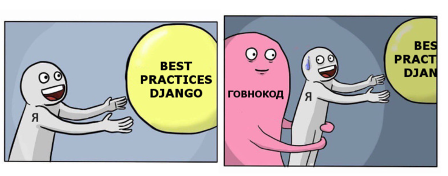
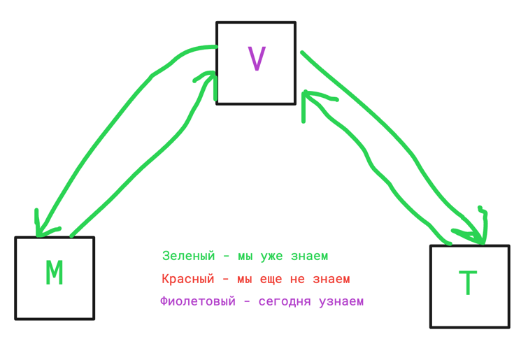

# Лекция 24. ClassBaseView

### Оглавление курса

<details>
  <summary>Блок 1 — Python Basic (1–6)</summary>

  - [Лекция 1. Введение. Типизации. Переменные. Строки и числа. Булева алгебра. Ветвление](lesson01.md)
  - [Лекция 2. Обработка исключений. Списки, строки детальнее, срезы, циклы.](lesson02.md)
  - [Лекция 3. None. Range, list comprehension, sum, max, min, len, sorted, all, any. Работа с файлами](lesson03.md)
  - [Лекция 4. Хеш-таблицы. Set, frozenset. Dict. Tuple. Немного об импортах. Namedtuple, OrderedDict](lesson04.md)
  - [Лекция 5. Функции, типизация, lambda. Map, zip, filter.](lesson05.md)
  - [Лекция 6. Алгоритмы и структуры данных](lesson06.md)
</details>

<details>
  <summary>Блок 2 — Git (7–8)</summary>

  - [Лекция 7. Git. История системы контроля версий. Локальный репозиторий. Базовые команды управления репозиторием.](lesson07.md)
  - [Лекция 8. Git. Удаленный репозиторий. Remote, push, pull. GitHub, Bitbucket, GitLab, etc. Pull request.](lesson08.md)
</details>

<details>
  <summary>Блок 3 — Python Advanced (9–14)</summary>

  - [Лекция 9. Введение в ООП. Основные парадигмы ООП. Классы и объекты. Множественное наследование.](lesson09.md)
  - [Лекция 10. Magic methods. Итераторы и генераторы.](lesson10.md)
  - [Лекция 11. Imports. Standard library. PEP 8](lesson11.md)
  - [Лекция 12. Декораторы. Декораторы с параметрами. Декораторы классов (staticmethod, classmethod, property)](lesson12.md)
  - [Лекция 13. Тестирование](lesson13.md)
  - [Лекция 14. Проектирование. Паттерны. SOLID.](lesson14.md)
</details>

<details>
  <summary>Блок 4 — SQL (15–17)</summary>

  - [Лекция 15. СУБД. PostgreSQL. SQL. DDL. Пользователи. DCL. DML. Связи.](lesson15.md)
  - [Лекция 16. СУБД. DQL. SELECT. Индексы. Group by. Joins.](lesson16.md)
  - [Лекция 17. СУБД. Нормализация. Аномалии. Транзакции. ACID. TCL. Backup](lesson17.md)
</details>

- [Лекция 18. Virtual env. Pip. Устанавливаемые модули. Pyenv.](lesson18.md)

<details open>
  <summary>Блок 5 — Django (19–26)</summary>

  - [Лекция 19. Знакомство с Django](lesson19.md)
  - [Лекция 20. Templates. Static](lesson20.md)
  - [Лекция 21. Модели. Связи. Meta. Abstract, proxy](lesson21.md)
  - [Лекция 22. Django ORM](lesson22.md)
  - [Лекция 23. Forms, ModelForms. User, Authentication](lesson23.md)
  - ▶ **Лекция 24. ClassBaseView**
  - [Лекция 25. NoSQL. Куки, сессии, кеш](lesson25.md)
  - [Лекция 26. Логирование. Middleware. Signals. Messages. Manage commands](lesson26.md)
</details>

<details>
  <summary>Блок 6 — Django Rest Framework (27–30)</summary>

  - [Лекция 27. Что такое API. REST и RESTful. Django REST Framework.](lesson27.md)
  - [Лекция 28. @api_view, APIView, ViewSets, Pagination, Routers](lesson28.md)
  - [Лекция 29. REST-аутентификация. Авторизация. Permissions. Фильтрация.](lesson29.md)
  - [Лекция 30. Тестирование. Django, REST API.](lesson30.md)
</details>

<details>
  <summary>Блок 7 — Python async (31–33)</summary>

  - [Лекция 31. Celery. Multithreading. GIL. Multiprocessing](lesson31.md)
  - [Лекция 32. Asyncio. Aiohttp. Асинхронное программирование на практике.](lesson32.md)
  - [Лекция 33. Сокеты. Django Channels.](lesson33.md)
</details>

<details>
  <summary>Блок 8 — Deployment (34–35)</summary>

  - [Лекция 34. Linux. Всё, что нужно знать для деплоймента.](lesson34.md)
  - [Лекция 35. Deployment](lesson35.md)
</details>

- [Лекция 36. Методологии разработки. CI/CD. Монолит и микросервисы. Docker](lesson36.md)




## Что сегодня учим?



# Class-Based View

С этого момента мы переходим на использование `view`, основанных исключительно на классах.

Все основные существующие классы описаны [Тут](https://ccbv.co.uk/)

## Class View

[Дока](https://docs.djangoproject.com/en/stable/ref/class-based-views/base/#view) | [CCBV](https://ccbv.co.uk/projects/Django/5.2/django.views.generic.base/View/)

Основой всех классов, используемых во `view`, является класс `View`. Методы этого класса используются всеми остальными
классами.

Основные атрибуты:

```http_method_names = ['get', 'post', 'put', 'patch', 'delete', 'head', 'options', 'trace']```

Этот атрибут нужен для определения того, какие виды HTTP методов будут доступны для запросов.

Основные функции:

`as_view()` — метод, который всегда вызывается, чтобы использовать класс в `urls.py`; внутри вызывает методы `setup`
и `dispatch`.

`setup()` — метод, который добавляет `request` в `self`, благодаря чему `request` будет доступен в абсолютно любом
методе всех наших view-классов.

`http_method_not_allowed()` — метод, который генерирует ошибку запроса (не могу обработать, например, POST-запрос).

`dispatch()` — метод, отвечающий за вызов обработчика при запросе.

```python
def dispatch(self, request, *args, **kwargs):
    # Try to dispatch to the right method; if a method doesn't exist,
    # defer to the error handler. Also defer to the error handler if the
    # request method isn't on the approved list.
    if request.method.lower() in self.http_method_names:  # Если запрос находится в списке разрешенных, то заходим.
        handler = getattr(self, request.method.lower(),
                          self.http_method_not_allowed)  # Пытаемся из self получить атрибут или метод, совпадающий названием с методом запроса (POST - post, GET - get), если не получается, то вернуть метод http_method_not_allowed
    else:
        handler = self.http_method_not_allowed  # Вернуть метод http_method_not_allowed
    return handler(request, *args,
                   **kwargs)  # Вызвать метод, который мы получили ранее, если удалось, то, например, get(), или post(), если нет, то http_method_not_allowed()
```

Как это работает?

Если наследоваться от этого класса, то мы можем описать функцию `get` и/или `post`, чтобы описать, что необходимо делать
при запросе методами `GET` или `POST`.

И можем описать, какие вообще запросы мы ожидаем принимать в атрибуте `http_method_names`

Например:

Во `views.py`

```python
from django.views import View
from django.shortcuts import render


class MyView(View):
    http_method_names = ['get', ]

    def get(self, request, *args, **kwargs):
        return render(request, 'index.html')
```

В `urls.py`:

```python
...
path('some-url/', MyView.as_view(), name='some-name')
...
```

Чем такая конструкция лучше, чем обычная функция? Тем, что обычная функция обязана принимать любой запрос и дальше
только при помощи `if` разделять разные запросы.

Такой класс будет принимать только запросы описанных методов, отклоняя все остальные, и каждый запрос будет написан в
отдельном методе, что сильно улучшает читабельность кода.

## Class TemplateView

[Дока](https://docs.djangoproject.com/en/stable/ref/class-based-views/base/#templateview) | [CCBV](https://ccbv.co.uk/projects/Django/5.2/django.views.generic.base/TemplateView/)

Класс, необходимый для рендера HTML-файлов.

Основные атрибуты:

```python
template_name = None  # Имя html файла, который нужно рендерить
extra_context = None  # Словарь с контентом
```

Основные методы:

Описан метод `get()`

```python
def get(self, request, *args, **kwargs):
    context = self.get_context_data(**kwargs)
    return self.render_to_response(context)
```

`get_context_data()` — метод, возвращающий данные, которые будут добавлены в контекст.

Как этим пользоваться?

```python
from django.views.generic.base import TemplateView

from blog.models import Article


class HomePageView(TemplateView):
    template_name = "home.html"

    def get_context_data(self, **kwargs):
        context = super().get_context_data(**kwargs)
        context['latest_articles'] = Article.objects.filter(
            status=Article.Status.PUBLISHED
        )[:5]
        return context
```

Мы описали класс, который будет рендерить файл `home.html`, в контексте которого будет переменная `latest_articles`, в
которой будет коллекция из объектов модели.

То же самое можно было сделать через `extra_context`:

```python
from django.views.generic.base import TemplateView

from blog.models import Article


class HomePageView(TemplateView):
    template_name = "home.html"
    extra_context = {"latest_articles": Article.objects.all()[:5]}
```

## Class RedirectView

[Дока](https://docs.djangoproject.com/en/stable/ref/class-based-views/base/#redirectview) | [CCBV](https://ccbv.co.uk/projects/Django/5.2/django.views.generic.base/RedirectView/)

Класс, необходимый для перенаправления запросов с одного URL на другой.

Основные атрибуты:

```python
query_string = False  # сохранить ли query-параметры (то, что в строке браузера после ?) при редиректе
url = None  # URL, на который надо перейти
pattern_name = None  # Имя URL, на который надо перейти
```

Основные методы:

Описаны все HTTP методы, и все они ссылаются на `get()`, например, `delete()`:

```python
def delete(self, request, *args, **kwargs):
    return self.get(request, *args, **kwargs)
```

Метод `get_redirect_url()` отвечает за то, чтобы получить URL, на который надо перейти.

Как пользоваться?

```python
from django.views.generic.base import RedirectView


class ArticleRedirectView(RedirectView):
    pattern_name = 'article-detail'
    query_string = True  # сохранить query параметры при редиректе
```

Этот класс перенаправит запрос на URL с именем `article-detail`, передав все параметры из URL.

## Class DetailView

[Дока](https://docs.djangoproject.com/en/stable/ref/class-based-views/generic-display/#detailview) | [CCBV](https://ccbv.co.uk/projects/Django/5.2/django.views.generic.detail/DetailView/)

Класс, который необходим для того, чтобы сделать страницу для просмотра одного объекта.

Ему необходимо передать `pk` либо `slug`, и это позволит отобразить один объект (статью, товар и т. д.).

Как этим пользоваться?

Например:

Во views.py

```python
from django.views.generic.detail import DetailView

from blog.models import Article


class ArticleDetailView(DetailView):
    model = Article
    template_name = 'blog/article_detail.html'
    context_object_name = 'article'  # вместо стандартного 'object'

    def get_context_data(self, **kwargs):
        context = super().get_context_data(**kwargs)
        context['comments'] = self.object.comments.all()
        return context
```

В urls.py:

```python
from django.urls import path

from blog.views import ArticleDetailView

urlpatterns = [
    path('article/<int:pk>/', ArticleDetailView.as_view(), name='article-detail'),
    # Или по slug:
    path('article/<slug:slug>/', ArticleDetailView.as_view(), name='article-detail'),
]
```

> При использовании `slug` вместо `pk` нужно указать `slug_field` и `slug_url_kwarg` в классе, если имя поля отличается от `slug`.

Этого уже достаточно, чтобы отрисовать страницу деталей объекта. Если `template_name` не указан явно, то Django будет
пытаться отобразить `templates/app_name/model_detail.html`, где `app_name` — название приложения, `model` — название
модели, `detail` — константа.

В контекст будет передана переменная `object`. Методы `post`, `put` и т. д. не определены.

Важные параметры:

```python
pk_url_kwarg = 'pk'  # Как переменная называется в urls.py, например `<int:my_id>`
slug_field = 'slug'  # Имя поля модели для поиска по slug
slug_url_kwarg = 'slug'  # Имя параметра в URL для slug
context_object_name = None  # Имя переменной в контексте (по умолчанию 'object')
queryset = None  # Ограничить доступ только для части объектов
template_name = None  # Указать имя шаблона
model = None  # Класс модели, если не указан queryset
```

Важные методы:

`get_queryset()` — переопределить queryset.

`get_context_data()` — то же, что и у TemplateView.

`get_object()` — определяет логику получения объекта.

## Class ListView

[Дока](https://docs.djangoproject.com/en/stable/ref/class-based-views/generic-display/#listview) | [CCBV](https://ccbv.co.uk/projects/Django/5.2/django.views.generic.list/ListView/)

Класс, необходимый для отображения списка объектов.

Добавляет в контекст список объектов и информацию о пагинации.

Как пользоваться?

```python
from django.views.generic import ListView
from blog.models import Article


class ArticleListView(ListView):
    model = Article
    template_name = 'blog/article_list.html'
    context_object_name = 'articles'
    paginate_by = 10

    def get_queryset(self):
        # Показываем только опубликованные статьи
        return Article.objects.filter(status=Article.Status.PUBLISHED)
```

### Пагинация

[Дока](https://docs.djangoproject.com/en/stable/topics/pagination/)

Очень часто наше приложение хранит большое количество данных, и при отображении нам не нужно показывать прямо всё
(допустим, у нас блог на 1 000 000 000 статей). Логично отдавать данные порциями — это и называется пагинация,
или разбиение на страницы.

При прокрутке ленты в соцсети вы подгружаете всё новые и новые страницы, просто при помощи JavaScript это сделано
так, что вы этого не замечаете.

За это отвечает параметр:

```python
paginate_by = None  # можно указать, сколько должно быть объектов на одной странице
```

В шаблон будут переданы как список объектов, так и данные по пагинации:

```python
context = {
    'paginator': paginator,  # объект класса пагинации, хранит все подробности, которые только могут быть.
    'page_obj': page,
    # информация о текущей странице, какая это страница, сколько всего страниц, URL на следующую и предыдущую страницу
    'is_paginated': is_paginated,
    # были ли данные вообще пагинированы, возможно у вас 10 объектов на страницу, а их всего 5, тогда нет смысла в пагинации
    'object_list': queryset  # Сам queryset с объектами
}
```

Важные параметры такие же, как у DetailView, и ещё новые:

```python
allow_empty = True  # разрешить ли отображение пустого списка
ordering = None  # явно указать порядок сортировки
```

Всё ещё описан только метод `get()`. Методы `post()`, `put()` и т. д. не разрешены.

Важные методы:

`get_queryset()` — переопределить queryset.

`get_context_data()` — то же, что и у TemplateView.

`get_paginator()` — определяет логику получения класса Paginator.

`get_paginate_by()` — определяет логику получения значения paginate_by.

`get_ordering()` — определяет логику получения переменной ordering.

`get_allow_empty()` — определяет логику получения переменной allow_empty.

### Фильтрация по текущему пользователю

Частый паттерн — показывать только объекты текущего пользователя:

```python
class MyArticlesListView(LoginRequiredMixin, ListView):
    model = Article
    template_name = 'blog/my_articles.html'
    context_object_name = 'articles'

    def get_queryset(self):
        # Показываем только статьи текущего пользователя
        return Article.objects.filter(author=self.request.user)
```

## Class FormView

[Дока](https://docs.djangoproject.com/en/stable/ref/class-based-views/generic-editing/#formview) | [CCBV](https://ccbv.co.uk/projects/Django/5.2/django.views.generic.edit/FormView/)

Не все классы предназначены только для чтения данных.

`FormView` — класс, необходимый для обработки формы.

Как пользоваться?

В `forms.py`:

```python
from django import forms


class ContactForm(forms.Form):
    name = forms.CharField()
    message = forms.CharField(widget=forms.Textarea)

    def send_email(self):
        # send email using the self.cleaned_data dictionary
        pass
```

Во `views.py`:

```python
from myapp.forms import ContactForm
from django.views.generic.edit import FormView


class ContactView(FormView):
    template_name = 'contact.html'
    form_class = ContactForm
    success_url = '/thanks/'

    def form_valid(self, form):
        # This method is called when valid form data has been POSTed.
        # It should return an HttpResponse.
        form.send_email()
        return super().form_valid(form)
```

В  `contact.html`:

```html

<form method="post"> 
    {{ form.as_p }}
    <input type="submit" value="Send message">
</form>
```

Важные параметры:

Такие же, как у TemplateView, и ещё свои:

```python
form_class = None  # сам класс формы
success_url = None  # на какую страницу перейти, если форма была валидна
initial = {}  # словарь с базовыми значениями формы
```

Важные методы:

Тут наконец определён метод `post()`:

```python
def post(self, request, *args, **kwargs):
    """
    Handle POST requests: instantiate a form instance with the passed
    POST variables and then check if it's valid.
    """
    form = self.get_form()
    if form.is_valid():
        return self.form_valid(form)
    else:
        return self.form_invalid(form)
```

Также все методы из TemplateView:

`get_context_data()` — дополнительно добавляет переменную `form` в шаблон.

`get_form()` — получить объект формы.

`get_form_class()` — получить класс формы.

`form_valid()` — что делать, если форма валидна.

`form_invalid()` — что делать, если форма не валидна.

`get_success_url()` — переопределить генерацию URL, на который будет совершён переход, если форма валидна.

## Class CreateView

[Дока](https://docs.djangoproject.com/en/stable/ref/class-based-views/generic-editing/#createview) | [CCBV](https://ccbv.co.uk/projects/Django/5.2/django.views.generic.edit/CreateView/)

Класс для создания объектов.

Как этим пользоваться?

Во `views.py`

```python
from django.urls import reverse_lazy
from django.views.generic.edit import CreateView
from django.contrib.auth.mixins import LoginRequiredMixin

from blog.models import Article
from blog.forms import ArticleForm


class ArticleCreateView(LoginRequiredMixin, CreateView):
    model = Article
    form_class = ArticleForm
    template_name = 'blog/article_form.html'
    success_url = reverse_lazy('article-list')

    def form_valid(self, form):
        form.instance.author = self.request.user  # Устанавливаем автора
        return super().form_valid(form)
```

В `blog/article_form.html`:

```html
<form method="post">
    {{ form.as_p }}
    <input type="submit" value="Сохранить">
</form>
```

> В класс нужно передать либо ModelForm, либо модель и поля, чтобы класс сам сгенерировал такую форму.

> **Почему `reverse_lazy`, а не `reverse`?** Атрибуты класса вычисляются при загрузке модуля, когда URL-конфигурация ещё не загружена. `reverse_lazy` откладывает вычисление URL до момента использования.

Метод `get()` откроет страницу, на которой будет переменная `form`, как и другие view, к которым добавляется форма.

Метод `post()` выполнит те же действия, что и FormView, но в случае валидности формы предварительно
выполнит `form.save()`

Важные параметры:

Такие же, как у FormView, и ещё свои:

```python
form_class = None  # Должен принимать ModelForm
model = None  # Можно указать модель вместо формы, чтобы сгенерировать её на ходу
fields = None  # Поля модели, если не указана форма
```

Важные методы:

Все методы из FormView, но дополненные под создание объекта:

`post()` — предварительно добавит классу атрибут `self.object = None`.

`form_valid()` — дополнительно выполнит такую строку: `self.object = form.save()`.

`get_success_url()` — переопределить URL для редиректа после успешного сохранения.

### Динамический success_url

Часто после создания объекта нужно перейти на его страницу. Для этого переопределяем `get_success_url()`:

```python
from django.urls import reverse


class ArticleCreateView(LoginRequiredMixin, CreateView):
    model = Article
    form_class = ArticleForm

    def form_valid(self, form):
        form.instance.author = self.request.user
        return super().form_valid(form)

    def get_success_url(self):
        # self.object доступен после form_valid()
        return reverse('article-detail', kwargs={'pk': self.object.pk})
```

> Здесь используется `reverse()`, а не `reverse_lazy()`, потому что метод вызывается во время обработки запроса, когда URL-конфигурация уже загружена.

## Class UpdateView

[Дока](https://docs.djangoproject.com/en/stable/ref/class-based-views/generic-editing/#updateview) | [CCBV](https://ccbv.co.uk/projects/Django/5.2/django.views.generic.edit/UpdateView/)

Класс для обновления объекта. Как пользоваться?

Во `views.py`:

```python
from django.urls import reverse_lazy
from django.views.generic.edit import UpdateView
from django.contrib.auth.mixins import LoginRequiredMixin, UserPassesTestMixin

from blog.models import Article
from blog.forms import ArticleForm


class ArticleUpdateView(LoginRequiredMixin, UserPassesTestMixin, UpdateView):
    model = Article
    form_class = ArticleForm
    template_name = 'blog/article_form.html'
    success_url = reverse_lazy('article-list')

    def test_func(self):
        # Только автор может редактировать статью
        article = self.get_object()
        return self.request.user == article.author
```

В `blog/article_form.html` (тот же шаблон, что и для CreateView):

```html
<form method="post">
    {{ form.as_p }}
    <input type="submit" value="Сохранить">
</form>
```

Методы и атрибуты почти полностью совпадают с CreateView, только UpdateView перед действиями вызывает
метод `get_object()` для получения нужного объекта, и url должен принимать `pk` (или `slug`) для определения этого объекта.

## Class DeleteView

[Дока](https://docs.djangoproject.com/en/stable/ref/class-based-views/generic-editing/#deleteview) | [CCBV](https://ccbv.co.uk/projects/Django/5.2/django.views.generic.edit/DeleteView/)

Класс для удаления объектов.

Как пользоваться?

Во views.py:

```python
from django.urls import reverse_lazy
from django.views.generic.edit import DeleteView
from django.contrib.auth.mixins import LoginRequiredMixin, UserPassesTestMixin

from blog.models import Article


class ArticleDeleteView(LoginRequiredMixin, UserPassesTestMixin, DeleteView):
    model = Article
    template_name = 'blog/article_confirm_delete.html'
    success_url = reverse_lazy('article-list')

    def test_func(self):
        article = self.get_object()
        return self.request.user == article.author
```

В `blog/article_confirm_delete.html`:

```html
<form method="post">
    <p>Вы уверены, что хотите удалить "{{ object.title }}"?</p>
    <input type="submit" value="Удалить">
    <a href="">Отмена</a>
</form>
```

Не принимает форму! Принимает модель или queryset и обязательно `success_url`. URL должен принимать идентификатор для определения объекта.

## Class LoginView

[Дока](https://docs.djangoproject.com/en/stable/topics/auth/default/#django.contrib.auth.views.LoginView) | [CCBV](https://ccbv.co.uk/projects/Django/5.2/django.contrib.auth.views/LoginView/)

Класс, реализующий логику логина.

Основан на FormView, если форма не была заменена, то по умолчанию использует
`django.contrib.auth.forms.AuthenticationForm`. Эта форма содержит два поля, `username` и `password`, и
проверяет, что данные валидны, и в случае, если данные валидны и пользователь активен, добавляет пользователя в объект
формы.

Также в LoginView переписан метод form_valid():

```python
def form_valid(self, form):
    """Security check complete. Log the user in."""
    auth_login(self.request, form.get_user())
    return HttpResponseRedirect(self.get_success_url())
```

Если форма валидна, то провести авторизацию.

## Class LogoutView

[Дока](https://docs.djangoproject.com/en/stable/topics/auth/default/#django.contrib.auth.views.LogoutView) | [CCBV](https://ccbv.co.uk/projects/Django/5.2/django.contrib.auth.views/LogoutView/)

Класс для логаута.

У LogoutView переписан метод `dispatch`, так что, каким бы методом вы не обратились к классу, вы всё равно будете
разлогинены.

## Регистрация

По сути регистрация — это CreateView со своими особенностями (пароль хешируется), поэтому для регистрации используют
просто CreateView, и существует заранее описанная форма `UserCreationForm`:

```python
class UserCreationForm(forms.ModelForm):
    """
    A form that creates a user, with no privileges, from the given username and
    password.
    """
    error_messages = {
        'password_mismatch': _("The two password fields didn't match."),
    }
    password1 = forms.CharField(label=_("Password"),
                                widget=forms.PasswordInput)
    password2 = forms.CharField(label=_("Password confirmation"),
                                widget=forms.PasswordInput,
                                help_text=_("Enter the same password as above for verification."))

    class Meta:
        model = User
        fields = ("username",)

    def clean_password2(self):
        password1 = self.cleaned_data.get("password1")
        password2 = self.cleaned_data.get("password2")
        if password1 and password2 and password1 != password2:
            raise forms.ValidationError(
                self.error_messages['password_mismatch'],
                code='password_mismatch',
            )
        return password2

    def save(self, commit=True):
        user = super(UserCreationForm, self).save(commit=False)
        user.set_password(self.cleaned_data["password1"])
        if commit:
            user.save()
        return user
```

Принимает `username` и два раза пароль, проверяет, чтобы пароли были одинаковые, и при сохранении записывает пароль в
хешированном виде.

## Управление доступом

Управление доступом — это важная часть разработки любого веб-приложения. В Django этот процесс включает контроль того,
какие пользователи могут просматривать или изменять определённые ресурсы. Django предоставляет несколько встроенных
инструментов для управления доступом, таких как декораторы, permissions и миксины.

> Пермишены и группы подробно рассмотрены в [лекции 23](lesson23.md#система-разрешений-permissions). Здесь мы сосредоточимся на миксинах для CBV.

### Управление доступом с использованием декораторов

> Практически не используется

В Django основным способом управления доступом при использовании функциональных представлений являются декораторы, такие
как `@login_required` и `@user_passes_test`. Однако, при использовании CBV их нельзя применять напрямую. Вместо этого
их можно использовать с помощью метода `@method_decorator`.

#### Пример:

```python
from django.contrib.auth.decorators import login_required
from django.utils.decorators import method_decorator
from django.views.generic import ListView

from blog.models import Article


@method_decorator(login_required, name='dispatch')
class ArticleListView(ListView):
    model = Article
    template_name = 'blog/article_list.html'
```

Здесь `@method_decorator` оборачивает метод `dispatch`, который вызывается при каждом запросе. Это гарантирует, что
пользователь должен быть авторизован для доступа к представлению.

### Использование миксинов для управления доступом

Django предоставляет несколько миксинов для управления доступом, которые можно использовать с CBV.

#### LoginRequiredMixin

Один из самых часто используемых миксинов — `LoginRequiredMixin`. Этот миксин обеспечивает доступ к представлению только
для авторизованных пользователей.

#### Пример:

```python
from django.contrib.auth.mixins import LoginRequiredMixin
from django.views.generic import DetailView

from blog.models import Article


class ArticleDetailView(LoginRequiredMixin, DetailView):
    model = Article
    template_name = 'blog/article_detail.html'
```

Если вам нужно указать, куда именно должен происходить редирект, вы можете указать это специальным атрибутом:

```python
from django.contrib.auth.mixins import LoginRequiredMixin
from django.views.generic import DetailView

from blog.models import Article


class ArticleDetailView(LoginRequiredMixin, DetailView):
    model = Article
    template_name = 'blog/article_detail.html'
    login_url = '/login/'
```

В данном примере `ArticleDetailView` будет доступен только для авторизованных пользователей. Если пользователь не
авторизован, он будет перенаправлен на страницу входа.

#### UserPassesTestMixin

Иногда требуется создать более сложные условия для доступа. Для этого используется `UserPassesTestMixin`, который
позволяет определить произвольное условие доступа с помощью метода `test_func`.

#### Пример:

```python
from django.urls import reverse_lazy
from django.contrib.auth.mixins import UserPassesTestMixin
from django.views.generic import DeleteView

from blog.models import Article


class ArticleDeleteView(UserPassesTestMixin, DeleteView):
    model = Article
    template_name = 'blog/article_confirm_delete.html'
    success_url = reverse_lazy('article-list')

    def test_func(self) -> bool:
        article = self.get_object()
        return self.request.user == article.author
```

Здесь пользователь сможет удалить статью только в том случае, если он является её автором.

### Комбинирование миксинов

Часто бывает необходимо комбинировать несколько миксинов для достижения нужного уровня контроля доступа. Важно помнить,
что порядок следования миксинов может быть критичным.

#### Пример:

```python
from django.contrib.auth.mixins import LoginRequiredMixin, UserPassesTestMixin
from django.views.generic import UpdateView

from blog.models import Article
from blog.forms import ArticleForm


class ArticleUpdateView(LoginRequiredMixin, UserPassesTestMixin, UpdateView):
    model = Article
    form_class = ArticleForm
    template_name = 'blog/article_form.html'

    def test_func(self) -> bool:
        article = self.get_object()
        return self.request.user == article.author
```

В этом примере `ArticleUpdateView` требует как авторизации, так и пользователь должен являться автором статьи.

#### PermissionRequiredMixin

Для проверки разрешений (permissions) используется `PermissionRequiredMixin`:

```python
from django.contrib.auth.mixins import LoginRequiredMixin, PermissionRequiredMixin
from django.views.generic import CreateView

from blog.models import Article
from blog.forms import ArticleForm


class ArticlePublishView(LoginRequiredMixin, PermissionRequiredMixin, UpdateView):
    model = Article
    fields = ['status']
    permission_required = 'blog.publish_article'  # Требуется право publish_article
    # Можно указать несколько разрешений:
    # permission_required = ['blog.change_article', 'blog.publish_article']
```

### Обработка отказа в доступе

Иногда может понадобиться изменить стандартное поведение при отказе в доступе, например, вместо перенаправления на
страницу входа, вывести сообщение об ошибке.

#### Пример:

```python
from django.contrib.auth.mixins import LoginRequiredMixin
from django.core.exceptions import PermissionDenied


class CustomLoginRequiredMixin(LoginRequiredMixin):

    def handle_no_permission(self):
        if self.raise_exception or self.request.user.is_authenticated:
            raise PermissionDenied
        return super().handle_no_permission()
```

Этот миксин изменяет поведение так, что при отсутствии авторизации пользователь получит исключение `PermissionDenied`, а
не редирект.

## Живой пример

Допустим, нам нужен сайт, на котором можно зарегистрироваться, залогиниться, разлогиниться и написать заметку, если ты
залогинен. Заметки должны отображаться списком, последняя созданная отображается первой. Все пользователи видят все
заметки. Возле тех, которые создал текущий пользователь, должна быть кнопка удалить.

Как это сделать?

Разработка всегда начинается с описания моделей, нам нужны две сущности: пользователь и заметка.

Мы не будем изменять пользователя, нам подходит стандартный.

Создадим модель заметки:

В models.py:

```python
from django.conf import settings
from django.db import models


class Note(models.Model):
    text = models.CharField(max_length=100)
    created_at = models.DateTimeField(auto_now_add=True)
    author = models.ForeignKey(settings.AUTH_USER_MODEL, on_delete=models.CASCADE, related_name='notes')

    class Meta:
        ordering = ['-created_at', ]
```

Не забываем про миграции и про добавление приложения в `settings.py`.

Создадим необходимые шаблоны: `base.html`, `index.html`, `login.html`, `register.html`. Пока пустые, заполним чуть
позже.

Создадим view. Для базовой страницы, на которой отображается список заметок, лучше всего подходит ListView; для логина
и логаута — существующие классы; для регистрации — CreateView.

Для логина и регистрации воспользуемся готовой формой.

Базовую страницу и логаут закроем от незалогиненных пользователей.

Получается как-то так.

Во `views.py`:

```python
from django.contrib.auth.forms import UserCreationForm
from django.contrib.auth.mixins import LoginRequiredMixin
from django.contrib.auth.views import LoginView, LogoutView
from django.views.generic import ListView, CreateView

from app.models import Note


class NoteListView(LoginRequiredMixin, ListView):
    model = Note
    template_name = 'index.html'
    login_url = 'login/'


class Login(LoginView):
    success_url = '/'
    template_name = 'login.html'

    def get_success_url(self):
        return self.success_url


class Register(CreateView):
    form_class = UserCreationForm
    template_name = 'register.html'
    success_url = '/'


class Logout(LoginRequiredMixin, LogoutView):
    next_page = '/'
    login_url = 'login/'
```

В `urls.py` проекта добавим через `include` `urls.py` приложения.

В `app/urls.py`:

```python
from django.urls import path
from .views import NoteListView, Login, Logout, Register

urlpatterns = [
    path('', NoteListView.as_view(), name='index'),
    path('login/', Login.as_view(), name='login'),
    path('register/', Register.as_view(), name='register'),
    path('logout/', Logout.as_view(), name='logout'),
]

```

И заполним HTML-файлы.

`base.html`:

```html
<!DOCTYPE html>
<html lang="en">
<head>
    <meta charset="UTF-8">
    <title>Base</title>
</head>
<body>
<div>
    
    
</div>
</body>
</html>
```

`index.html`:

```html



<div>
    <a href="">Logout</a>
</div>

```

`login.html`:

```html



<span>Wanna register? <a href="">Sign Up</a></span>

<form method="post">
    
    {{ form }}
    <input type="submit" value="Login">
</form>

```

`register.html`:

```html



<span>Already has account? <a href="">Login</a></span>

<form method="post">
    
    {{ form }}
    <input type="submit" value="Register">
</form>

```

Структура для логина, логаута, и регистрации готова.

Добавим отображение списка заметок.

В `index.html`:

```html



<div>
    <a href="">Logout</a>
</div>

<div>
    
    <div>
        {{ obj.text }} from {{ obj.author.username }}
    </div>
    
</div>

```

Но как добавить создание заметок?

Нам нужна форма для создания заметок и CreateView.

В `forms.py`:

```python
from django.forms import ModelForm

from app.models import Note


class NoteCreateForm(ModelForm):
    class Meta:
        model = Note
        fields = ('text',)
```

В полях только текст, потому что время создания будет заполняться автоматически, id тоже, а юзера мы будем брать из
реквеста.

Будем ли мы отображать отдельную страницу для создания? Нет, значит отдельный html файл нам не нужен, а раз мы не будем
отображать страницу, то и метод `get()` нам не нужен. Оставим только `post()`.

Создадим CreateView.

В `views.py`:

```python
class NoteCreateView(LoginRequiredMixin, CreateView):
    login_url = 'login/'
    http_method_names = ['post']
    form_class = NoteCreateForm
    success_url = '/'
```

Выведем URL под этот класс.

В `urls.py`:

```python
from django.urls import path
from .views import NoteListView, Login, Logout, Register, NoteCreateView

urlpatterns = [
    path('', NoteListView.as_view(), name='index'),
    path('login/', Login.as_view(), name='login'),
    path('register/', Register.as_view(), name='register'),
    path('logout/', Logout.as_view(), name='logout'),
    path('note/create/', NoteCreateView.as_view(), name='note-create'),
]
```

Достаточно ли этого, чтобы создавать заметки? Нет, потому что мы никуда не вывели форму для создания заметок. Давайте
выведем её на нашу основную страницу.

Во `views.py` изменим класс `NoteListView`, добавив атрибут `extra_context = {'create_form': NoteCreateForm()}`:

```python
class NoteListView(LoginRequiredMixin, ListView):
    model = Note
    template_name = 'index.html'
    login_url = 'login/'
    extra_context = {'create_form': NoteCreateForm()}
```

Теперь мы можем вывести форму в шаблоне. Изменим `index.html`:

```html



<div>
    <a href="">Logout</a>
</div>

<div>
    
    <div>
        {{ obj.text }} from {{ obj.author.username }}
    </div>
    
</div>
<form method="post" action="">
    
    {{ create_form }}
    <input type="submit" value="Create">
</form>

```

Достаточно ли этого? Нет. Наша заметка должна хранить в себе пользователя, а мы нигде его не добавляем. При попытке
вызвать `save()` мы получим ошибку: не могу сохранить без пользователя.

Что будем делать? Переписывать логику `form_valid()`, мы знаем, что метод `save()` для CreateView вызывается там.

Есть два способа добавить пользователя к создаваемому объекту.

Вариант 1 — через `commit=False` (получить объект, дополнить, сохранить):

```python
class NoteCreateView(LoginRequiredMixin, CreateView):
    login_url = 'login/'
    http_method_names = ['post']
    form_class = NoteCreateForm
    success_url = '/'

    def form_valid(self, form):
        obj = form.save(commit=False)
        obj.author = self.request.user
        obj.save()
        return super().form_valid(form)
```

Вариант 2 — через `form.instance` (короче и современнее):

```python
class NoteCreateView(LoginRequiredMixin, CreateView):
    login_url = 'login/'
    http_method_names = ['post']
    form_class = NoteCreateForm
    success_url = '/'

    def form_valid(self, form):
        form.instance.author = self.request.user
        return super().form_valid(form)
```

Мы будем использовать второй вариант.

Обратите внимание, после успеха мы попадаем обратно на `/` (success_url), где мы сразу же увидим новую заметку.

Создание готово.

Как добавить удаление? Создадим новую DeleteView — она даже не требует форму. Важно добавить проверку, что пользователь может удалять только свои заметки.

Во `views.py`:

```python
from django.urls import reverse_lazy
from django.contrib.auth.mixins import LoginRequiredMixin, UserPassesTestMixin


class NoteDeleteView(LoginRequiredMixin, UserPassesTestMixin, DeleteView):
    model = Note
    success_url = reverse_lazy('index')

    def test_func(self):
        note = self.get_object()
        return self.request.user == note.author
```

Не забываем добавить URL.

В `urls.py`:

```python
from django.urls import path
from .views import NoteListView, Login, Logout, Register, NoteCreateView, NoteDeleteView

urlpatterns = [
    path('', NoteListView.as_view(), name='index'),
    path('login/', Login.as_view(), name='login'),
    path('register/', Register.as_view(), name='register'),
    path('logout/', Logout.as_view(), name='logout'),
    path('note/create/', NoteCreateView.as_view(), name='note-create'),
    path('note/delete/<int:pk>/', NoteDeleteView.as_view(), name='note-delete'),
]
```

И добавляем форму для удаления в шаблон.

В `index.html`:

```html



<div>
    <a href="">Logout</a>
</div>

<div>
    
    <div>
        {{ obj.text }} from {{ obj.author.username }}
        <form method="post" action="">
            
            <input type="submit" value="Delete">
        </form>
    </div>
    
</div>
<form method="post" action="">
    
    {{ create_form }}
    <input type="submit" value="Create">
</form>

```

Это уже будет работать. Но нам же нужно, чтобы кнопка для удаления была только у своих заметок. Ок, добавим `if`.

```html



<div>
    <a href="">Logout</a>
</div>

<div>
    
    <div>
        {{ obj.text }} from {{ obj.author.username }}
        
            <form method="post" action="">
                
                <input type="submit" value="Delete">
            </form>
        
    </div>
    
</div>
<form method="post" action="">
    
    {{ create_form }}
    <input type="submit" value="Create">
</form>

```

Осталась маленькая деталь: сейчас мы отображаем все существующие заметки, а что, если их будет миллион? Это нерационально — давайте добавим пагинацию.

ListView уже передаёт все необходимые данные, нам нужно только добавить размер страницы и добавить отображение по
страницам в шаблоне.

Во `views.py` изменим `NoteListView`:

```python
from django.urls import reverse_lazy

class NoteListView(LoginRequiredMixin, ListView):
    model = Note
    template_name = 'index.html'
    login_url = reverse_lazy('login')
    paginate_by = 5

    def get_context_data(self, **kwargs):
        context = super().get_context_data(**kwargs)
        context['create_form'] = NoteCreateForm()
        return context
```

А в `index.html`:

```html



<div>
    <a href="">Logout</a>
</div>

<div>
     {# обратите внимание я заменил объект #}
    <div>
        {{ obj.text }} from {{ obj.author.username }}
        
        <form method="post" action="">
            
            <input type="submit" value="Delete">
        </form>
        
    </div>
    
    <div class="pagination">
    <span class="step-links">
        
            <a href="?page=1">&laquo; first</a>
            <a href="?page={{ page_obj.previous_page_number }}">previous</a>
        

        <span class="current">
            Page {{ page_obj.number }} of {{ page_obj.paginator.num_pages }}.
        </span>

        
            <a href="?page={{ page_obj.next_page_number }}">next</a>
            <a href="?page={{ page_obj.paginator.num_pages }}">last &raquo;</a>
        
    </span>
    </div>
</div>
<form method="post" action="">
    
    {{ create_form }}
    <input type="submit" value="Create">
</form>



```

Профит! Всё работает. Переходим к заданию на модуль. Все задания должны быть выполнены через Class-Based Views.

## Модуль № 3

[Ссылка](module3.md)

---

[← Лекция 23: Forms, ModelForms. User, Authentication.](lesson23.md) | [Лекция 25: NoSQL. Куки, сессии, кеш →](lesson25.md)
